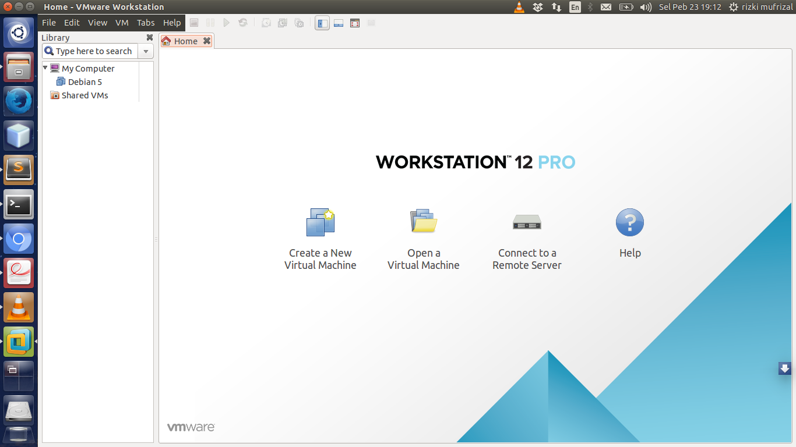
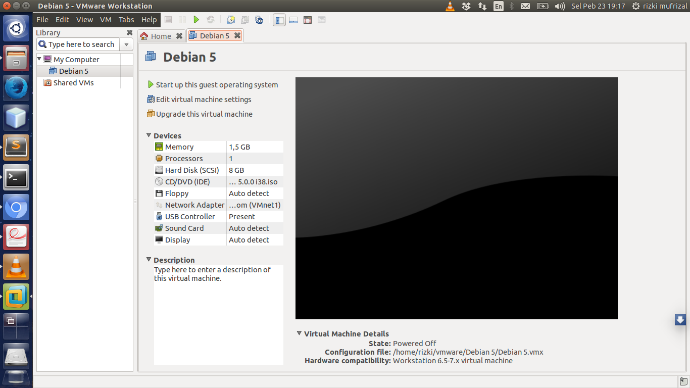
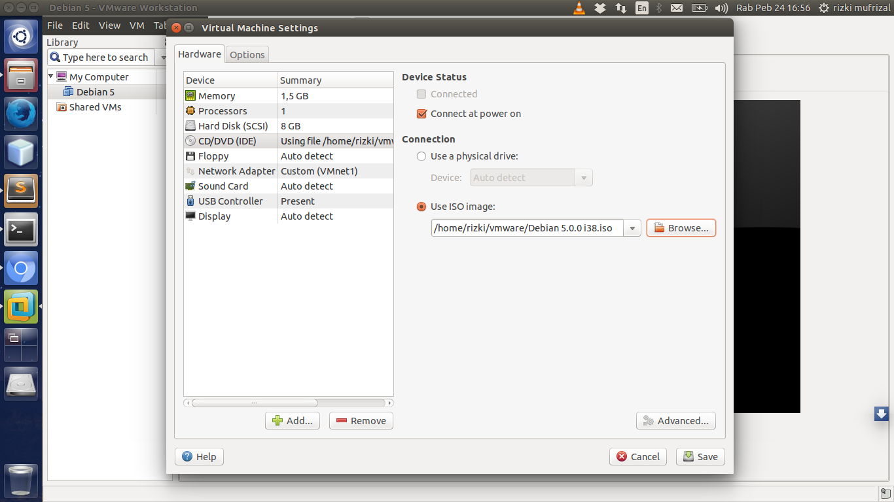
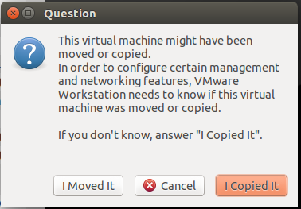
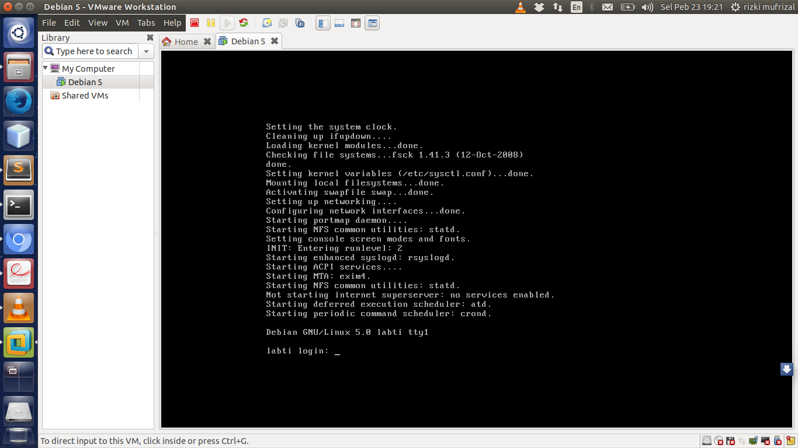
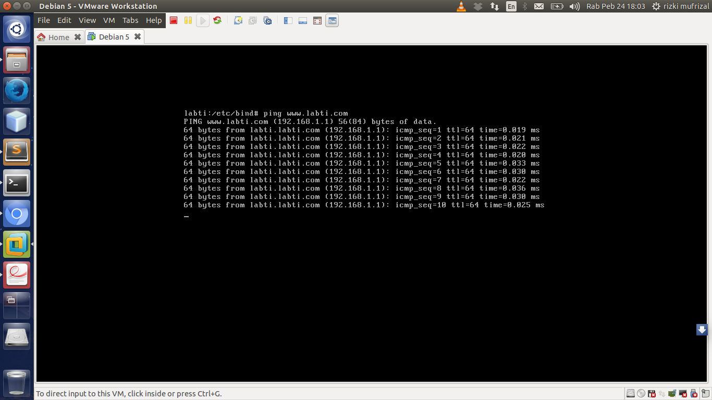

## Apa Itu DNS ?

>>DNS (Domain Name System) adalah sebuah sistem yang berfungsi untuk menerjemahkan domain name ke IP address ataupun sebaliknya.

Biasanya DNS ini digunakan oleh pengguna internet dikarenakan mengingat sebuah alamat situs lebih mudah dibandingkan dengan menghafal IP dari alamat situs tersebut.

## Setup Software

Untuk melakukan instalasi dan konfigurasi DNS, penulis menggunakan beberapa software diantaranya adalah :

* Konfigurasi Debian 5 : berfungsi sebagai konfigurasi debian 5 pada VMware, bagi yang belum memiliki silahkan donwload di [Debian 5.rar](https://drive.google.com/folderview?id=0B0eLGkbP10_ZX1UzUGJIUTdvV0U&usp=sharing).
* ISO Debian 5 : berfungsi sebagai sistem operasi yang akan kita gunakan, silahkan download ISO nya di [debian 5.iso](https://drive.google.com/folderview?id=0B0eLGkbP10_ZX1UzUGJIUTdvV0U&usp=sharing)
* VMware 12 : berfungsi sebagai virtual machine, silahkan download di [VMware](https://my.vmware.com/web/vmware/info/slug/desktop_end_user_computing/vmware_workstation_pro/12_0)

Silahkan lakukan instalasi VMware terlebih dahulu, jika telah selesai, silahkan extract file `Debian 5.rar` di sembarang tempat. Langkah selanjutnya buka VMware anda, yang anda buka adalah `VMware Workstation`, maka akan muncul halaman seperti berikut.

Kemudian `Open a Virtual Machine`, silahkan anda browse file `Debian 5.vmx` yang ada di dalam folder `Debian 5`. Maka muncul gambar seperti berikut.

Tahap selanjutnya, silahkan pilih menu `edit virtual machine settings` karena kita akan melakukan konfigurasi file iso yang akan digunakan. Kemudian silahkan pilih menu CD/DVD (IDE) seperti gambar berikut.

Silahkan browse file iso yang telah anda download. Langkah selanjutnya jalankan virtual machine tersebut dengan menekan tombol `Start up this guest operating system`, jika muncul seperti berikut.

silahkan pilih I Copied It, silahkan tunggu start up debian hingga selesai. Jika start up telah selesai maka akan muncul gambar seperti berikut.

Kemudian lakukan login dengan username : root dan password : labti.

## Instalasi Bind9

>>Bind9 atau Berkeley Internet Name Domain Versi 9 adalah salah satu software yang biasa digunakan untuk membuat dan mengatur DNS (Domain Name Server) pada sistem operasi Linux.

Untuk melakukan instalasi bind9 sangatlah gampang, silahkan jalankan perintah berikut.


apt-get install bind9


## Membuat Zone Domain

Setelah selesai melakukan instalasi, tahap selanjutnya adalah menentukan nama domain pada debian. Untuk menentukan domain maka kita harus membuat konfigurasi zone domain menggunakan Tld (Top Level Domain). Konfigurasi yang akan kita lakukan adalah konfigurasi forward dan reverse yang ada di dalam file `named.conf`. Silahkan masuk ke dalam folder `/etc/bind/` setelah selesai, jalankan perintah


nano named.conf


kemudian lakukan konfigurasi seperti berikut


// This is the primary configuration file for the BIND DNS server named.
//
// Please read /usr/share/doc/bind9/README.Debian.gz for information on the
// structure of BIND configuration files in Debian, *BEFORE* you customize
// this configuration file.
// If you just adding zones, please do that in /etc/bind/named.conf.local

include "/etc/bind/named.conf.options";

//prime the server with knowledge of the root servers
zone "." {
    type hint;
    file "/etc/bind/db.root";
};

// be authoritative for the localhost forward and reverse zones, and for
// broadcast zones as per RFC 1912

zone "localhost" {
    type master;
    file "/etc/bind/db.local";
};

zone "127.in-addr.arpa" {
    type master;
    file "/etc/bind/db.127";
};

zone "0.in-addr.arpa" {
    type master;
    file "/etc/bind/db.0";
};

zone "255.in-addr.arpa" {
    type master;
    file "/etc/bind/db.255";
};

//konfigurasi forward
zone "labti.com" {
    type master;
    file "/etc/bind/db.labti"; //lokasi file forward
};

//konfigurasi reverse
zone "1.168.192. in-addr.arpa" {
    type master;
    file "/etc/bind/db.192"; //lokasi file reverse
};

include "/etc/bind/named.conf.local";


Dari codingan diatas dapat dilihat bahwa kita melakukan konfigurasi domain dengan menggunakan zone domain. Dimana zone domain `labti.com` adalah merupakan konfigurasi dari forward sedangkan zone `1.168.192` adalah konfigurasi reverse, berikut adalah perbedaan antara konfigurasi forward dan reverse.

* Forward : mengubah nama domain ke IP address di dalam DNS.
* Reverse : engubah IP address ke nama domain di dalam DNS.

## Membuat File Forward

Untuk membuat file forward silahkan jalankan perintah berikut.


nano db.labti


Kemudian tekan tombol `ctrl + R` kemudian browse file dengan perintah `ctrl + T` lalu pilih file `db.local` lalu tekan enter. Isikan konfigurasi seperti berikut.


;
; BIND data file for local loopback interface
;
$TTL   604800
@      IN       SOA     labti.com. root.labti.com. (
                                2       ; Serial
                           604800       ; Refresh
                            86400       ; Retry
                          2419200       ; Expire
                           604800 )     ; Negative Cache TTL
;
@       IN      NS      labti.com.
@       IN      A       192.168.1.1
www     IN      A       192.168.1.1 


## Membuat File Reverse

Silahkan jalankan perintah berikut untuk membuat file reverse.


nano db.192


Kemudian tekan tombol `ctrl + R` kemudian browse file dengan perintah `ctrl + T` lalu pilih file `db.255` lalu tekan enter. Isikan konfigurasi seperti berikut.


;
; BIND data file for local loopback interface
;
$TTL   604800
@      IN       SOA     labti.com. root.labti.com. (
                                2       ; Serial
                           604800       ; Refresh
                            86400       ; Retry
                          2419200       ; Expire
                           604800 )     ; Negative Cache TTL
;
@       IN      NS      labti.com.
@       IN      A       192.168.1.1
1       IN      PTR     www.labti.com. 


## Test DNS Server

Jika telah selesai, langkah selanjutnya silahkan restart bind9 dengan perintah


/etc/init.d/bind9 restart


Setelah selesai, silahkan lakukan uji coba dengan menggunakan perintah berikut.


ping www.labti.com


Jika berhasil maka akan muncul output seperti berikut.

Sekian artikel mengenai instalasi dan konfigurasi DNS pada debian server dan terima kasih :).