Pada tutorial [sebelumnya](http://rizkimufrizal.github.io/belajar-instalasi-dan-konfigurasi-dns-pada-debian-server/) kita telah membahas bagaimana cara instalasi dan konfigurasi dns pada debian server, kali ini penulis akan melanjutnya artikel mengenai bagaimana konfigurasi DHCP dan web server pada debian :).

## Apa Itu DHCP ?

>>DHCP (Dymanic Configuration Protocol) adalah sebuah sistem dimana sistem tersebut dapat memberikan IP secara otomatis kepada komputer yang meminta.

DHCP sangatlah berguna, terutama ketika jumlah komputer yang akan kita berikan IP berjumlah sangat banyak. Dengan adanya DHCP, kita juga dapat memberikan range IP berdasarkan jumlah komputer yang tersedia.

Berikut adalah gambar dari activity diagram untuk DHCP

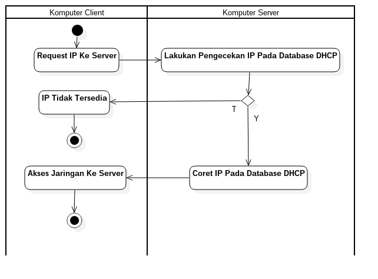

Berikut adalah penjelasan mengenai activity diagram diatas.

1. Komputer client melakukan request IP kepada komputer server, dimana komputer client bertindak sebagai DHCP client sedangkan komputer server bertindak sebagai DHCP server.
2. Komputer server akan melakukan pengecekan IP yang terdapat di dalam database DHCP, jika IP masih tersedia atau IP masih belum dicoret maka komputer server akan meminjamkan IP tersebut kepada komputer client dan mencoret IP tersebut dari database DHCP sehingga IP tidak akan ada yang duplicate atau double.
3. Jika IP tidak tersedia atau seluruh IP telah dicoret maka komputer client tidak akan mendapatkan IP sehingga komputer client tidak dapat mengakses jaringan tersebut.

## Apa Itu Web Server ?

>>Web Server adalah suatu perangkat lunak yang bertanggung jawab untuk menerima request dan memberikan response dari pada client melalui protokol http (hypertext transfer protocol).

Pada zaman sekarang ada banyak sekali web server yang dapat kita gunakan. Masing - masing bahasa pemrograman yang support untuk membuat web mempunyai web server tersendiri, berikut adalah contoh web server.

* Apache Web Server : biasanya digunakan sebagai web server untuk php
* Nginx : biasanya digunakan sebagai web server untuk php dan hhvm
* Apache Tomcat : biasanya digunakan sebagai web server untuk java web
* Jetty : biasanya digunakan sebagai web server untuk Java web
* GlassFish Server : biasanya digunakan sebagai web server untuk Java EE
* Wildfly Server : biasanya digunakan sebagai web server untuk Java EE
* WEBrick : biasanya digunakan sebagai web server untuk ruby
* Dan lain - lain

Berikut adalah gambar dari deployment diagram untuk web server.

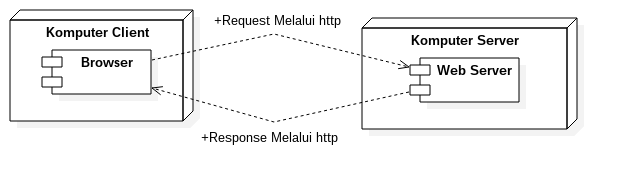

Berikut adalah penjelasan dari deployment diagram diatas.

1. Komputer client berfungsi sebagai node yang pertama, node disini berfungsi sebagai hardware dari bagian client. Begitu pula dengan komputer server yang bertindak sebagai node yang kedua.
2. browser : adalah component dari pada node komputer client, component adalah representasi dari pada sebuah software. Hal ini juga sama jika kita bandingkan dengan web server sebagai component software yang kedua.
3. Misalnya user akan melakukan akses sebuah halaman web. Sebuah halaman web biasanya terdiri dari html, css dan js. Ketika user melakukan akses sebuah web melalui browser, maka browser akan melakukan request melalui protokol http berdasarkan URL (uniform resource locator) yang diketikan oleh user. Request tersebut diterima oleh web server yang berada pada komputer server, jika URL sesuai maka web server akan mengembalikan response kepada browser.

## Instalasi Dan Konfigurasi DHCP3 Server

Setelah membahas mengenai cara kerja dari dhcp dan web server, sekarang kita akan langsung melakukan instalasi dhcp pada debian server :D.

Untuk melakukan instalasi dhcp3 server, silahkan jalankan perintah berikut.


apt-get install dhcp3-server


Setelah selesai, kita akan melakukan instalasi editor yang baru, jika dulu kita menggunakan nano, maka sekarang kita akan menggunakan editor mcedit, silahkan jalankan perintah berikut untuk melakukan instalasi editor tersebut.


apt-get install mc


Tahap selanjutnya kita akan melakukan konfigurasi dhcp, silahkan jalankan perintah berikut.


mcedit /etc/dhcp3/dhcpd.conf


Maka akan muncul tampilan seperti berikut.

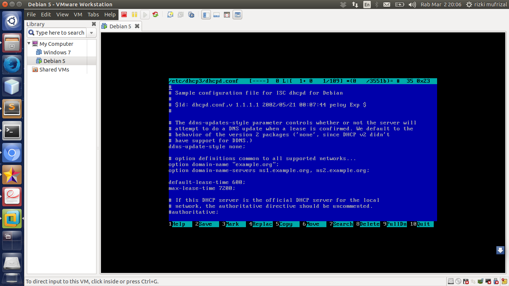

Kemudian untuk loncat ke baris yang akan kita tuju, silahkan tekan tombol `f9`, kemudian pindahkan kursor menu `commands` dengan tombol `left`, lalu tekan enter dan pilih `go to line`. Masukkan angka `51` artinya kita akan loncat ke baris 51 kemudian tekan tombol `alt + o`. Tahap selanjutnya silahkan ubah konfigurasi tersebut seperti ini.


subnet 192.168.1.0 netmask 255.255.255.0 {
    range 192.168.1.20 192.168.1.40;
    option domain-name-servers 192.168.1.1;
    option domain-name "labti.com";
    option routers 192.168.1.1;
    option broadcast-address 192.168.1.255;
    default-lease-time 7200;
    max-lease-time 7200;
}


Berikut adalah penjelasan dari konfigurasi diatas.

* subnet : berfungsi sebagai network address
* range : jarak ip yang akan digunakan pada komputer client
* option domain-name-servers : berfungsi sebagai IP DNS dari komputer server
* option domain-name : berfungsi sebagai nama domain
* option routers : berfungsi sebagai IP dari router atau bisa juga IP komputer server
* option broadcast-address : berfungsi sebagai broadcast dari IP
* default-lease-time : berfungsi sebagai waktu tetap untuk peminjaman IP kepada komputer client dari komputer server
* max-lease-time : berfungsi sebagai waktu maksimal untuk peminjaman IP kepada komputer client dari komputer server

Langkah selanjutnya adalah simpan konfigurasi tersebut dengan menekan tombol `f2` maka akan muncul tampilan seperti berikut.

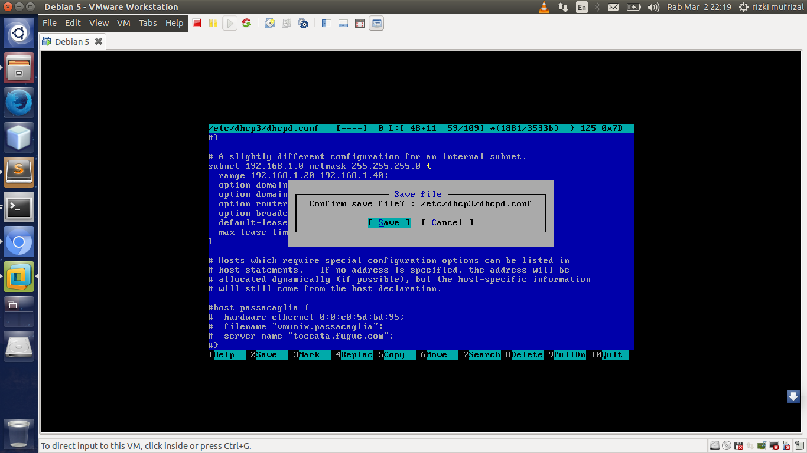

Kemudian tekan enter, lalu close editor dengan menekan tombol `f10`. Langkah selanjutnya silahkan restart dhcp3 dengan perintah.


/etc/init.d/dhcp3-server restart


Jika terjadi error seperti ini


Stopping DHCP server: dhcpd3 failed!
Starting DHCP server: dhcpd3.


Maka lakukan restart sekali lagi, jika masih failed maka silahkan lakukan pengecekan konfigurasi pada dhcp nya.

Jika berhasil maka outputnya seperti berikut.


Stopping DHCP server: dhcpd3.
Starting DHCP server: dhcpd3.


## Instalasi Dan Konfigurasi Web Server

Setelah berhasil melakukan instalasi dan konfigurasi dhcp, tahap selanjutnya kita akan melakukan instalasi dan konfigurasi web server pada debian server. Pada artikel ini, penulis akan menggunakan apache web server sebagai web server. Web server apache adalah salah satu web server untuk bahasa pemrograman php, maka pada saat proses instalasi, penulis juga melakukan instalasi php versi 5. Untuk melakukan instalasi tersebut silahkan jalankan perintan berikut.


apt-get install apache2 php5


Secara default, web server apache di debian belum dikonfigurasi folder htdocs nya, berbeda dengan ubuntu. Pada ubuntu, apache akan secara otomatis mendeklarasikan bahwa folder `/var/www/html` adalah sebagai folder `htdocs`. Folder `htdocs` sebenarnya berasal dari aplikasi xampp. Untuk melakukan konfigurasi tersebut silahkan jalankan perintah berikut.


nano /etc/apache2/sites-available/default


Kemudian ubah konfigurasinya seperti berikut.


<VirtualHost *:80>
  ServerAdmin admin@labti.com
  DocumentRoot /var/www/html

  <Directory />
    Options FollowSymLinks
    AllowOverride None
  </Directory>

  <Directory /var/www/html>
    Options Indexes FollowSymLinks MultiViews
    AllowOverride None
    Order allow, deny
    allow from all
  </Directory>

</VirtualHost>


Setelah selesai, sekarang kita akan membuat folder yang berfungsi sebagai folder `htdocs` silahkan jalankan perintah berikut.


mkdir /var/www/html


## Testing DHCP

Setelah melakukan konfigurasi DHCP, kita akan melakukan testing apakah dhcp tersebut berhasil atau tidak. Bagaimana cara nya ? untuk mempermudah, kita akan gunakan windows sebagai komputer client dan debian sebagai komputer server. Silahkan anda lakukan instalasi windows pada VMware anda, setelah selesai melakukan instalasi windows pada VMware terdapat beberapa langkah yang harus anda lakukan untuk konfigurasi dhcp. Berikut adalah langkah - langkahnya.

1. Pilih os windows lalu pilih menu edit, pilih virtual network editor
2. Silahkan pilih vmnet 1 kemudian uncheck list pada use local DHCP service to distribute IP addresses to VMs kemudian isi `192.168.1.0 pada bagian `subnet IP` seperti gambar berikut.
  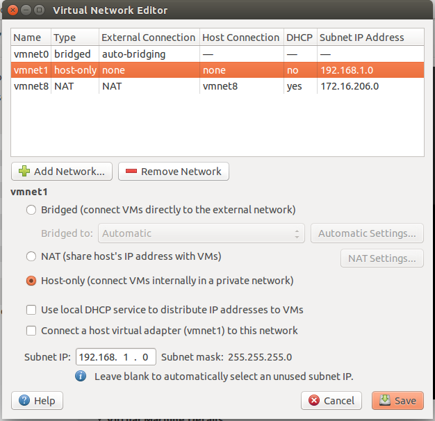
3. Selanjutnya pilih menu vm lalu pilih settings, pilih pada bagian network adapter, lihat pada menu kanannya terdapat radio button yaitu custom: spesific virtual network kemudian pilih /dev/vmnet1 seperti gambar berikut.
  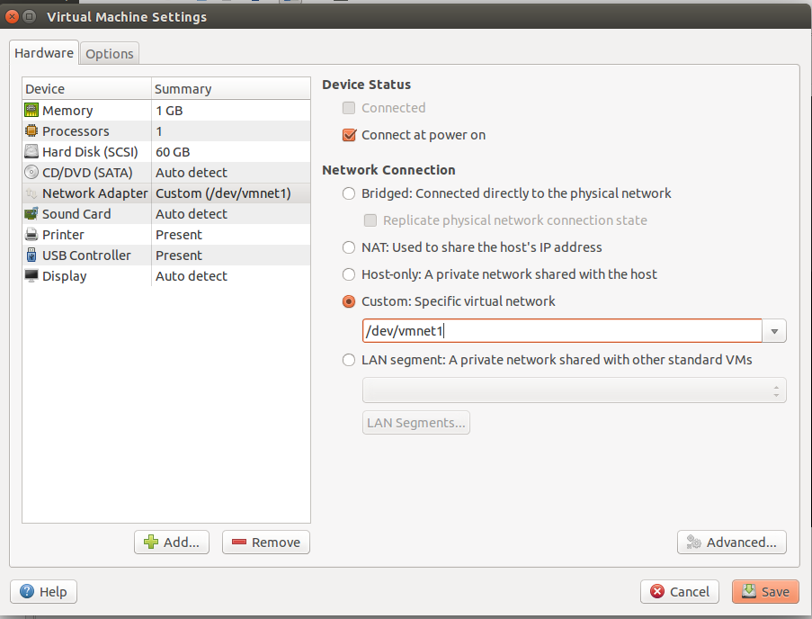

Setelah selesai, tahap selanjutnya silahkan jalankan windows anda dikarenakan kita akan melakukan konfigurasi pada bagian windowsnya. Berikut adalah langkah untuk konfigurasi jaringan pada windows.

1. Silahkan pilih control panel
2. Pilih menu network and internet
3. Kemudian pilih network and sharing center
4. Kemudian pilih menu change adapter settings yang ada di bagian kiri
5. Selanjutnya klik kanan pada local area connection lalu pilih properties. Klik pada internet protocol version 4(TCP/IPv4) lalu klik menu properties, kemudian ubah menjadi obtain an IP address automatically dan obtain DNS address automatically seperti gambar berikut.

  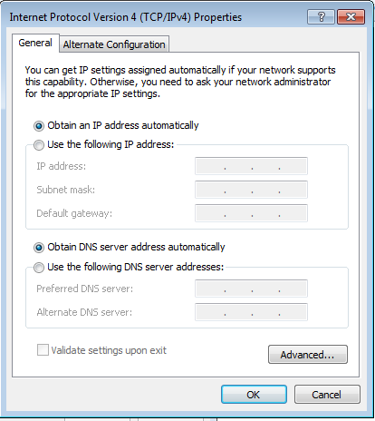

Setelah selesai, silahkan lakukan pengecekan IP pada windows dengan perintah.


ipconfig


Jika berhasil maka akan muncul output seperti berikut.

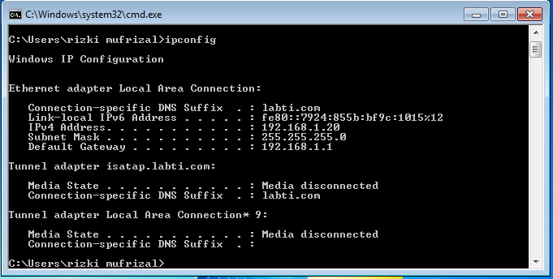

atau bisa juga lakukan ping ke IP server dengan perintah


ping 192.168.1.1


atau bahkan anda bisa juga melakukan ping ke dns server dengan perintah


ping www.labti.com


Jika berhasil maka akan muncul output seperti berikut.

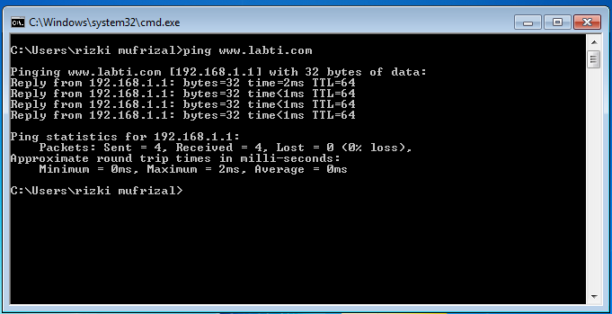

## Testing Web Server

Tahap yang terakhir adalah melakukan testing pada web server, silahkan masuk lagi ke dalam debian, lalu jalankan perintah berikut untuk membuat sebuah halaman html.


nana /var/www/html/index.html


Kemudian masukkan codingan html seperti berikut.


<!DOCTYPE html>
<html>
  <head>
    <meta charset="utf-8">
    <title>Belajar Web Server</title>
  </head>
  <body>
    <h1>Belajar Web Server</h1>  
    <h1>Hello Rizki Mufrizal</h1>
  </body>
</html>


Setelah selesai, silahkan restart apache web server anda dengan perintah.


/etc/init.d/apache2 restart


Kemudian silahkan akses web dengan perintah berikut.


w3m www.labti.com


Jika berhasil maka akan muncul output seperti berikut.

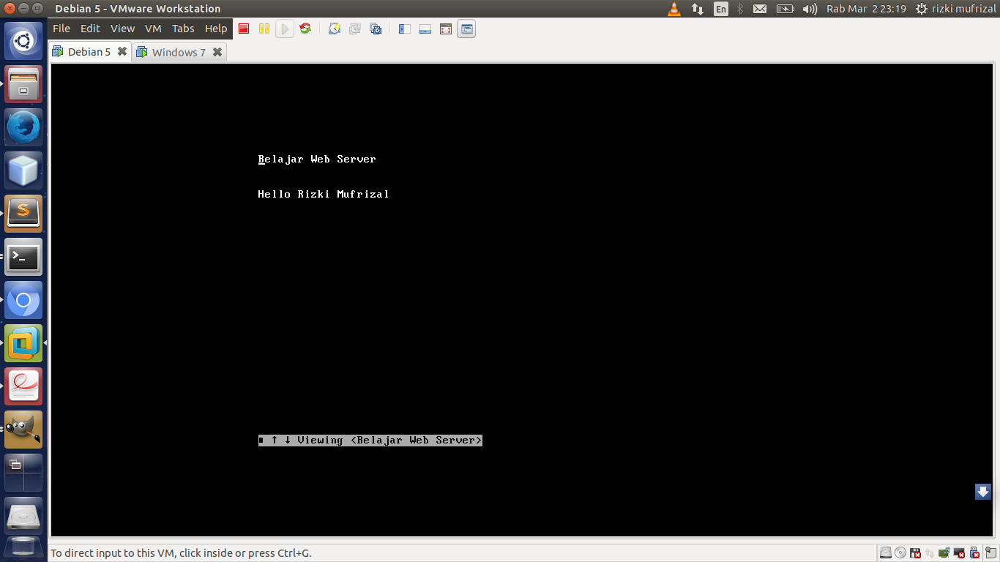

Untuk keluar dari mode silahkan tekan tombol q. Jika menggunakan windows yang telah kita konfigurasikan tadi silahkan buka browser, kemudian akses `www.labti.com` maka akan muncul seperti berikut.

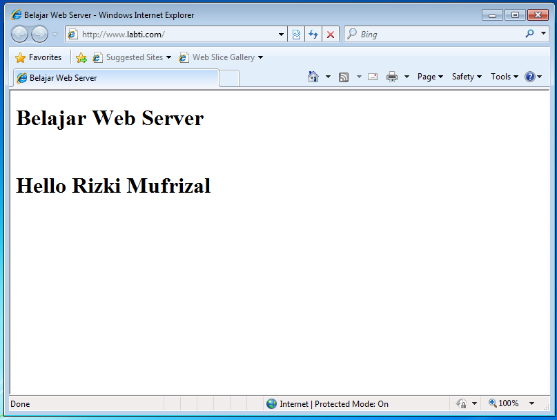

Sekian artikel mengenai instalasi dan konfigurasi dhcp serta web server pada debian server dan terima kasih :).