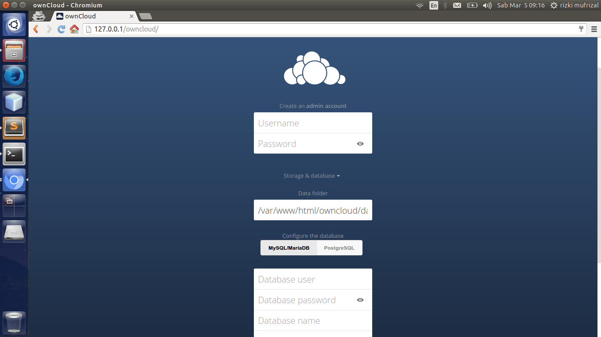
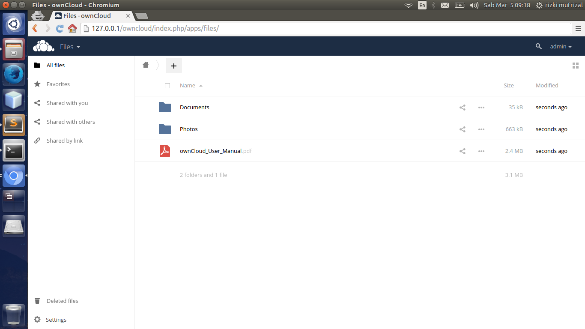
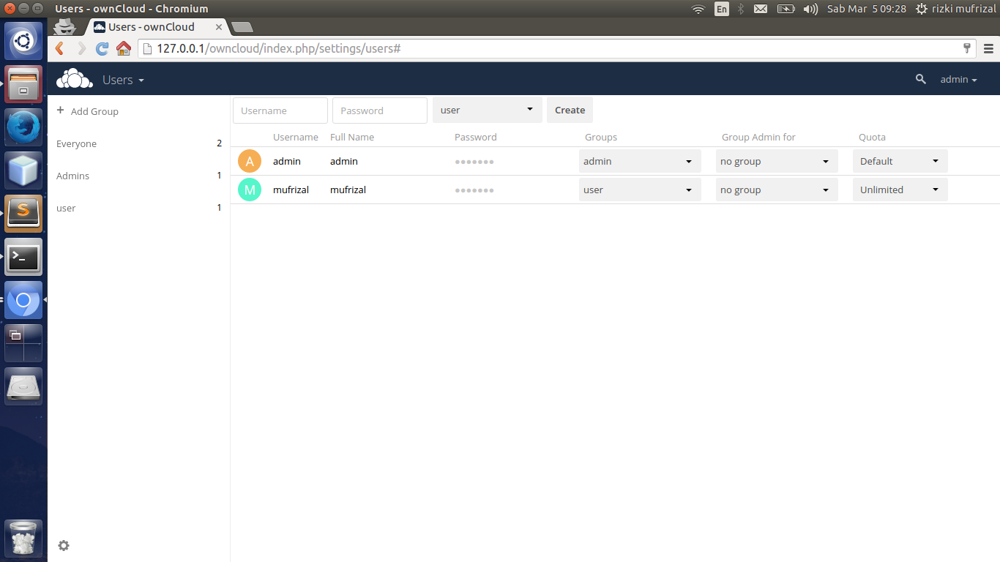
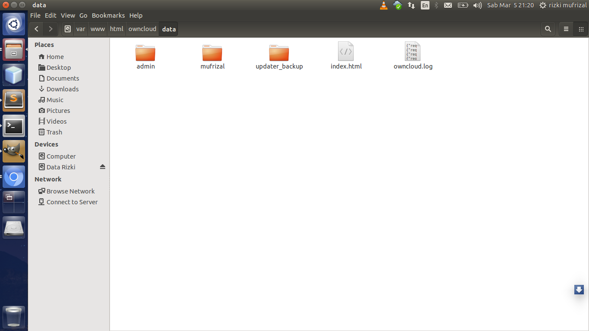
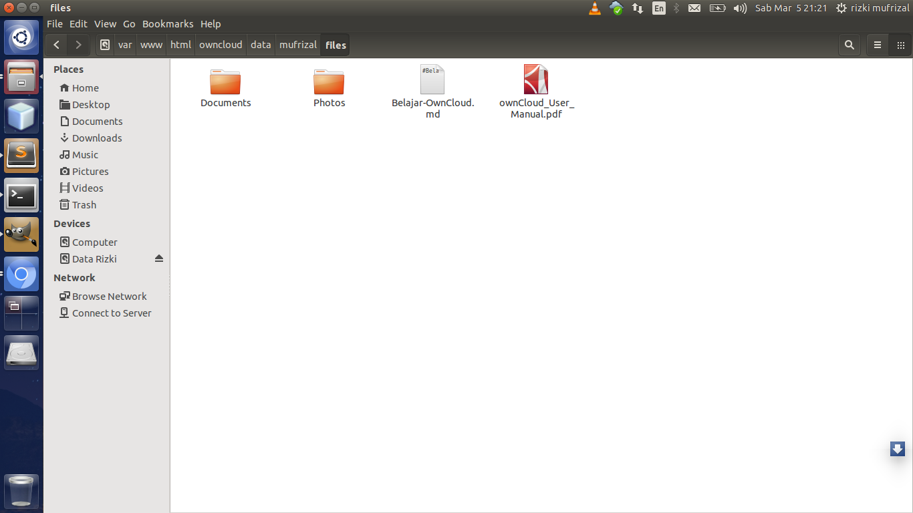
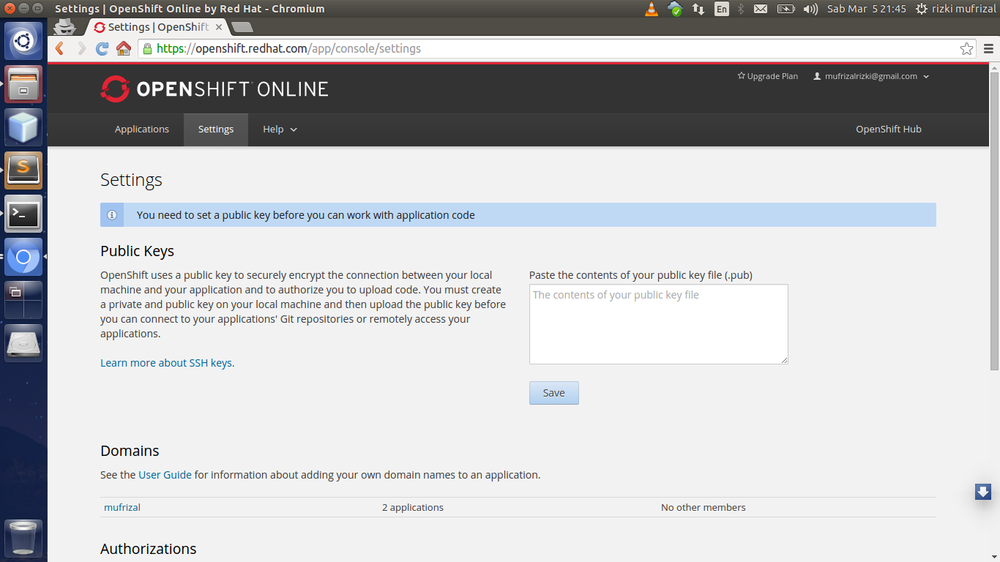
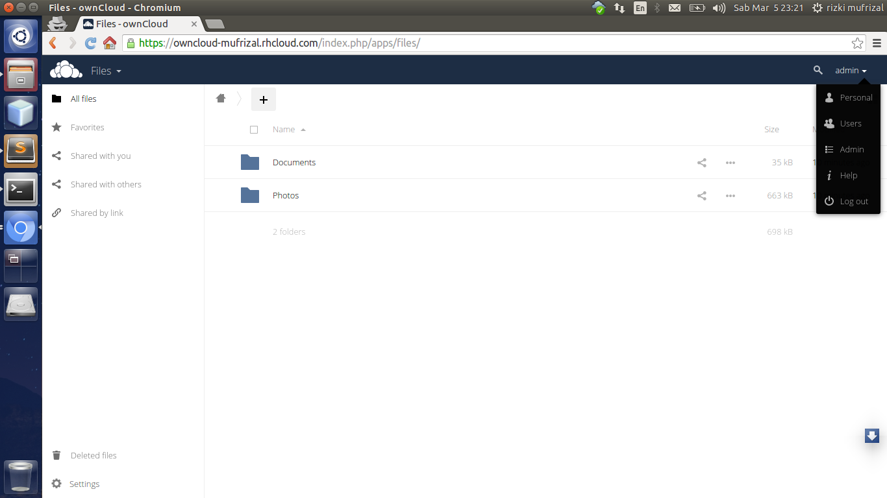
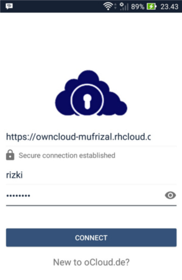

Pada artikel [sebelumnya](http://rizkimufrizal.github.io/heroku-sebagai-komputasi-modern/) penulis telah membahas sedikit mengenai cloud computing. Pada artikel ini, penulis akan membuat cloud storage sendiri dengan owncloud sehingga bisa diakses oleh siapa pun dan dimana pun dengan ketentuan komputer client terhubung dengan 1 jaringan komputer server. Pada artikel ini akan dibahas bagaimana cara instalasi, konfigurasi owncloud pada laptop masing - masing sehingga laptop anda nantinya akan kita gunakan sebagai server. Nah bagaimana jika kita ingin mengakses lewat aplikasi owncloud melalui mobile ? pastinya kita akan menggunakan provider yang support untuk owncloud.

## Apa Itu OwnCloud ?

>>OwnCloud adalah salah satu CMS(Content Management System) untuk layanan cloud storage seperti google drive, dropbox dan owncloud berbasis layanan model IaaS.

Dengan menggunakan owncloud, kita dapat mengatur layanan cloud storage mulai dari user, group user, limited akses, size quota user dan lain sebagainya. Owncloud bisa kita jadikan sebagai salah satu bahan testing untuk cloud computing dikarenakan owncloud termasuk salah satu kategori dari model layanan cloud computing.

## Setup OwnCloud

OwnCloud dibangun dengan menggunakan bahasa pemrograman PHP, bagi yang belum melakukan instalasi php, silahkan lihat di artikel [instalasi perlengkapan php untuk coding php](http://rizkimufrizal.github.io/instalasi-perlengkapan-coding-php/). Owncloud support untuk 2 database yaitu mysql/mariadb dan postgresql, pada artikel ini penulis akan menggunakan database postgresql, bagi yang belum melakukan instalasi postgresql, silahkan lihat artikel di [instalasi dan konfigurasi PostgreSQL pada linux](http://rizkimufrizal.github.io/instalasi-dan-konfigurasi-postgresql/). Silahkan download owncloud di [owncloud](https://owncloud.org/install/), Setelah selesai silahkan extract di dalam folder `/var/www/html` kemudian berikan hak akses dengan perintah.


sudo chmod -R 777 /var/www/html/*


Setelah selesai, selanjutnya kita akan membuat database owncloud di postgresql, silahkan buka terminal lalu jalankan perintah berikut.


createdb -h localhost -U postgres -E utf-8 -O postgres owncloud


Perintah diatas akan membuat sebuah database dengan nama `owncloud`. Tahap selanjutnya silahkan akses owncloud melalui browser pada url `http://127.0.0.1/owncloud/` maka akan muncul gambar seperti berikut.

Silahkan isi form yang telah disediakan berdasarkan konfigurasi yang anda inginkan, disini penulis menggunakan database postgresql. Jika telah selesai, maka akan muncul halaman seperti berikut.

Gambar diatas adalah halaman default admin.

## Membuat User Baru

Secara default, owncloud hanya membuat user untuk admin. Untuk membuat user baru silahkan pilih panel admin, lalu pilih menu `users`. Silahkan tambahkan group baru terlebih dahulu, misalnya grup nya adalah user. Setelah selesai lalu silahkan buatlah user baru untuk dapat megakses cloud storage nya sendiri, misalnya username : mufrizal, password : rizki dan group : user. Setelah selesai, anda juga dapat memilih quota nya, berikut adalah contoh user yang telah dibuat.

Untuk melakukan akses berdasarkan user tersebut, silahkan logout dan login kembali dengan user yang telah anda buat tadi.

## Instalasi Dan Konfigurasi Client Desktop OwnCloud

Owncloud telah menyediakan sebuah aplikasi client berbasis desktop yang dapat kita gunakan untuk mengakses cloud storage yang telah kita buat. Untuk melakukan instalasi client desktop owncloud, silahkan jalankan perintah berikut.


sudo sh -c "echo 'deb http://download.opensuse.org/repositories/isv:/ownCloud:/desktop/Ubuntu_14.04/ /' >> /etc/apt/sources.list.d/owncloud-client.list"


Perintah diatas berfungsi untuk menambah repository ppa yang kita butuhkan untuk instalasi client desktop owncloud. Langkah selanjutnya adalah melakukan import key dengan perintah.


wget http://download.opensuse.org/repositories/isv:ownCloud:desktop/Ubuntu_14.04/Release.key
sudo apt-key add - < Release.key


Setelah selesai, lakukan update dan instal aplikasi dengan perintah berikut.


sudo apt-get update
sudo apt-get install owncloud-client


Silahkan buka aplikasi yang telah diinstall, kemudian isikan server address dengan url berikut.


http://127.0.0.1/owncloud


Setelah selesai, klik next maka akan muncup form input untuk username dan password. Silahkan masukkan username dan password yang telah anda buat. Lalu klik next, jika autentikasinya berhasil maka akan muncul window selanjutnya yang berisi tentang konfigurasi folder owncloud. Secara default, folder owncloud client berada di `/home/nama user/owncloud`. Setelah melakukan semua konfigurasi, kita dapat melakukan upload file. Cara melakukan upload file sama halnya seperti dropbox, yaitu silahkan copy kan file yang ingin kita upload ke dalam folder owncloud yang telah kita konfigurasikan tadi. Penulis melakukan konfigurasi folder owncloud di `/home/rizki/owncloud`, misalnya kita akan melakukan upload file `Belajar-OwnCloud.md`, silahkan buat sebuah file dengan nama `Belajar-OwnCloud.md` lalu tulisakan beberapa baris text, setelah selesai silahkan copy file tersebut ke dalam folder `owncloud` maka secara otomatis aplikasi client desktop owncloud akan melakukan sinkronisasi antara folder `owncloud` dengan folder yang ada di server.

Bagaimana kita tahu bahwa file tersebut telah berhasil di upload atau tidak ? caranya sangatlah mudah yaitu kita dapat melihat file tersebut di dalam folder aplikasi owncloudnya atau aplikasi web owncloudnya. Karena file - file tersebut hanya bisa diakses oleh root maka kita harus menjalankan nautilus dengan hak akses root. Silahkan jalankan perintah berikut untuk menjalakan nautilus dengan root.


sudo nautilus


Setelah selesai, silahkan buka folder `/var/www/html/owncloud`. Di dalam folder tersebut terdapat sebuah folder yaitu namanya adalah folder data. Folder data ini berisi file - file yang telah di upload oleh user, dan file - file tersebut dikelompokkan berdasarkan folder user nya sehingga nama foldernya akan disesuaikan dengan nama user. Berikut adalah gambar - gambar folder tersebut.

Jika ingin melihat filenya ada di dalam folder `nama user owncloud/files`, berikut adalah gambar dari file `Belajar-OwnCloud.md` yang telah kita upload tadi.

## Instalasi Dan Konfigurasi OwnCloud Pada Provider OpenShift

Mengapa kita menggunakan provider ? karena kita ingin agar owncloud dapat diakses melalui internet :D. Salah satu provider yang dapat kita gunakan adalah openshift :). Jika anda ingin menggunakan provider lain, bisa dilihat di [owncloud provider](https://owncloud.org/providers/). Untuk tool client openshift sendiri kita akan menggunakan The OpenShift Client Tools (rhc). Untuk melakukan instalasi rhc, anda diharuskan melakukan instalasi ruby dan git, bagi yang belum melakukan instalasi ruby bisa di lihat pada artikel [instalasi perlengkapan coding ruby](http://rizkimufrizal.github.io/instalasi-perlengkapan-coding-ruby/) dan untuk git bisa dilihat di artikel [belajar git](http://rizkimufrizal.github.io/belajar-git/). Silahkan jalankan perintah berikut untuk instalasi rhc.


gem install rhc


Setelah selesai, lakukan setup account pada komputer anda dengan perintah `rhc setup`. Kemudian isikan username berserta password anda sehingga rhc akan secara otomatis melakukan autentikasi pada pc anda. Tahap selanjutnya adalah kita melakukan konfigurasi ssh key. Ssh key ini juga sama hal nya dengan di github. Jalankan perintah berikut untuk melakukan copy isi dari file id_rsa.pub.


xclip -sel clip < ~/.ssh/id_rsa.pub


Silahkan login ke web openshift, Kemudian pilih menu setting maka akan muncul gambar seperti berikut.

Silahkan paste tepat di dalam text box tersebut kemudian simpan key tersebut. Key ini merupakan public key yang merupakan pasangan dari private key. Private key berada pada komputer kita sendiri, sedangkan public key bisa dibagikan kepada aplikasi yang lain. Fungsinya adalah untuk keamanan data ketika adanya pertukaran data antar 2 komputer, algortima yang digunakan adalah RSA dengan konsep asymmetric algorithm. Tahap selanjutnya jangan lupa membuat domain, dimana domain ini berfungsi untuk mengelompokkan aplikasi yang akan kita buat.

Tahap selanjutnya adalah kita akan melakukan setup software yang dibutuhkan untuk owncloud dan membuat sebuah gear atau aplikasi. Lalu silahkan jalankan perintah berikut.


rhc app create owncloud php-5.4 postgresql-9.2 cron-1.4


Perintah diatas akan membuat sebuah gear atau aplikasi dengan nama owncloud, dimana di dalam gear atau aplikasi tersebut akan diinstall php, database postgresql dan cron. Jika berhasil maka outputnya seperti berikut.


RSA 1024 bit CA certificates are loaded due to old openssl compatibility
Application Options
-------------------
Domain:     mufrizal
Cartridges: php-5.4, postgresql-9.2, cron-1.4
Gear Size:  default
Scaling:    no

Creating application 'owncloud' ... done

  PostgreSQL 9.2 database added.  Please make note of these credentials:

   Root User: adming8aaee8
   Root Password: entGcfXWyG-_
   Database Name: owncloud

Connection URL: postgresql://$OPENSHIFT_POSTGRESQL_DB_HOST:$OPENSHIFT_POSTGRESQL_DB_PORT

To schedule your scripts to run on a periodic basis, add the scripts to 
your application's .openshift/cron/{minutely,hourly,daily,weekly,monthly}/
directories (and commit and redeploy your application).

Example: A script .openshift/cron/hourly/crony added to your application
         will be executed once every hour.
         Similarly, a script .openshift/cron/weekly/chronograph added
         to your application will be executed once every week.

Waiting for your DNS name to be available ... done

Cloning into 'owncloud'...
The authenticity of host 'owncloud-mufrizal.rhcloud.com (54.173.52.16)' can't be established.
RSA key fingerprint is cf:ee:77:cb:0e:fc:02:d7:72:7e:ae:80:c0:90:88:a7.
Are you sure you want to continue connecting (yes/no)? yes
Warning: Permanently added 'owncloud-mufrizal.rhcloud.com,54.173.52.16' (RSA) to the list of known hosts.

Your application 'owncloud' is now available.

  URL:        http://owncloud-mufrizal.rhcloud.com/
  SSH to:     56daf3ba2d5271009000002c@owncloud-mufrizal.rhcloud.com
  Git remote: ssh://56daf3ba2d5271009000002c@owncloud-mufrizal.rhcloud.com/~/git/owncloud.git/
  Cloned to:  /home/rizki/programming/gitclone/owncloud

Run 'rhc show-app owncloud' for more details about your app.


Kemudian silahkan akses folder project yang telah di clone tadi dengan terminal. Kemudian jalankan perintah berikut untuk clone repository dari openshift karena secara default owncloud yang disediakan openshift masih versi lama. 


git remote add upstream -m master git://github.com/openshift/owncloud-openshift-quickstart.git
git pull -s recursive -X theirs upstream master


Setelah selesai, lakukan push kembali dengan perintah.


git push


Jika berhasil maka outputnya seperti berikut.


Counting objects: 18671, done.
Delta compression using up to 4 threads.
Compressing objects: 100% (11694/11694), done.
Writing objects: 100% (18671/18671), 61.18 MiB | 15.00 KiB/s, done.
Total 18671 (delta 6083), reused 18663 (delta 6080)
remote: Stopping PHP 5.4 cartridge (Apache+mod_php)
remote: Waiting for stop to finish
remote: Waiting for stop to finish
remote: Stopping Postgres cartridge
remote: Stopping Cron cartridge
remote: Building git ref 'master', commit 9b06956
remote: Starting pre_build...
remote: Completed pre_build.
remote: Checking .openshift/pear.txt for PEAR dependency...
remote: Starting build...
remote: ownCloud not yet installed...
remote: Downloading https://download.owncloud.org/community/owncloud-8.2.0.tar.bz2...
remote: Verifying md5...
remote: Extracting owncloud-8.2.0.tar.bz2...
remote: Setting current version to 8.2.0...
remote: Completed build.
remote: Preparing build for deployment
remote: Deployment id is a7a899c4
remote: Activating deployment
remote: Starting Postgres cartridge
remote: Postgres started
remote: Starting Cron cartridge
remote: Starting deploy...
remote: Copying to /var/lib/openshift/56daf3ba2d5271009000002c/app-root/data/current...
remote: Linking the instalation with the repo dir...
remote: Completed deploy.
remote: Starting PHP 5.4 cartridge (Apache+mod_php)
remote: Application directory "php/" selected as DocumentRoot
remote: Starting post_deploy...
remote: Requesting index.php to trigger autoconfig...
remote: CLIENT_RESULT: 
remote: CLIENT_RESULT: ownCloud configured successfully.
remote: CLIENT_RESULT: Take note of the default admin credentials:
remote: CLIENT_RESULT: 
remote: CLIENT_RESULT:       Username: admin
remote: CLIENT_RESULT:       Password: piGayRDPVGZ5
remote: CLIENT_RESULT: 
remote: CLIENT_RESULT: Don't forget to change your admin password!
remote: CLIENT_RESULT: 
remote: /var/lib/openshift/56daf3ba2d5271009000002c/app-root/runtime/repo/php /var/lib/openshift/56daf3ba2d5271009000002c
remote: Persisting configuration...
remote: /var/lib/openshift/56daf3ba2d5271009000002c
remote: Completed post_deploy.
remote: -------------------------
remote: Git Post-Receive Result: success
remote: Activation status: success
remote: Deployment completed with status: success
To ssh://56daf3ba2d5271009000002c@owncloud-mufrizal.rhcloud.com/~/git/owncloud.git/
   5e8d216..9b06956  master -> master


Setelah selesai, silahkan akses web nya berdasarkan nama domain anda, berikut adalah contoh nya


http://owncloud-$yourdomain.rhcloud.com


Seperti kita lihat pada task sebelumnya, pada saat push atau deploy ke openshift, owncloud secara otomatis melakukan konfigurasi ke database, konfigurasi ini sendiri sebenarnya telah disediakan pada repository [openshift](https://github.com/openshift/owncloud-openshift-quickstart). Setelah melakukan akses web silahkan login dengan username dan password yang telah digenerate oleh owncloud, username dan password bisa dilihat pada task push ke openshift. Username dan password bisa dilihat pada baris.


remote: CLIENT_RESULT:       Username: admin
remote: CLIENT_RESULT:       Password: piGayRDPVGZ5


Jika berhasil login, maka akan muncul halaman home. Dan tidak ada perbedaan antara owncloud yang telah kita buat di komputer pribadi dengan yang ada di provider, perbedaanya hanyalah akses jaringan melalui internet. Berikut adalah gambar owcloud pada openshift.

## Instalasi Dan Konfigurasi Client Mobile oCloud

Jika sebelumnya kita telah menggunakan client desktop owncloud untuk pc, pada bagian ini kita akan coba menggunakan mobile. Untuk mobile, kita bisa menggunakan OCloud, silahkan cari di playstore. Jika melalui web, aplikasinya bisa dilihat di [play store](https://play.google.com/store/apps/details?id=com.ocloud24.android).

Setelah selesai melakukan instalasi aplikasi tersebut, silahkan anda buat username dan password untuk user baru pada owncloud yang ada di openshift, tujuannya adalah kita ingin melakukan akses user tersebut melalui aplikasi mobile.

Setelah membuat user baru, silahkan buka aplikasi tersebut. Isikan server address dengan url web owncloud anda, lalu masukkan username dan password berdasarkan user yang telah anda buat. Berikut adalah gambar melalui aplikasi mobile ocloud.

Jika berhasil login, maka anda dapat melakukan upload melalui mobile :D. Silahkan upload file melalui aplikasi ocloud, jika telah selesai maka akan muncul file yang telah di upload melalui aplikasi mobile dan anda juga dapat melakukan pengecekan langsung melalui web onwcloud pada openshift. 

Bagaimana agar kita mengetahui bahwa file tersebut benar - benar telah di upload ke server openshift ? caranya yaitu dengan menggunakan akses ssh. Silahkan jalankan perintah berikut untuk akses ssh ke server openshift.


rhc ssh -a owncloud


Maka secara otomatis anda masuk ke terminal server openshift. Kemudian jalankan perintah berikut untuk masuk ke folder root project.


cd app-root/


Setelah selesai, silahkan jalankan lagi perintah berikut untuk akses folder data.


cd data/


Jika kita gunakan perintah `ls` maka secara otomatis terminal akan menampilkan folder - folder user. Dimana folder - folder user ini berisi file yang telah di upload. Disini penulis menggunakan user rizki, maka penulis mengakses folder `rizki` dan folder `files` dengan perintah.


cd rizki/files/


Kemudian tampilkan seluruh file yang ada di dalam folder tersebut dengan perintah `ls` maka hasilnya adalah seperti berikut.


[owncloud-mufrizal.rhcloud.com files]\> ls
Documents  Photos  Screenshot_2016-03-05-23-43-11.jpg


Bisa kita lihat bahwa file Screenshot_2016-03-05-23-43-11.jpg telah berhasil di upload ke server openshift :D. Sekian artikel mengenai belajar membuat cloud storage dengan owncloud dan terima kasih :).