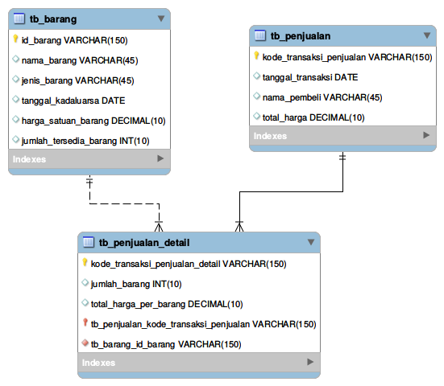
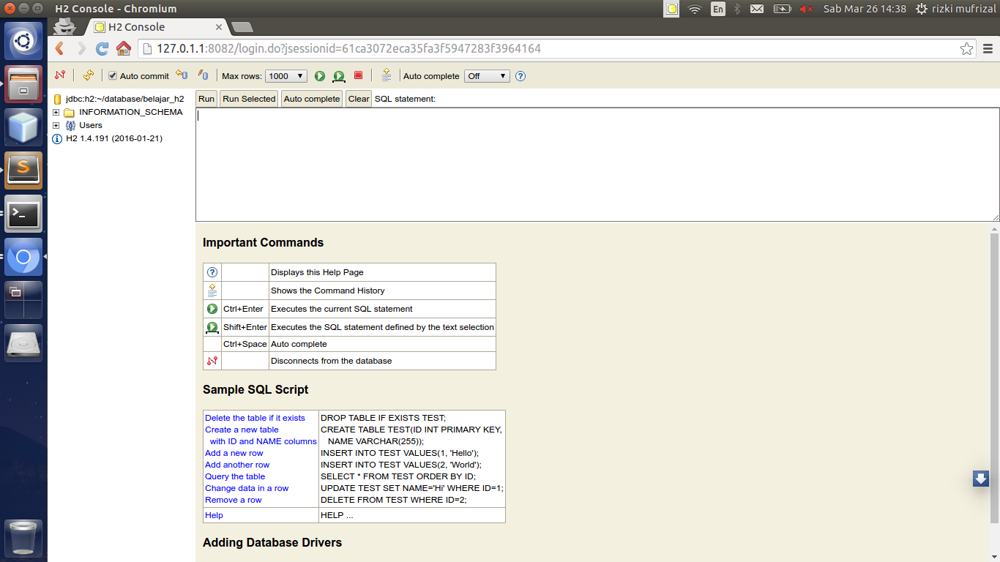
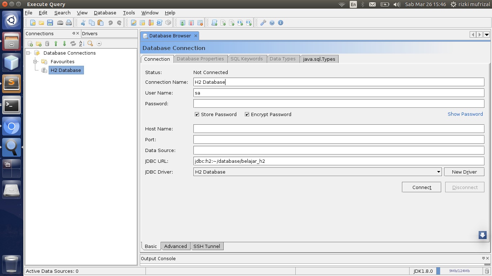
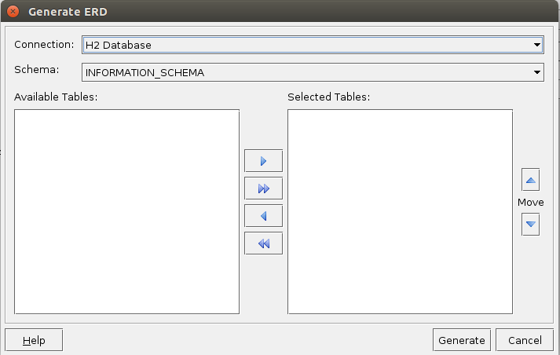
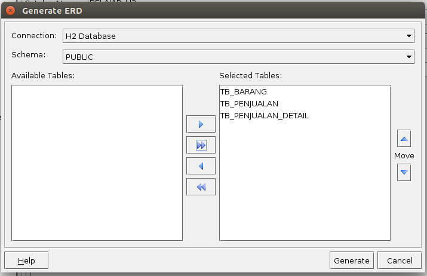
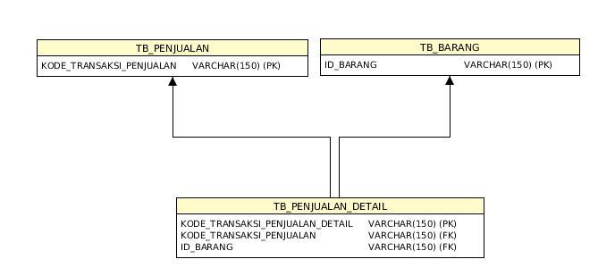

Artikel - artikel yang lalu, penulis membuat tulisan mengenai database PostgreSQL, akan tetapi pada penulisan ini kita akan mencoba menggunakan database h2 :).

## Apa Itu Foreign Key ?

>>Foreign Key adalah sebuah column atau field yang berfungsi sebagai kunci tamu dimana kunci ini akan kita gunakan untuk relasi antar tabel.

Jika anda telah terbiasa dengan database yang memiliki arsitektur RDBMS maka anda tidak asing lagi dengan namanya primary key. Setiap tabel di dalam database wajib memiliki primary key, dikarenakan primary key ini berfungsi sebagai kunci unik untuk membedakan antara 1 row atau record dengan record yang lain.

Apa hubungan antara primary key dan foreign key ? biasanya primary key kita gunakan sebagai kata kunci, sedangkan foreign key biasanya diambil dari primary key sebuah tabel, contoh nya seperti berikut.

|    NPM    | Nama Mahasiswa | Kelas |
|:----------|:---------------|:------|
|58412085   | Rizki Mufrizal | 4IA04 |
|12345678   | Mufrizal       | 4IA00 |
{: rules="groups"}

dan berikut adalah tabel nilai uts.

| ID Nilai | UTS | UAS |    NPM   |
|:---------|:----|:----|:---------:
| N01      | 100 | 100 | 58412085 |
| N02      | 90  | 90  | 12345678 |
| N03      | 80  | 80  | 58412085 |
{: rules="groups"}

Dari kedua tabel diatas dapat dilihat adanya relasi antara tabel mahasiswa dan tabel nilai. Pada tabel mahasiswa terdapat 1 primary key yaitu npm sedangkan pada tabel nilai kita memiliki 1 primary key juga yaitu id nilai. Sesuai dengan pembahasan kita yaitu foreign key, pada kedua tabel diatas terdapat 1 foreign key. Fireign key tersebut berada pada tabel nilai yaitu npm, dimana npm ini adalah primary key yang terdapat pada tabel mahasiswa.

## Bagaimana Cara Menentukan Foreign Key ?

Kebiasaan seorang mahasiswa bingung bagaimana cara menetukan relasi antar tabel, bahkan ada beberapa mahasiswa yang secara langsung membuat aplikasi tanpa membuat normalisasi dan ERD, padahal normalisasi dan ERD adalah sesuatu yang wajib dibuat. Pada artikel ini, kita akan menggunakan cara cepat untuk menentukan relasi antar tabel. Misalkan penulis mempunyai data seperti berikut.

| NB | JB | TK | HSB | JBT | TH | TT | NP | JBD | THPB |
|:------------|:-------------|:-------------------|:--------------------|:-----------------------|:------------|:------------------|:-------------|:---------------------|:-----------------------|
|Rinso|Cair|01-01-2016|Rp 1000|10|Rp 5000|02-02-2016|Rizki|5|Rp 5000|
|Baju|Padat|01-02-2016|Rp 2000|50|Rp 10000|02-02-2016|Rizki|5|Rp 10000|
|Rinso|Cair|01-01-2016|Rp 1000|10|Rp 10000|02-02-2016|Mufrizal|10|Rp 10000|
{: rules="groups"}

Ket :

* NB : Nama Barang
* JB : Jenis Barang
* TK : Tanggal Kadaluarsa
* TH : Total Harga
* TT : Tanggal Transaksi
* NP : Nama Pembeli
* HSB : Harga Satuan Barang
* JBT : Jumlah Barang Tersedia
* JBD : Jumlah Barang Dibeli
* THPB : Total Harga Per Barang

Data diatas merupakan data mentah atau bisa dibilang data diatas masih terdapat duplicate. Biar gampang, silahkan copy data tersebut ke libre office atau excel. Jika sudah kita akan membedakan data - data tersebut. Dari tabel diatas, bisa dilihat bahwa terdapat terdapat column - column yang doubel seperti nama barang, jenis barang, tanggal kadaluarsa, harga satuan barang dan jumlah barang yang tersedia. Column - column tersebut merupakan data barang, dimana data tersebut kita kelompokkan menjadi satu tabel, maka tabel barang akan menjadi seperti berikut.

| ID Barang | Nama Barang | Jenis Barang | Tanggal Kadaluarsa | Harga Satuan Barang | Jumlah Barang Tersedia |
|:----------|:------------|:-------------|:-------------------|:--------------------|:----------------------------|
| B01 | Rinso | Cair | 01-01-2016 | Rp 1000 | 10 |
| B02 | Baju | Padat | 01-02-2016 | Rp 2000 | 50 |
{: rules="groups"}

Pada tabel diatas kita menambahkan satu column yaitu id barang, id barang ditambahkan karena pada tabel sebelum nya belum terdapat primary key. Setelah selesai, langkah selanjutnya kita akan melakukan spesifikasi untuk tabel penjualan, berikut adalah bentuk tabel nya.

| Kode Transaksi Penjualan | Tanggal Transaksi | Nama Pembeli | Total Harga |
|:-------------------------|:------------------|:-------------|:------------|
| T01 | 02-02-2016 | Rizki | Rp 5000 |
| T02 | 02-02-2016 | Mufrizal | Rp 10000 |
{: rules="groups"}

Lagi - lagi penulis menambahkan sebuah column kode transaksi penjualan sebagai primary key. Tabel penjualan ini akan berisi mengenai data - data penjualan dalam sekali transaksi, akan tetapi di dalam sekali transaksi terdapat beberapa barang yang berbeda sehingga kita akan membuat tabel penjualan detail. Tabel penjualan detail ini akan memiliki relasi ke tabel penjualan dan tabel barang, dimana relasi tabel penjualan ke tabel penjualan detail memiliki relasi one to many sama seperti tabel barang dan tabel penjualan detail sehingga seluruh data akan konsisten dan mengurangi kerangkapan data. Berikut adalah tabel penjualan detail.

| Kode Transaksi Penjualan Detail | Jumlah Barang | Total Harga Per Barang | Kode Transaksi Penjualan | ID Barang |
|:--------------------------------|:--------------|:-----------------------|:-------------------------|:-----------|
| TD01 | 5 | Rp 5000 | T01 | B01 |
| TD02 | 5 | Rp 10000 | T01 | B02 |
| TD03 | 10 | Rp 10000 | T02 | B01 |
{: rules="groups"}

Dari tabel diatas terdapat 3 column yang penulis tambahkan yaitu column kode transaksi penjualan detail sebagai primary key, kode transaksi penjualan sebagai foreign key dan id barang sebagai foreign key juga. Berikut adalah tampilan ERD nya seperti berikut.

Dari ERD diatas penulis membuat 2 garis yang berbeda yaitu ada yang tersambung dan ada garis putus - putus. Perbedaan nya adalah garis tersambung berfungsi sebagai parent child sehingga apabila orang tua nya atau tabel master dihapus maka tabel anak nya atau child nya juga akan dihapus yang sering disebut dengan `identifying relationship`. Berbeda dengan garis putus - putus, jika master tabel dihapus maka child tabel tidak akan dihapus.

Dari tabel diatas kita bisa melihat bahwa jika tabel penjualan dihapus maka secara otomatis si tabel penjualan detail akan dihapus, berbeda dengan tabel barang, jika tabel barang dihapus maka tabel penjualan detail tidak dihapus.

## Implementasi Pada H2 Database

>>[H2 Database](http://www.h2database.com/html/main.html) adalah salah satu dbms yang bisa kita gunakan sebagai database server maupun embedded database dan ditulis dengan menggunakan bahasa pemrograman java.

Pada tutorial ini, kita akan menggunakan h2 database untuk membuat relasi dengan menggunakan foreign key. Silahkan download h2 database di [h2 database](http://www.h2database.com/html/download.html). Penulis mendownload file binary yang ada pada bagian Maven (Binary, Javadoc, and Source), kemudian jalankan perintah berikut.


java -jar h2-1.4.191.jar


Maka secara otomatis browser akan terbuka dan melakukan akses web h2 database yang akan kita gunakan. Kemudian ubah jdbc url seperti berikut


jdbc:h2:~/database/belajar_h2


Kemudian klik connect, secara otomatis h2 database akan membuat database dengan nama belajar_h2.mv.db di dalam folder database. Tampilan web h2 database yang akan tampil seperti berikut.

Langkah selanjutnya, untuk membuat tabel barang, silahkan jalankan perintah berikut pada web h2 database.


CREATE TABLE IF NOT EXISTS tb_barang(
    id_barang VARCHAR(150) NOT NULL PRIMARY KEY,
    nama_barang VARCHAR(45) NOT NULL,
    jenis_barang VARCHAR(45) NOT NULL,
    tanggal_kadaluarsa DATE NOT NULL,
    harga_satuan_barang DECIMAL(10) NOT NULL,
    jumlah_tersedia_barang INT(10) NOT NULL
);


Kemudian untuk tabel penjualan silahkan jalankan perintah berikut.


CREATE TABLE IF NOT EXISTS tb_penjualan(
    kode_transaksi_penjualan VARCHAR(150) NOT NULL PRIMARY KEY,
    tanggal_transaksi DATE NOT NULL,
    nama_pembeli VARCHAR(45) NOT NULL,
    total_harga DECIMAL(10) NOT NULL
);


Langkah selanjutnya adalah membuat tabel penjualan detail, silahkan jalankan perintah berikut.


CREATE TABLE IF NOT EXISTS tb_penjualan_detail(
    kode_transaksi_penjualan_detail VARCHAR(150) NOT NULL PRIMARY KEY,
    jumlah_barang INT(10) NOT NULL,
    total_harga_per_barang DECIMAL(10) NOT NULL,
    kode_transaksi_penjualan VARCHAR(150) NOT NULL,
    id_barang VARCHAR(150) NOT NULL,
    FOREIGN KEY(kode_transaksi_penjualan) REFERENCES tb_penjualan(kode_transaksi_penjualan),
    FOREIGN KEY(id_barang) REFERENCES tb_barang(id_barang)
);


Untuk dapat mengenerate ERD dari tabel yang telah dibuat maka kita akan menggunakan [Execute Query](http://executequery.org/index.php). Silahkan download aplikasi tersebut, jika sudah langsung buka aplikasi tersebut. Silahkan lakukan konfigurasi driver h2 database, setelah selesai, lakukan konfigurasi seperti berikut.

Lalu klik connect, silahkan klik nama databasenya kemudian pilih menu database dan pilih generate ERD lalu pilih map existing database maka akan muncul seperti berikut.

Kemudian pilih schema menjadi public, lalu pilih semua tabel dan pilih select all, maka outputnya akan seperti berikut.

Setelah selesai, silahkan klik generate. berikut adalah output yang dihasilkan.

Sekian artikel mengenai belajar membuat foreign key pada h2 database dan terima kasih :).