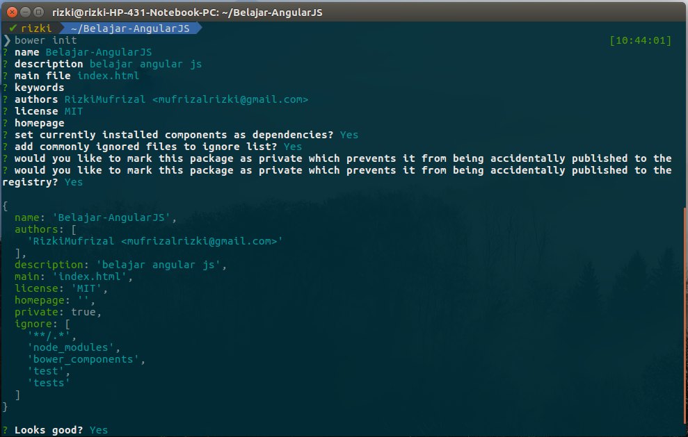
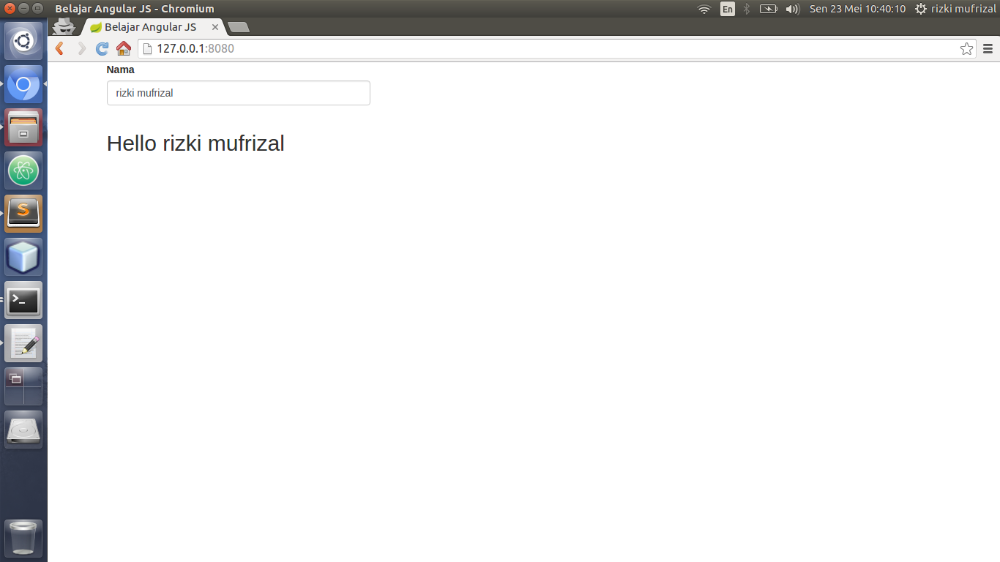
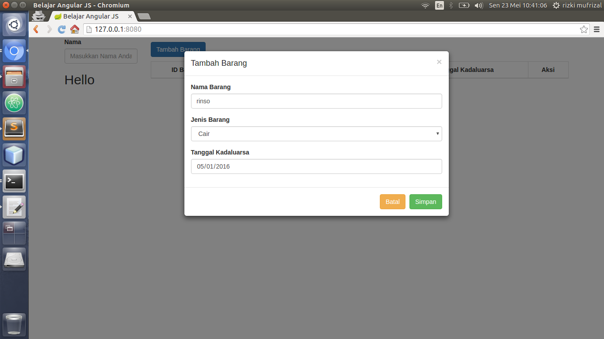
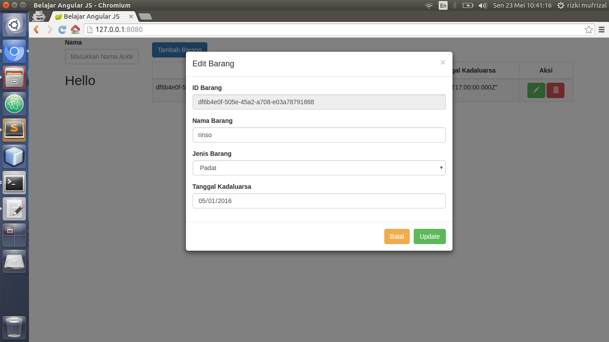
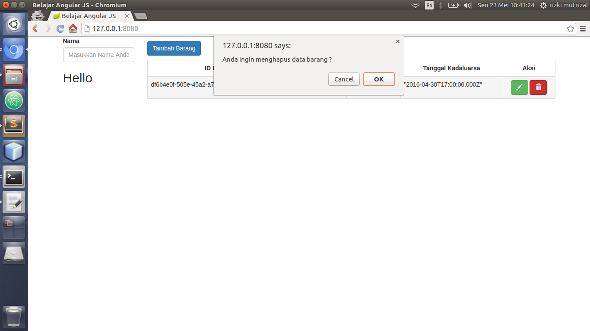

## Apa Itu Angular JS ?

>>Angular JS adalah salah satu framework javascript yang mengusungkan pola MV* dan dikembangkan oleh google.

Angular JS biasanya digunakan sebagai framework di bagian front end suatu website. Salah satu kelebihan dari angular js ini adalah data binding sehingga antara model dan controller datanya akan dilakukan sinkronisasi secara asynchronous. Kelebihan angular yang lain adalah angular dapat melakukan routing, membuat sebuah directive dan biasanya digunakan sebagai client untuk sebuah web service.

## Membuat Hello Word Dengan Angular JS

Untuk mempermudah pemahaman, kita akan langsung mencoba membuat hello word dengan menggunakan angular js :D. Untuk mendownload kebutuhan dependency angular, penulis akan menggunakan [bower](http://bower.io/), karena menggunakan bower maka anda diwajibkan untuk melakukan instalasi node js. Bagi anda yang belum melakukan instalasi node js, silahkan lihat di [Instalasi Perlengkapan Coding Node JS](https://rizkimufrizal.github.io/instalasi-perlengkapan-coding-node-js/). Silahkan buat sebuah folder dengan nama `Belajar-AngularJS`, kemudian akses foder tersebut dengan terminal. Kemudian jalankan perintah berikut.


bower init


Kemudian silahkan isi konfigurasinya seperti berikut.

Lalu tahap selanjutnya, kita akan mendownload dependency library yang diperlukan, silahkan jalankan perintah berikut.


bower install bootstrap angular --save


perintah diatas akan mendownload dependency bootstrap untuk tampilan web nya dan angular js. Setelah selesai, silahkan buat sebuah file `index.html` lalu isikan codingan seperti berikut.



<!DOCTYPE html>
<html lang="en" ng-app>
    <head>
        <meta charset="utf-8">
        <meta http-equiv="X-UA-Compatible" content="IE=edge">
        <meta name="viewport" content="width=device-width, initial-scale=1">
        <title>Belajar Angular JS</title>

        <!-- Bootstrap -->
        <link href="./bower_components/bootstrap/dist/css/bootstrap.min.css" rel="stylesheet" type="text/css"/>

        <!-- HTML5 Shim and Respond.js IE8 support of HTML5 elements and media queries -->
        <!-- WARNING: Respond.js doesn't work if you view the page via file:// -->
        <!--[if lt IE 9]>   <![endif]-->
    </head>
    <body>

        

            

                

                    

                        <label>Nama</label>
                        <input type="text" class="form-control" placeholder="Masukkan Nama Anda" ng-model="nama"/>
                    

                

            

            <h2>Hello {{nama}}</h2>
        

        
        
        
    </body>
</html>



Berikut adalah penjelasan mengenai codingan diatas.

* `ng-app` berfungsi untuk mendeklarasikan bahwa file html ini akan dihandle oleh angular js.
* `ng-model` berfungsi sebagai model yang dapat menampung data, nantinya data ini akan ditampilkan.
*  {{nama}}  berfungsi untuk menampilkan data, di dalam angular, kita akan menggunakan tanda  {{}}  untuk menampilkan data

Nah setelah selesai, selanjutnya kita akan menjalankan file `index.html`, untuk menjalankannya, kita akan menggunakan plugin [http-server](https://github.com/indexzero/http-server) dari node js :D. Bagi anda yang masing bingung dengan node js, silahkan simak di artikel [instalasi perlengkapan node js](https://rizkimufrizal.github.io/instalasi-perlengkapan-coding-node-js/). Untuk melakukan instalasi http-server, silahkan jalankan perintah berikut.


 npm install -g http-server


Setelah selesai, jalankan perintah berikut pada root project untuk menjalankan http-server.


http-server


Jika berhasil, maka di terminal akan muncul output seperti berikut.


Starting up http-server, serving ./
Available on:
  http://127.0.0.1:8080
Hit CTRL-C to stop the server


Kemudian silahkan akses `http://127.0.0.1:8080` pada browser anda.

## Membuat CRUD Sederhana Dengan Angular JS

Setelah selesai membuat hello word dengan angular js, tahap selanjutnya kita akan membuat fungsi crud dengan menggunakan angular. Silahkan ubah file `index.html` seperti berikut.



<!DOCTYPE html>
<html lang="en" ng-app="Belajar-AngularJS">
    <head>
        <meta charset="utf-8">
        <meta http-equiv="X-UA-Compatible" content="IE=edge">
        <meta name="viewport" content="width=device-width, initial-scale=1">
        <title>Belajar Angular JS</title>

        <!-- Bootstrap -->
        <link href="./bower_components/bootstrap/dist/css/bootstrap.min.css" rel="stylesheet" type="text/css"/>

        <!-- HTML5 Shim and Respond.js IE8 support of HTML5 elements and media queries -->
        <!-- WARNING: Respond.js doesn't work if you view the page via file:// -->
        <!--[if lt IE 9]>   <![endif]-->
    </head>
    <body ng-controller="AppController">

        

            

                

                    

                        <label>Nama</label>
                        <input type="text" class="form-control" placeholder="Masukkan Nama Anda" ng-model="nama"/>
                    

                    <h2>Hello {{nama}}</h2>
                

                

                    

                    <button ng-click="tambahBarang()" type="button" class="btn btn-primary" data-toggle="modal" data-target="#modal">
                        Tambah Barang
                    </button>

                    

                    <table class="table table-striped table-bordered table-hover">
                        <thead>
                            <tr>
                                <th class="text-center">ID Barang</th>
                                <th class="text-center">Nama Barang</th>
                                <th class="text-center">Jenis Barang</th>
                                <th class="text-center">Tanggal Kadaluarsa</th>
                                <th class="text-center">Aksi</th>
                            </tr>
                        </thead>
                        <tbody>
                            <tr ng-repeat="b in dataBarang">
                                <td>{{b.idBarang}}</td>
                                <td>{{b.namaBarang}}</td>
                                <td>{{b.jenisBarang}}</td>
                                <td>{{b.tanggalKadaluarsa}}</td>
                                <td class="text-center">
                                    <button type="button" class="btn btn-success" data-toggle="modal" data-target="#modal" ng-click="editBarang(b)">
                                        <i class="glyphicon glyphicon-pencil"></i>
                                    </button>
                                    <button type="button" class="btn btn-danger" ng-click="hapusBarang(b)">
                                        <i class="glyphicon glyphicon-trash"></i>
                                    </button>
                                </td>
                            </tr>
                        </tbody>
                    </table>
                

            

        

        <!-- Modal -->
        

            

                

                    

                        <button type="button" class="close" data-dismiss="modal" aria-label="Close">
                            &times;
                        </button>
                        <h4 ng-hide="enable" class="modal-title">Tambah Barang</h4>
                        <h4 ng-show="enable" class="modal-title">Edit Barang</h4>
                    

                    

                        <form>
                            

                                <label>ID Barang</label>
                                <input type="text" class="form-control" ng-model="inputDataBarang.idBarang" disabled/>
                            

                            

                                <label>Nama Barang</label>
                                <input type="text" class="form-control" placeholder="Masukkan Nama Barang" ng-model="inputDataBarang.namaBarang"/>
                            

                            

                                <label>Jenis Barang</label>
                                <select class="form-control" ng-model="inputDataBarang.jenisBarang">
                                    <option value="" disabled>Pilih Jenis Barang</option>
                                    <option value="gas">Gas</option>
                                    <option value="padat">Padat</option>
                                    <option value="cair">Cair</option>
                                </select>
                            

                            

                                <label>Tanggal Kadaluarsa</label>
                                <input type="date" class="form-control" placeholder="Masukkan Tanggal Kadaluarsa" ng-model="inputDataBarang.tanggalKadaluarsa"/>
                            

                        </form>
                    

                    

                        <button type="button" class="btn btn-warning" data-dismiss="modal">Batal</button>
                        <button ng-hide="enable" type="button" class="btn btn-success" data-dismiss="modal" ng-click="simpanBarang(inputDataBarang)">Simpan</button>
                        <button ng-show="enable" type="button" class="btn btn-success" data-dismiss="modal" ng-click="updateBarang(inputDataBarang)">Update</button>
                    

                

            

        

        
        
        
        
    </body>
</html>



Codingan diatas berfungsi untuk melakukan proses crud dimana untuk proses memasukkan data, kita hanya menggunakan fungsi modal dari bootstrap.

Kemudian silahkan buat sebuah file `app.js` kemudian isikan codingan seperti berikut.


'use strict';

angular.module('Belajar-AngularJS', [])
  .controller('AppController', ['$scope', function($scope) {

    $scope.dataBarang = [];
    $scope.inputDataBarang = {};

    function generateUUID() {
      var d = new Date().getTime();
      if (window.performance && typeof window.performance.now === "function") {
        d += performance.now();
      }
      var uuid = 'xxxxxxxx-xxxx-4xxx-yxxx-xxxxxxxxxxxx'.replace(/[xy]/g, function(c) {
        var r = (d + Math.random() * 16) % 16 | 0;
        d = Math.floor(d / 16);
        return (c == 'x' ? r : (r & 0x3 | 0x8)).toString(16);
      });
      return uuid;
    }

    $scope.tambahBarang = function() {
      $scope.enable = false;
      $scope.inputDataBarang.idBarang = '';
      $scope.inputDataBarang.namaBarang = '';
      $scope.inputDataBarang.jenisBarang = '';
      $scope.inputDataBarang.tanggalKadaluarsa = '';
    };

    $scope.simpanBarang = function(barang) {
      $scope.dataBarang.push({
        'idBarang': generateUUID(),
        'namaBarang': barang.namaBarang,
        'jenisBarang': barang.jenisBarang,
        'tanggalKadaluarsa': barang.tanggalKadaluarsa
      });
    };

    $scope.editBarang = function(barang) {
      $scope.enable = true;
      $scope.index = $scope.dataBarang.indexOf(barang);
      $scope.inputDataBarang.idBarang = barang.idBarang;
      $scope.inputDataBarang.namaBarang = barang.namaBarang;
      $scope.inputDataBarang.jenisBarang = barang.jenisBarang;
      $scope.inputDataBarang.tanggalKadaluarsa = barang.tanggalKadaluarsa;
    };

    $scope.updateBarang = function(barang) {
      $scope.dataBarang[$scope.index].idBarang = barang.idBarang;
      $scope.dataBarang[$scope.index].namaBarang = barang.namaBarang;
      $scope.dataBarang[$scope.index].jenisBarang = barang.jenisBarang;
      $scope.dataBarang[$scope.index].tanggalKadaluarsa = barang.tanggalKadaluarsa;
    };

    $scope.hapusBarang = function(barang) {
      var result = confirm('Anda ingin menghapus data barang ?');
      if (result) {
        $scope.index = $scope.dataBarang.indexOf(barang);
        $scope.dataBarang.splice($scope.index, 1);
      }
    }

  }]);


Codingan diatas berfungsi untuk proses crud pada bagian angular js. Function generateUUID berfungsi untuk melakukan generate id barang secara random. Jika telah selesai, silahkan jalankan file `index.html`, jika berhasil maka akan muncul output seperti berikut.

output untuk proses insert.

output untuk proses select.

output untuk proses update

output untuk proses delete

Sekian tutorial belajar angular js dan Terima kasih :). Untuk source code lengkap, penulis publish di [Belajar Angular JS](https://github.com/RizkiMufrizal/Belajar-AngularJS).