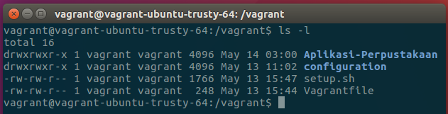
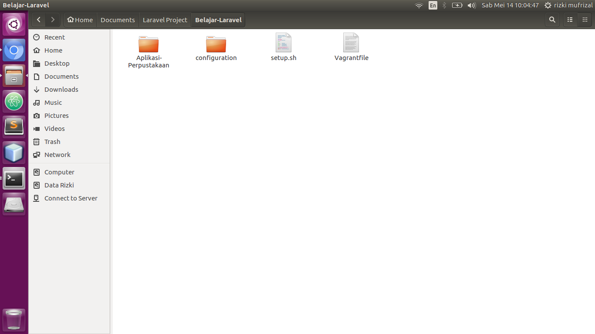
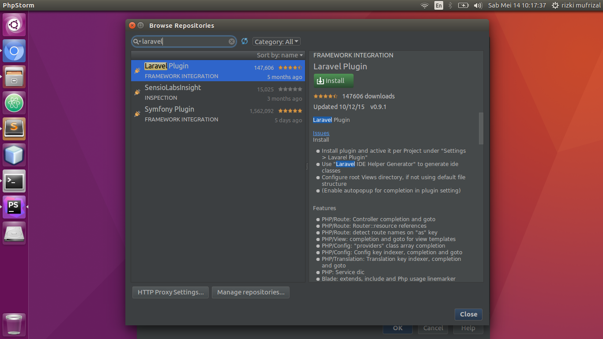
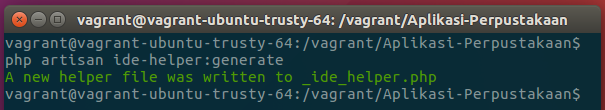
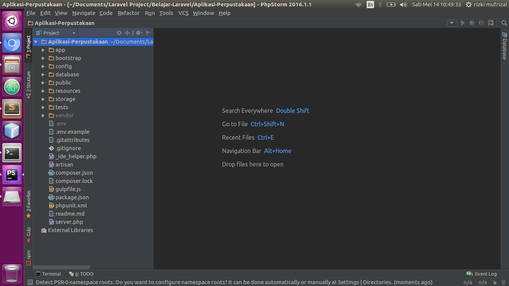

## Apa Itu Laravel ?

>>[Laravel](https://laravel.com/) adalah framework berbasis PHP yang open source, menggunakan konsep model–view–controller (MVC). Laravel berada dibawah lisensi MIT.

Beberapa tahun yang lalu, framework laravel tidak begitu terkenal di dalam dunia pemrograman php, akan tetapi dengan perkembangan teknologi tidak dapat dipungkiri sehingga framework laravel berkembang begitu pesat. Terdapat banyak kelebihan di dalam framework laravel salah satu nya adalah memungkinkan kita menggunakan konsep orm, dimana di dalam laravel biasanya kita menggunakan eloquent orm untuk mengabstraksikan antara model object dengan database.

Singkat cerita, penulis ingin belajar mengenai framework laravel, biasanya penulis menggunakan framework [codeigniter](https://www.codeigniter.com/) untuk membuat aplikasi. Framework laravel merupakan framework yang telah banyak digunakan untuk aplikasi production, dan sangat dihandalkan untuk urusan keamanan sebuah website. Jika dilihat dari case study, framework laravel merupakan framework yang bisa dikatakan lumayan lama jika ingin anda pelajari dikarenakan berbagai konfigurasi dan pemahaman yang harus anda kuasai. Pada artikel ini, penulis akan membagi beberapa bagian dikarenakan artikel akan sangat panjang jika membahas laravel hanya pada 1 bagian artikel saja.

## Setup Project

Langkah yang pertama kali kita lakukan adalah melakukan setup project. Untuk mempermudah tahap development, kita akan menggunakan beberapa tool berikut diantaranya adalah

1. Vagrant, bagi yang belum mengerti apa itu vagrant, silahkan lihat di artikel [belajar vagrant](https://rizkimufrizal.github.io/belajar-vagrant/).
2. [PhpStorm](https://www.jetbrains.com/phpstorm/) merupakan IDE untuk bahasa pemrograman php

sedangkan tool yang lain seperti composer, hhvm, nginx dan lain sebagainya akan kita lakukan konfigurasi pada vagrant.

### Keterangan

Untuk mempermudah development, silahkan lakukan instalasi php dan tool lain nya di komputer anda karena IDE PhpStorm memerlukan interpreter php. Bagi yang belum melakukan instalasi php bisa dilihat di artikel [instalasi perlengkapan coding php](https://rizkimufrizal.github.io/instalasi-perlengkapan-coding-php/).

### Membuat Konfigurasi Vagrant

Silahkan buat sebuah folder `Belajar-Laravel`, kemudian akses folder tersebut dengan menggunakan terminal. Lalu kita akan melakukan inisialisasi vagrant dengan perintah.


vagrant init


maka akan dibentuk sebuah file yaitu `Vagrantfile`, silahkan buka file tersebut kemudian ubah seperti berikut.


Vagrant.configure(2) do |config|
  config.vm.box = 'ubuntu/trusty64'
  config.vm.provider 'virtualbox' do |v|
    v.memory = 1024
  end
  config.vm.provision 'shell', path: 'setup.sh'
  config.vm.network 'forwarded_port', guest: 80, host: 8080
end


kemudian silahkan buat sebuah file dengan nama `setup.sh` untuk konfigurasi provisioning, kemudian isikan codingan shell seperti berikut.


#!/bin/bash

echo "proses provisioning"

echo "konfigurasi sources dan environment"
cp /vagrant/configuration/sources.list /etc/apt/sources.list
cp /vagrant/configuration/environment /etc/environment

echo "Tambah Repo Git"
sudo add-apt-repository -y ppa:git-core/ppa

echo "Tambah Repo Nginx"
add-apt-repository -y ppa:nginx/stable

echo "Tambah Repo Mariadb"
apt-get install software-properties-common
apt-key adv --recv-keys --keyserver hkp://keyserver.ubuntu.com:80 0xcbcb082a1bb943db
add-apt-repository 'deb [arch=amd64,i386] http://mariadb.biz.net.id/repo/10.1/ubuntu trusty main'

echo "Tambah Repo HHVM"
apt-key adv --recv-keys --keyserver hkp://keyserver.ubuntu.com:80 0x5a16e7281be7a449
add-apt-repository "deb http://dl.hhvm.com/ubuntu $(lsb_release -sc) main"

apt-get update
apt-get upgrade -y
apt-get dist-upgrade -y

echo "Konfigurasi Mariadb"
apt install -y debconf-utils
echo mariadb-server-10.1 mysql-server/root_password password root | debconf-set-selections
echo mariadb-server-10.1 mysql-server/root_password_again password root | debconf-set-selections

apt-get install -y git nginx mariadb-server mariadb-client hhvm

echo "Konfigurasi Virtual Host Nginx"
cp /vagrant/configuration/nginx-vhost /etc/nginx/sites-available/belajarlaravel
ln -s /etc/nginx/sites-available/belajarlaravel /etc/nginx/sites-enabled/
rm /etc/nginx/sites-enabled/default
service nginx restart

echo "Konfigurasi HHVM"
/usr/share/hhvm/install_fastcgi.sh
/usr/bin/update-alternatives --install /usr/bin/php php /usr/bin/hhvm 60

echo "Install Composer"
curl -sS https://getcomposer.org/installer | php
mv /home/vagrant/composer.phar /usr/local/bin/composer


Kemudian untuk environment pada vagrant silahkan buat sebuah folder dengan nama `configuration` dan buat lah file `environment`, `nginx-vhost` dan `sources.list` di dalam nya. Untuk file environment, silahkan isikan dengan value seperti berikut.


PATH="/usr/local/sbin:/usr/local/bin:/usr/sbin:/usr/bin:/sbin:/bin:/usr/games:/usr/local/games"
LC_CTYPE="en_US.UTF-8"
LC_ALL="en_US.UTF-8"


untuk file nginx-vhost seperti berikut.


server {
  listen 80 default_server;
  listen [::]:80 default_server;
  root /vagrant/Aplikasi-Perpustakaan/public;
  index index.html index.php index.htm index.nginx-debian.html;

  server_name perpustakaan.com;
  include hhvm.conf;

  location / {
    try_files $uri $uri/ /index.php?$query_string;
  }
}


dan yang terakhir untuk file sources.list isikan seperti berikut.


deb http://kambing.ui.ac.id/ubuntu trusty main universe multiverse
deb http://kambing.ui.ac.id/ubuntu trusty-updates main universe multiverse
deb http://security.ubuntu.com/ubuntu trusty-security main universe multiverse


Nah konfigurasi vagrant telah selesai, silahkan jalankan dengan perintah


vagrant up


untuk melakukan akses silahkan jalankan perintah berikut.


vagrant ssh


### Membuat Project Laravel Dengan Composer

Untuk membuat project laravel, kita dapat menggunakan composer. Silahkan akses folder `vagrant` yang berada pada folder system vagrant yang sedang anda gunakan dengan perintah berikut.


cd /vagrant


Jalankan perintah berikut untuk membuat project laravel dengan menggunakan composer.


composer create-project --prefer-dist laravel/laravel Aplikasi-Perpustakaan


secara otomatis, composer akan membuatkan anda sebuah project laravel dengan nama Aplikasi-Perpustakaan. Dan lihatlah secara otomatis project laravel akan muncul di dalam folder `Belajar-Laravel`. Jika dilihat dari sisi terminal pada vagrant, maka akan muncul seperti berikut.

Sedangkan jika dilihat dari sisi folder yang ada pada ubuntu, maka akan muncul seperti berikut.

### Membuka Project Laravel Dengan PhpStorm

Silahkan buka IDE PhpStorm, sebelum membuka project dengan menggunakan PhpStorm, kita harus melakukan instalasi plugin laravel terlebih dahulu, silahkan pilih menu configure lalu pilih plugin maka akan muncul tampilan form baru untuk plugins, silahkan pilih menu browse repositories lalu silahkan cari plugin laravel, maka akan muncul seperti berikut.

Silahkan lakukan instalasi terhadap plugin laravel dan juga symfony karena basic dari laravel adalah symfony. Jika sudah maka silahkan restart IDE PhpStorm anda.

Setelah selesai, yang perlu diperhatikan lagi adalah bahwa agar project laravel benar - benar dapat menggunakan autocomplete pada PhpStorm, kita akan menggunakan [laravel IDE helper](https://github.com/barryvdh/laravel-ide-helper). Silahkan buka kembali terminal pada vagrant anda, silahkan akses folder project laravel anda, lalu ketikan perintah berikut.


composer require barryvdh/laravel-ide-helper


Jika telah selesai, silahkan buka file `app.php` yang berada di dalam folder `config/`, kemudian cari array `providers` silahkan tambahkan codingan seperti berikut.


Barryvdh\LaravelIdeHelper\IdeHelperServiceProvider::class


maka hasilnya akan seperti berikut.


<?php
  'providers' => [

      /*
       * Laravel Framework Service Providers...
       */

      Illuminate\Auth\AuthServiceProvider::class,
      Illuminate\Broadcasting\BroadcastServiceProvider::class,
      Illuminate\Bus\BusServiceProvider::class,
      Illuminate\Cache\CacheServiceProvider::class,
      Illuminate\Foundation\Providers\ConsoleSupportServiceProvider::class,
      Illuminate\Cookie\CookieServiceProvider::class,
      Illuminate\Database\DatabaseServiceProvider::class,
      Illuminate\Encryption\EncryptionServiceProvider::class,
      Illuminate\Filesystem\FilesystemServiceProvider::class,
      Illuminate\Foundation\Providers\FoundationServiceProvider::class,
      Illuminate\Hashing\HashServiceProvider::class,
      Illuminate\Mail\MailServiceProvider::class,
      Illuminate\Pagination\PaginationServiceProvider::class,
      Illuminate\Pipeline\PipelineServiceProvider::class,
      Illuminate\Queue\QueueServiceProvider::class,
      Illuminate\Redis\RedisServiceProvider::class,
      Illuminate\Auth\Passwords\PasswordResetServiceProvider::class,
      Illuminate\Session\SessionServiceProvider::class,
      Illuminate\Translation\TranslationServiceProvider::class,
      Illuminate\Validation\ValidationServiceProvider::class,
      Illuminate\View\ViewServiceProvider::class,

      /*
       * Application Service Providers...
       */
      App\Providers\AppServiceProvider::class,
      App\Providers\AuthServiceProvider::class,
      App\Providers\EventServiceProvider::class,
      App\Providers\RouteServiceProvider::class,

      Barryvdh\LaravelIdeHelper\IdeHelperServiceProvider::class

],


Setelah selesai, silahkan jalankan perintah berikut untuk melakukan generate ide helper dengan perintah


php artisan ide-helper:generate


Jika berhasil maka akan muncul output seperti berikut.

Setelah selesai semuanya, silahkan kembali ke IDE PhpStorm, lalu pilih menu open lalu cari project laravel anda yaitu `Aplikasi-Perpustakaan`. Jika berhasil, maka akan muncul output seperti berikut.

Sekian tutorial belajar laravel bagian 1, untuk bagian selanjutnya InsyaAllah akan segera di publish dan Terima kasih :).