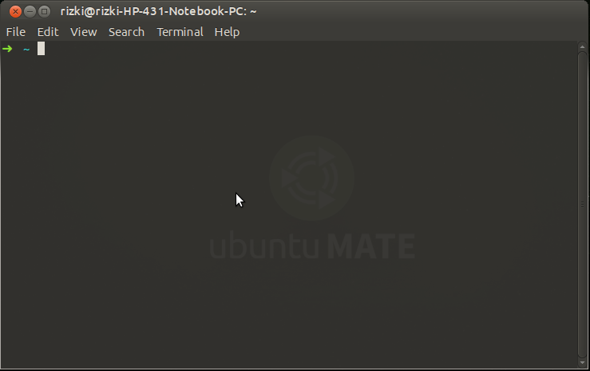
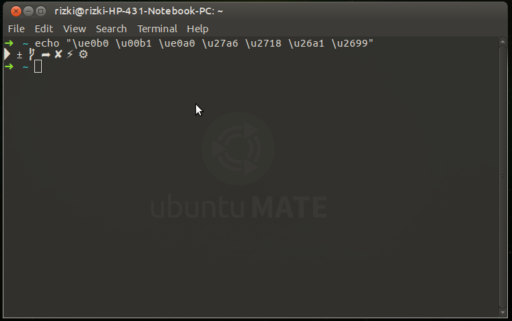
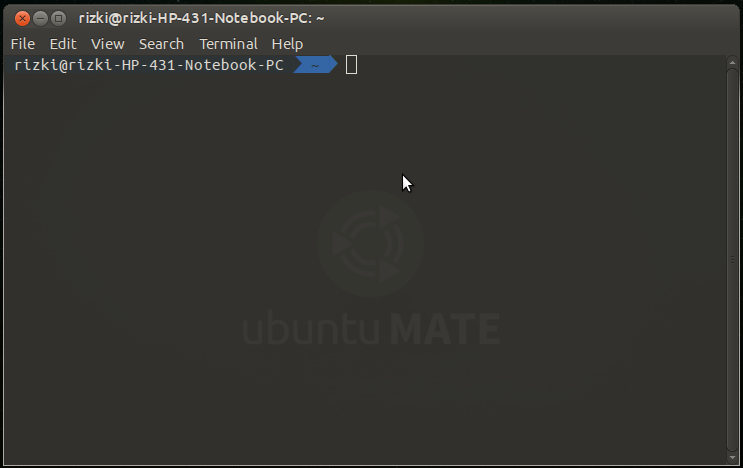
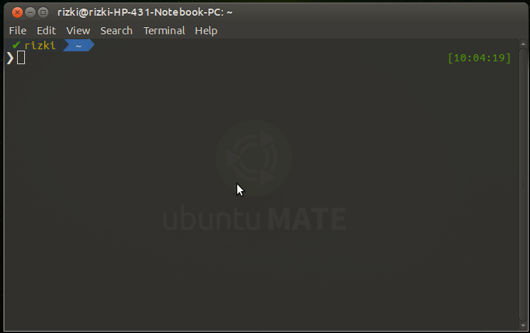
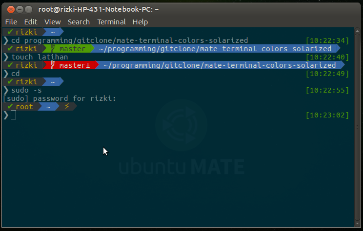

Pada bulan april yang lalu, akhirnya ubuntu merilis sistem operasi baru dengan codename xenial xerus 16.04 LTS. Tidak hanya ubuntu, teryata ubuntu varian yang lain seperti kubuntu, xubuntu, lubuntu dan ubuntu mate juga release :D. Karena ubuntu telah release versi 16.04 LTS maka penulis juga ikut upgrade ke versi 16.04 LTS. Setelah dicoba - coba teryata ubuntu 16.04 LTS ini lumayan rakus sama RAM :(, berbeda jauh dengan saudaranya yang dulu yaitu ubuntu 14.04 trusty. Dikarenakan terlalu memakan resource, akhirnya penulis mulai migrasi, awalnya migrasi ke ubuntu mate, Eh teryata lumayan ringan akan tetapi setelah cari beberapa referensi teryata kubuntu melakukan upgrade kde 4 menjadi kde 5 plasma dan dikabarkan kubuntu lebih stabil dan ringan dari pada ubuntu. Akhirnya penulis migrasi ke kubuntu, jika dilihat dari segi tampilan, kubuntu merupakan salah satu distro yang cukup sempurna :D dibandingkan dengan ubuntu mate yang telah penulis coba. Hari berganti dengan hari, dan teryata penulis mendapat kendala lagi yaitu laptop lebih cepet panas dengan menggunakan kubuntu :(. Karena ubuntu dan kubuntu tidak sesuai dengan keinginan penulis, akhirnya penulis balik ke ubuntu mate. Dan apa yang terjadi ? teryata ubuntu mate lebih terasa dingin dan hemat memory RAM :D. Begitulah jika anda adalah seorang linux user, anda akan selalu penasaran dengan distro - distro yang belum anda coba, setiap distro memiliki keunggulan dan kekurangan masing - masing. Jika anda adalah seorang developer terlebih jika anda suka bermain - main dengan yang namanya netbeans, android studio dan keluarga jetbrains, penulis sarankan untuk menggunakan ubuntu mate :D.

## Apa Itu Apt-Fast ?

Pada [artikel sebelumnya](http://rizkimufrizal.github.io/belajar-instalasi-software-di-linux/) penulis telah membahas mengenai package management pada ubuntu yaitu bisa menggunakan apt-get dan juga dpkg. Pada ubuntu 16.04 lebih disarankan untuk menggunakan perintah `apt` saja tanpa perlu menggunakan perintah `apt-get`. Terus apa hubungannya dengan apt-fast ?

>>apt-fast adalah shell script yang berfungsi sebagai pembungkus apt-get dan aptitude atau dapat dikatakan bahwa apt-fast merupakan perintah yang dikembangkan dari dasar apt-get yang dapat melakukan download package secara paralel dengan multiple koneksi per package.

Mungkin sedikit sulit untuk memahami pengertian diatas. Sebenarnya apt-fast dengan apt-get adalah sama, hanya saja apt-fast dikembangkan dengan cara mengabungkan apt-get dan aptitude. Perintah yang digunakan pada apt-fast sama seperti yang ada pada apt-get. Lalu apa yang membedakannya ? yang membedakannya adalah pada saat proses mendownload package. Jika anda menggunakan apt-get, kita melakukan download package secara sequential atau secara satu per satu. Jika kita menggunakan apt-fast, apt-fast akan melakukan download package secara paralel, dan setiap package yang kita download akan menggunakan multiple connection sehingga proses download package lebih cepat dibandingkan dengan apt-get :D.

### Instalasi Apt-Fast

Untuk melakukan instalasi apt-fast, tambahkan PPA berikut.


sudo add-apt-repository ppa:saiarcot895/myppa


Kemudian lakukan update dengan perintah berikut.


sudo apt update


Lalu lanjutnya dengan instalasi apt-fast dengan perintah.


sudo apt install apt-fast


## Apa Itu ZSH ?

>>ZSH (Z shell) adalah salah satu alternatif dari bash shell dan sangat banyak digunakan dikalangan developer.

Secara default, keluarga unix menggunakan bash shell di dalam terminal, contohnya sperti GNU/linux, mac os x dan keluarga unix yang lainnya. ZSH merupakan salah satu shell yang cukup populer dan salah satu fungsi utama dari ZSH adalah autocomplete yang diberikan lebih sempurna dibandingkan dengan bash shell. Pada artikel ini, kita akan mencoba melakukan instalasi zsh pada ubuntu mate dan mengganti bash shell menjadi ZSH.

### Instalasi Dan Konfigurasi ZSH

Untuk melakukan instalasi ZSH silahkan jalankan perintah berikut.


sudo apt install zsh


Untuk konfigurasi ZSH, penulis menggunakan tool [Oh My Zsh](http://ohmyz.sh/). Untuk melakukan instalasinya, silahkan jalankan perintah berikut.


sh -c "$(wget https://raw.github.com/robbyrussell/oh-my-zsh/master/tools/install.sh -O -)"


Setelah selesai, jalankan perintah berikut agar ZSH menjadi default shell yang akan anda gunakan


chsh -s $(which zsh)


Nah setelah selesai, silahkan tutup terminal anda lalu buka kembali, jika berhasil maka akan muncul output seperti berikut.

Langkah selanjutnya, penulis ingin mengganti thema zsh menjadi [agnoster](https://gist.github.com/agnoster/3712874), akan tetapi untuk instalasi thema agnoster memerlukan sedikit konfigurasi untuk font. Silahkan jalankan perintah berikut untuk melakukan clone repository [powerline/font](https://github.com/powerline/fonts)


git clone https://github.com/powerline/fonts.git


Setelah selesai, silahkan akses folder `fonts` lalu jalankan perintah berikut untuk melakukan instalasi font.


./install.sh


Setelah selesai, kita akan lakukan konfigurasi font tersebut, silahkan jalankan perintah berikut untuk mendownload font yang dibutuhkan


wget https://github.com/powerline/powerline/raw/develop/font/PowerlineSymbols.otf
wget https://github.com/powerline/powerline/raw/develop/font/10-powerline-symbols.conf


Setelah selesai, jalankan perintah berikut untuk membuat folder untuk font tersebut.


mkdir ~/.fonts/
mkdir -p ~/.config/fontconfig/conf.d/


Langkah selanjutnya silahkan jalankan perintah berikut untuk konfigurasi font tersebut.


mv PowerlineSymbols.otf ~/.fonts/
fc-cache -vf ~/.fonts/
mv 10-powerline-symbols.conf ~/.config/fontconfig/conf.d


Nah setelah selesai, silahkan tutup terminal lalu buka lagi, silahkan jalankan perintah berikut.


echo "\ue0b0 \u00b1 \ue0a0 \u27a6 \u2718 \u26a1 \u2699"


Jika berhasil maka akan muncul output seperti berikut.

Jika output seperti diatas maka anda telah berhasil melakukan konfigurasi font nya :D. Langkah selanjutnya, silahkan buka file `.zshrc` dengan perintah berikut.


nano .zshrc


Kemudian cari kata `ZSH_THEME` kemudian ganti menjadi seperti berikut.


ZSH_THEME="agnoster"


Nah silahkan disimpan, lalu restart terminal anda, maka akan muncul output seperti berikut.

Pada artikel ini, penulis merubah konfigurasi thema tersebut agar sesuai dengan keinginan penulis, jika anda merasa sudah cukup puas dengan thema tersebut maka langkah selanjutnya tidak perlu anda ikuti :). Silahkan buka file `agnoster.zsh-theme` di dalam folder `.oh-my-zsh/themes/` dengan perintah berikut.


nano ~/.oh-my-zsh/themes/agnoster.zsh-theme


Kemudian replace semua codingan tersebut dengan codingan berikut.



# Original theme https://github.com/agnoster zsh theme
# modified by lborg019

ZSH_THEME_GIT_PROMPT_DIRTY='±'

function _git_prompt_info() {
  ref=$(git symbolic-ref HEAD 2> /dev/null) || ref="➦ $(git show-ref --head -s --abbrev |head -n1 2> /dev/null)"
  echo "${ref/refs\/heads\// }$(parse_git_dirty)"
}

function _git_info() {
  if $(git rev-parse --is-inside-work-tree >/dev/null 2>&1); then
    local BG_COLOR=green
    if [[ -n $(parse_git_dirty) ]]; then
      BG_COLOR=yellow
      FG_COLOR=black
    fi

    if [[ ! -z $(git ls-files --other --exclude-standard 2> /dev/null) ]]; then
        BG_COLOR=red
        FG_COLOR=white
    fi
    echo "%% $(_git_prompt_info) %{%F{$BG_COLOR}%K{blue}%}"
  else
    echo "%"
  fi
}

function virtualenv_info {
    [ $VIRTUAL_ENV ] && echo '('`basename $VIRTUAL_ENV`') '
}

PROMPT_HOST='%{%b%F{gray}%K{black}%} %(?.%✔.%✘)% %n %'
PROMPT_DIR='% %~%  '
PROMPT_SU='%(!.%{%k%F{blue}%K{black}%}% ⚡ %{%k%F{black}%}.%{%k%F{blue}%})%{%f%k%b%}'

PROMPT='%{%f%b%k%}$PROMPT_HOST$(_git_info)$PROMPT_DIR$PROMPT_SU
$(virtualenv_info)❯ '
RPROMPT='%{$fg[green]%}[%*]%{$reset_color%}'



Silahkan restart kembali terminal anda, dan berikut adalah hasilnya

Waw... hasilnya lebih bagus :D. Langkah terakhir, karena secara default thema agnoster menggunakan warna solarized, maka kita akan melakukan konfigurasi warna solarized pada terminal mate. Secara default, terminal mate tidak memiliki warna solarized meskipun sudah ubuntu mate versi 16.04 :(, untuk itu kita perlu sedikit melakukan konfigurasi. Silahkan jalankan perintah berikut untuk melakukan clone [mate-terminal-colors-solarized](https://github.com/NeuralSandwich/mate-terminal-colors-solarized).


git clone https://github.com/NeuralSandwich/mate-terminal-colors-solarized.git


Setelah selesai, silahkan akses folder solarized-mate-terminal, kemudian jalankan perintah berikut.


./install.sh


Kemudian silahkan jawab pertayaan yang diajukan, berikut adalah output untuk jawaban penulis.


This script will ask you if you want a light or dark color scheme, and
which Mate Terminal profile to overwrite.

Please note that there is no uninstall option yet. If you do not wish
to overwrite any of your profiles, you should create a new profile
before you run this script. However, you can reset your colors to the
Mate default, by running:

dconf reset -f /org/mate/terminal/profiles:/

By default, it runs in the interactive mode, but it also can be run
non-interactively, just feed it with the necessary options, see
'install.sh --help' for details.

Please select a color scheme:
1) dark
2) light
#? 1

Please select a Mate Terminal profile:
1) 'Rizki Mufrizal'
#? 1

You have selected:

  Scheme:  dark
  Profile: 'Rizki Mufrizal' (default)

Are you sure you want to overwrite the selected profile?
(YES to continue) YES
Confirmation received -- applying settings


Kemudian restart terminal anda kembali, kemudian silahkan pilih menu edit pada terminal, lalu pilih profile preferences, pilih tab color kemudian uncheck list pada use colors from system theme. Maka hasil terminalnya akan seperti berikut :D.

## Konfigurasi Apt-Fast Pada ZSH

Agar fitur autocomplete apt-fast pada ZSH berjalan, kita harus melakukan beberapa konfigurasi. Silahkan jalankan perintah berikut untuk melakukan clone repository [apt-fast](https://github.com/ilikenwf/apt-fast).


git clone https://github.com/ilikenwf/apt-fast.git


Setelah selesai, jalankan perintah berikut untuk menjalankan konfigurasi apt-fast pada ZSH.


sudo cp completions/zsh/_apt-fast /usr/share/zsh/functions/Completion/Debian/
sudo chown root:root /usr/share/zsh/functions/Completion/Debian/_apt-fast
source /usr/share/zsh/functions/Completion/Debian/_apt-fast


Sekian tutorial instalasi apt-fast dan zsh pada ubuntu mate dan Terima kasih :).
