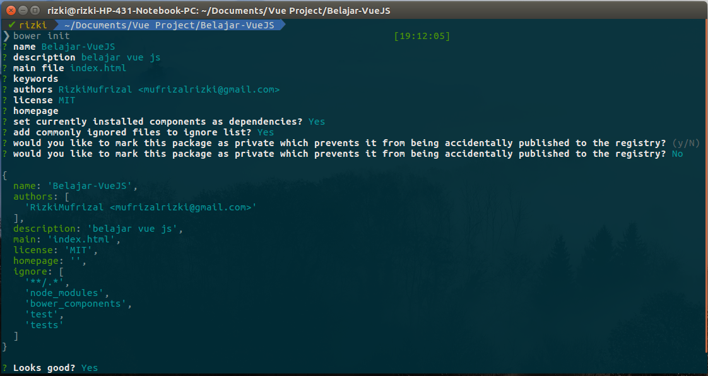
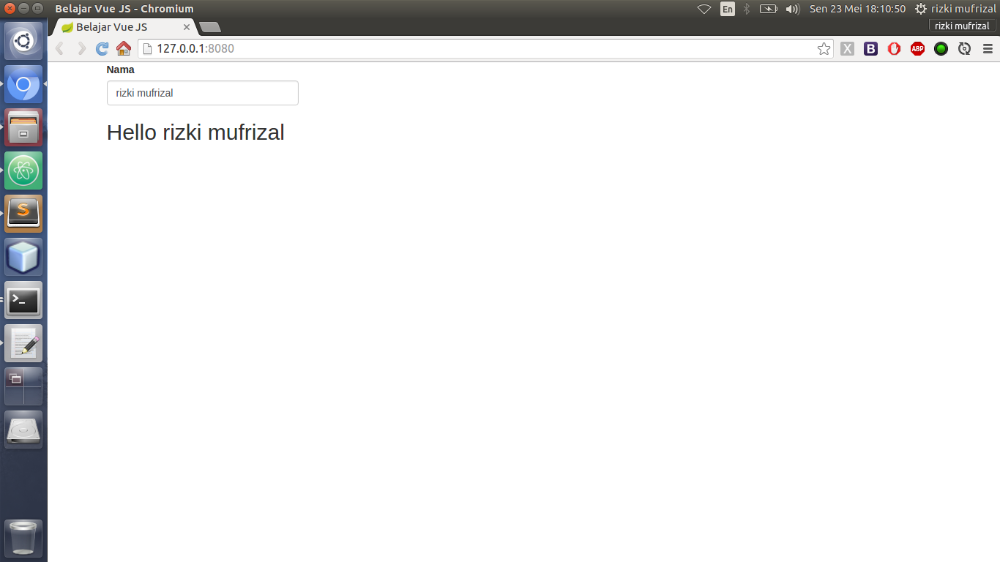
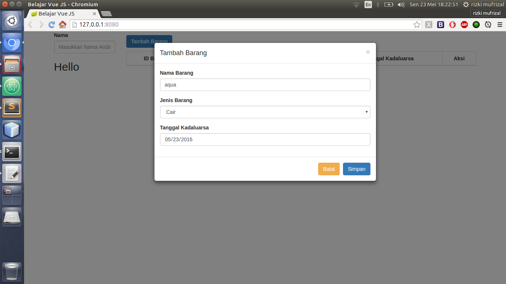
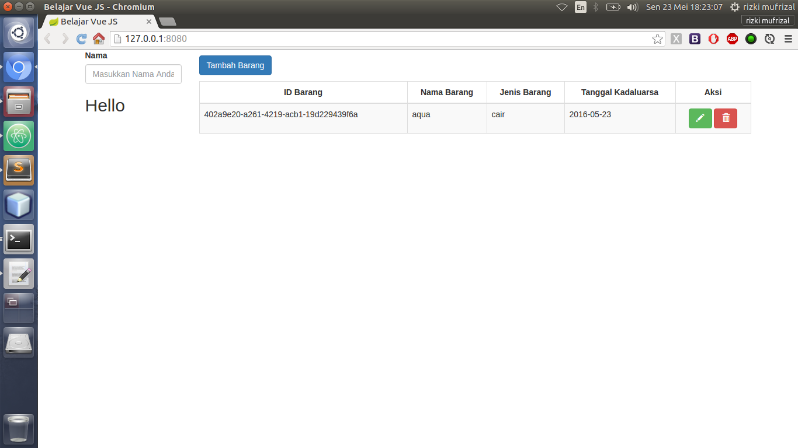
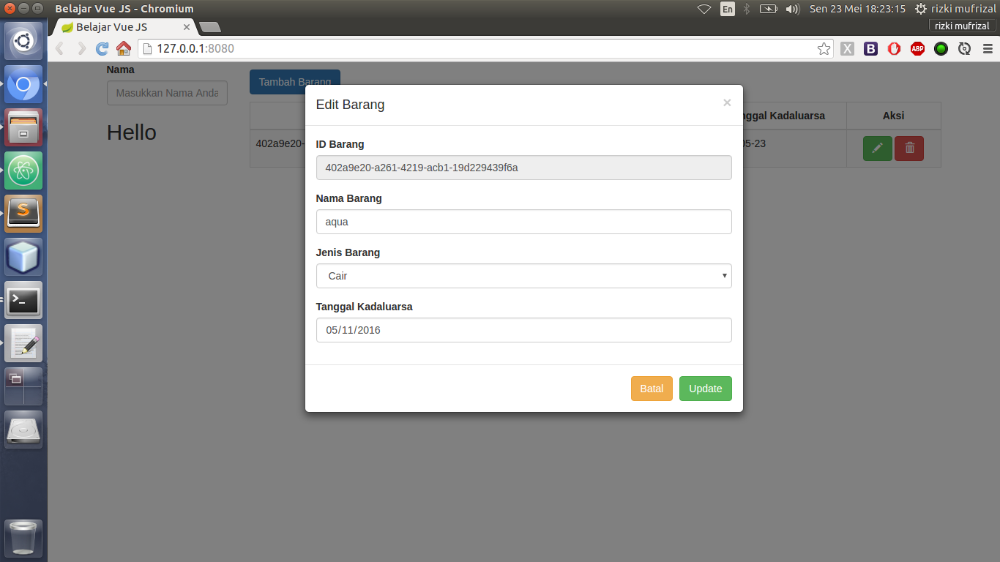
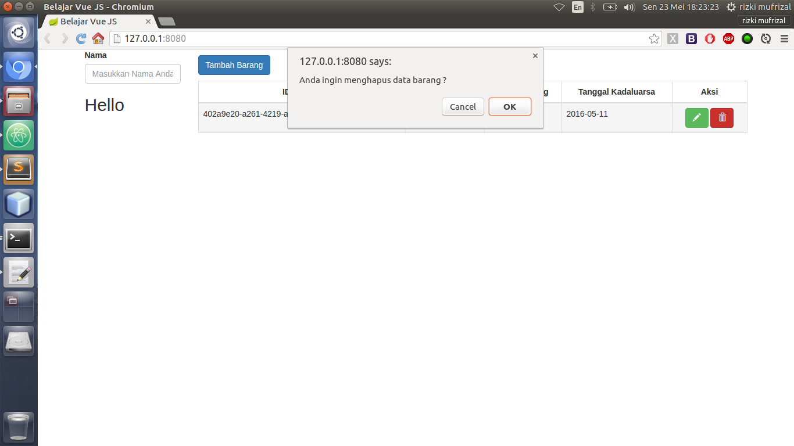

## Apa Itu Vue JS ?

>>Vue js adalah salah satu framework javascript. Vue Js merupakan framework untuk kebutuhan front end dari sebuah project.

Vue js merupakan salah satu framework yang banyak digunakan. Jika anda telah terbiasa dengan menggunakan angular js, maka untuk melakukan migrasi ke vue js tidak lah terlalu susah karena mereka mempunyai kemiripan di bagian sintak, hanya saja angular js memiliki development stack yang lebih rumit dibandingkan dengan vue js :). Bagi anda yang penasaran dengan angular js, silahkan lihat di artikel [belajar angular js](http://rizkimufrizal.github.io/belajar-angular-js/). Vue js juga menggunakan fitur data binding sama seperti angular js. Jika di angular js kita menggunakan fungsi controller, maka di vue js kita akan menggunakan pendekatan dom yaitu kita akan menggunakan id, name atau class dari suatu component html. Vue js juga memiliki component routing yaitu vue-router, akan tetapi bagian router akan dibahas pada artikel selanjutnya :). Pada artikel ini, penulis hanya akan memberikan contoh sederhana vue js dengan menggunakan ecmascript 5 (ES5).

## Membuat Hello Word Dengan Vue JS

Seperti biasa, sebelum menggunakan sebuah framework, kita akan melakukan test hello word terlebih dahulu untuk mempermudah pemahaman tentang alur kerja dari sebuah framework yang akan kita gunakan :D. Untuk mendownload dependency, kita akan menggunakan [bower](http://bower.io/). Bagi anda yang masing bingung dengan bower, silahkan baca di artikel [Instalasi Perlengkapan Coding Node JS](https://rizkimufrizal.github.io/instalasi-perlengkapan-coding-node-js/). Silahkan buat sebuah folder dengan nama `Belajar-VueJS` kemudian akses folder tersebut dengan menggunakan terminal lalu jalankan perintah berikut.


bower init


Kemudian silahkan isi konfigurasinya seperti berikut.

Lalu silahkan jalankan perintah berikut untuk mendownload dependency yang kita butuhkan seperti vue js dan bootstrap.


bower install bootstrap vue --save


Setelah selesai, silahkan buat sebuah file `index.html` di dalam folder `Belajar-VueJS` kemudian isikan codingan seperti berikut.



<!DOCTYPE html>
<html lang="en">
    <head>
        <meta charset="utf-8">
        <meta http-equiv="X-UA-Compatible" content="IE=edge">
        <meta name="viewport" content="width=device-width, initial-scale=1">
        <title>Belajar Vue JS</title>

        <!-- HTML5 Shim and Respond.js IE8 support of HTML5 elements and media queries -->
        <!-- WARNING: Respond.js doesn't work if you view the page via file:// -->
        <!--[if lt IE 9]>   <![endif]-->
        <link rel="stylesheet" href="./bower_components/bootstrap/dist/css/bootstrap.min.css" type="text/css">
    </head>
    <body>

        

            

                

                    

                        <label>Nama</label>
                        <input type="text" class="form-control" placeholder="Masukkan Nama Anda" v-model="nama"/>
                    

                    <h2>Hello {{ nama }}</h2>
                

            

        

        
        
        
        
    </body>
</html>



Dari codingan diatas dapat kita lihat, kita melakukan inisialisasi project vue dengan menggunakan id pada html. Disini penulis menggunakan id belajar sebagai root dari project. Jika pada angular kita mengenal dengan `ng-model` maka pada vue js kita mengenal dengan yang namanya `v-model`, fungsinya sama yaitu sebagai model. Pada v-model, terdapat variabel nama, dimana variabel nama ini dapat kita tampilkan dengan menggunakan sintak double kurung kurawal  {{ }} .

Setelah selesai, silahkan buat sebuah file `app.js` kemudian isikan codingan seperti berikut.


'use strict';

new Vue({
  el: '#belajar'
});


Nah cukup sederhana, kita bisa melihat bahwa codingan diatas melakukan inisialisasi element dengan menggunakan variabel id belajar, sehingga view yang tadi akan dikenali sebagai project vue js. Setelah selesai, seperti biasa kita akan menggunakan bantuan [http-server](https://github.com/indexzero/http-server) untuk menjalankan file index.html. Bagi anda yang belum melakukan instalasi [http-server](https://github.com/indexzero/http-server), silahkan jalankan perintah berikut.


 npm install -g http-server


Setelah selesai, jalankan perintah berikut pada root project untuk menjalankan http-server.


http-server


Jika berhasil, maka di terminal akan muncul output seperti berikut.


Starting up http-server, serving ./
Available on:
  http://127.0.0.1:8080
Hit CTRL-C to stop the server


Kemudian silahkan akses `http://127.0.0.1:8080` pada browser anda.

## Membuat CRUD Sederhana Dengan Vue JS

Untuk membuat crud, kita akan menggunakan data array pada javascript sehingga data ini hanya bersifat sementara. Untuk mempersingkat artikel, silahkan ubah codingan yang berada pada file `index.html` seperti berikut.



<!DOCTYPE html>
<html lang="en">
    <head>
        <meta charset="utf-8">
        <meta http-equiv="X-UA-Compatible" content="IE=edge">
        <meta name="viewport" content="width=device-width, initial-scale=1">
        <title>Belajar Vue JS</title>

        <!-- HTML5 Shim and Respond.js IE8 support of HTML5 elements and media queries -->
        <!-- WARNING: Respond.js doesn't work if you view the page via file:// -->
        <!--[if lt IE 9]>   <![endif]-->
        <link rel="stylesheet" href="./dist/css/bootstrap.min.css" type="text/css">
    </head>
    <body id="belajar">

        

            

                

                    

                        <label>Nama</label>
                        <input type="text" class="form-control" placeholder="Masukkan Nama Anda" v-model="nama"/>
                    

                    <h2>Hello {{ nama }}</h2>
                

                

                    

                    <button @click="tambahBarang" type="button" class="btn btn-primary" data-toggle="modal" data-target="#modal">
                        Tambah Barang
                    </button>

                    

                    <table class="table table-striped table-bordered table-hover">
                        <thead>
                            <tr>
                                <th class="text-center">ID Barang</th>
                                <th class="text-center">Nama Barang</th>
                                <th class="text-center">Jenis Barang</th>
                                <th class="text-center">Tanggal Kadaluarsa</th>
                                <th class="text-center">Aksi</th>
                            </tr>
                        </thead>
                        <tbody>
                            <tr v-for="b in dataBarang">
                                <td>{{ b.idBarang }}</td>
                                <td>{{ b.namaBarang }}</td>
                                <td>{{ b.jenisBarang }}</td>
                                <td>{{ b.tanggalKadaluarsa }}</td>
                                <td class="text-center">
                                    <button type="button" class="btn btn-success" data-toggle="modal" data-target="#modal" @click="editBarang(b)">
                                        <i class="glyphicon glyphicon-pencil"></i>
                                    </button>
                                    <button type="button" class="btn btn-danger" @click="hapusBarang(b)">
                                        <i class="glyphicon glyphicon-trash"></i>
                                    </button>
                                </td>
                            </tr>
                        </tbody>
                    </table>
                

            

        

        <!-- Modal -->
        

            

                

                    

                        <button type="button" class="close" data-dismiss="modal" aria-label="Close">
                            &times;
                        </button>
                        <h4 v-if="enable" class="modal-title">Tambah Barang</h4>
                        <h4 v-else="enable" class="modal-title">Edit Barang</h4>
                    

                    

                        <form v-if="enable">
                            

                                <label>Nama Barang</label>
                                <input type="text" class="form-control" placeholder="Masukkan Nama Barang" v-model="inputDataBarang.namaBarang"/>
                            

                            

                                <label>Jenis Barang</label>
                                <select class="form-control" v-model="inputDataBarang.jenisBarang">
                                    <option value="" disabled>Pilih Jenis Barang</option>
                                    <option value="gas">Gas</option>
                                    <option value="padat">Padat</option>
                                    <option value="cair">Cair</option>
                                </select>
                            

                            

                                <label>Tanggal Kadaluarsa</label>
                                <input type="date" class="form-control" placeholder="Masukkan Tanggal Kadaluarsa" v-model="inputDataBarang.tanggalKadaluarsa"/>
                            

                        </form>
                        <form v-else="enable">
                            

                                <label>ID Barang</label>
                                <input type="text" class="form-control" v-model="inputDataBarang.idBarang" disabled/>
                            

                            

                                <label>Nama Barang</label>
                                <input type="text" class="form-control" placeholder="Masukkan Nama Barang" v-model="inputDataBarang.namaBarang"/>
                            

                            

                                <label>Jenis Barang</label>
                                <select class="form-control" placeholder="Pilih Jenis Barang" v-model="inputDataBarang.jenisBarang">
                                    <option value="" disabled>Pilih Jenis Barang</option>
                                    <option value="gas">Gas</option>
                                    <option value="padat">Padat</option>
                                    <option value="cair">Cair</option>
                                </select>
                            

                            

                                <label>Tanggal Kadaluarsa</label>
                                <input type="date" class="form-control" placeholder="Masukkan Tanggal Kadaluarsa" v-model="inputDataBarang.tanggalKadaluarsa"/>
                            

                        </form>
                    

                    

                        <button type="button" class="btn btn-warning" data-dismiss="modal">Batal</button>
                        <button v-if="enable" type="button" class="btn btn-primary" data-dismiss="modal" @click="simpanBarang(inputDataBarang)">Simpan</button>
                        <button v-else="enable" type="button" class="btn btn-success" data-dismiss="modal" @click="updateBarang(inputDataBarang)">Update</button>
                    

                

            

        

        
        
        
        
    </body>
</html>



Dari codingan diatas bisa kita lihat, terdapat sedikit perbedaan diantaranya adalah jika pada angular biasanya kita menggunakan perintah `ng-click` sedangkan pada vue js kita menggunakan perintah `@click`. Jika pada angular, untuk menampilkan data yang berbentuk array kita akan menggunakan perintah `ng-repeat` sedangkan jika pada vue js kita akan menggunakan perintah `v-for`. Sedangkan pada perintah - perintah yang lain adalah sama.

Selanjutnya silahkan buka file `app.js` kemudian ubah codingannya menjadi seperti berikut.


'use strict';

new Vue({
  el: '#belajar',
  data: function() {
    return {
      dataBarang: [],
      inputDataBarang: {},
      enable: false
    }
  },
  methods: {
    generateUUID: function() {
      var d = new Date().getTime();
      if (window.performance && typeof window.performance.now === "function") {
        d += performance.now();
      }
      var uuid = 'xxxxxxxx-xxxx-4xxx-yxxx-xxxxxxxxxxxx'.replace(/[xy]/g, function(c) {
        var r = (d + Math.random() * 16) % 16 | 0;
        d = Math.floor(d / 16);
        return (c == 'x' ? r : (r & 0x3 | 0x8)).toString(16);
      });
      return uuid;
    },
    tambahBarang: function() {
      this.enable = true;
      this.inputDataBarang = {};
    },
    simpanBarang: function(barang) {
      this.dataBarang.push({
        'idBarang': this.generateUUID(),
        'namaBarang': barang.namaBarang,
        'jenisBarang': barang.jenisBarang,
        'tanggalKadaluarsa': barang.tanggalKadaluarsa
      });
    },
    editBarang: function(barang) {
      this.enable = false;
      this.index = this.dataBarang.indexOf(barang);
      this.inputDataBarang.idBarang = barang.idBarang;
      this.inputDataBarang.namaBarang = barang.namaBarang;
      this.inputDataBarang.jenisBarang = barang.jenisBarang;
      this.inputDataBarang.tanggalKadaluarsa = barang.tanggalKadaluarsa;
    },
    updateBarang: function(barang) {
      this.dataBarang[this.index].idBarang = barang.idBarang;
      this.dataBarang[this.index].namaBarang = barang.namaBarang;
      this.dataBarang[this.index].jenisBarang = barang.jenisBarang;
      this.dataBarang[this.index].tanggalKadaluarsa = barang.tanggalKadaluarsa;
      this.inputDataBarang = {};
    },
    hapusBarang: function(barang) {
      var result = confirm('Anda ingin menghapus data barang ?');
      if (result) {
        this.index = this.dataBarang.indexOf(barang);
        this.dataBarang.splice(this.index, 1);
      }
    }
  }
});


Dari codingan diatas, terdapat perbedaan antara angular js dan vue js. Dimana pada vue js, antara data dan method akan dibagi berdasarkan section, sehingga kita akan melakukan deklarasi data dan method di section yang berbeda. Setiap variabel yang terdapat di dalam section data dapat kita panggil dengan menggunakan perintah `this.nama variabel`. Semua function yang terdapat di dalam section method juga dapat kita panggil melalui function lain yang berada di dalam section method tersebut, contohnya adalah function `generateUUID`.

Setelah selesai, silahkan akses kembali `http://127.0.0.1:8080` berikut adalah output ketika anda melakukan insert.

berikut adalah output ketika anda melakukan select data.

berikut adalah output ketika anda melakukan update data.

berikut adalah output ketika anda melakukan delete data.

Sekian tutorial belajar vue js dan Terima kasih :)