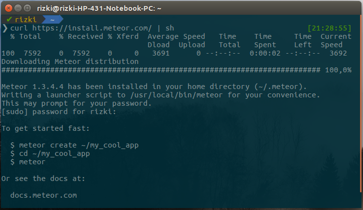
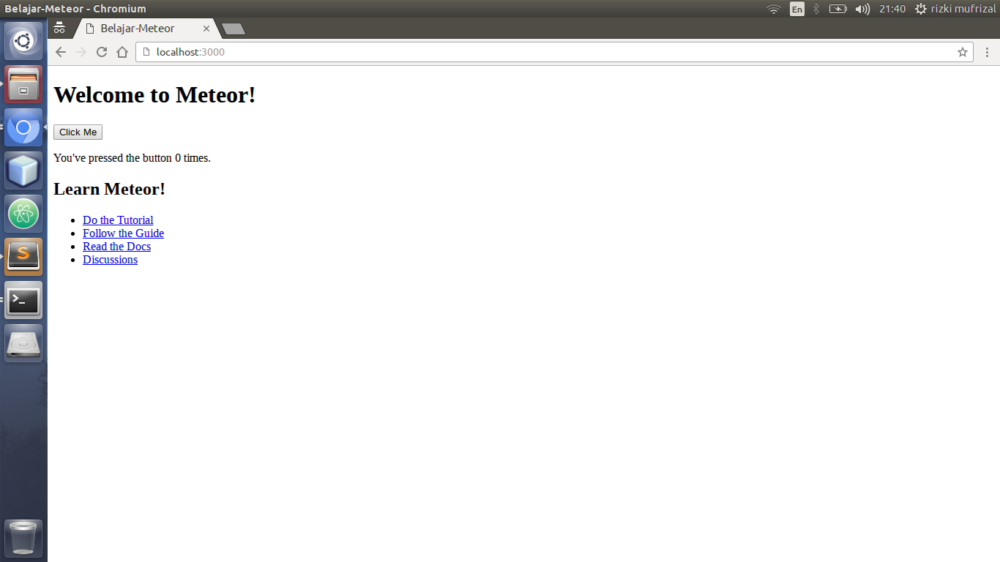
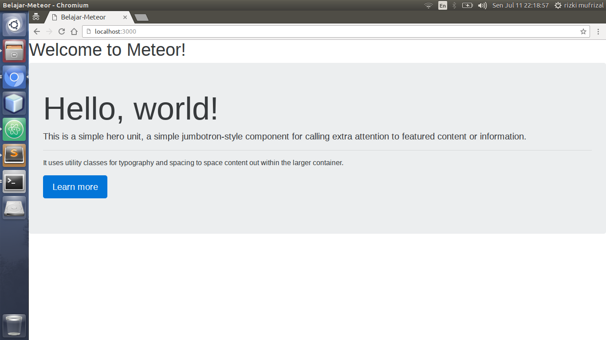
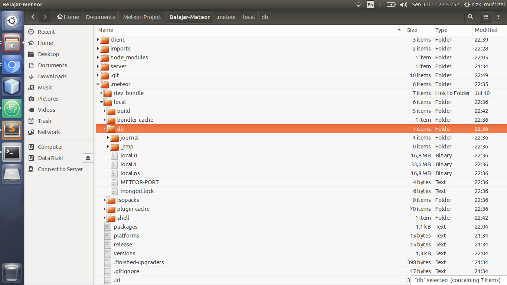
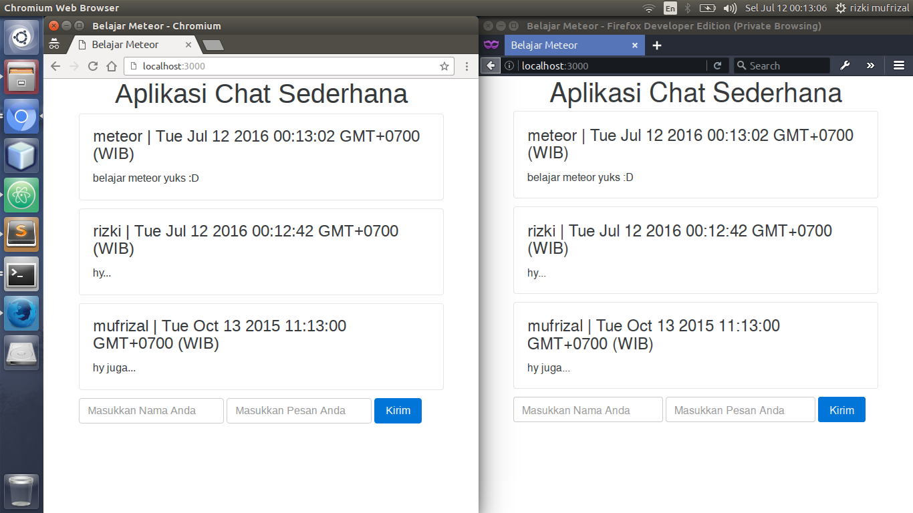
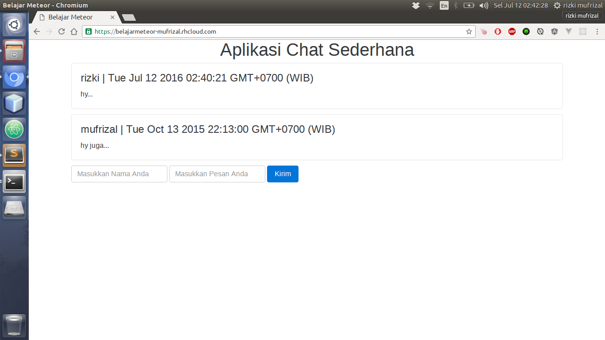

Beberapa hari yang lalu, penulis iseng - iseng lihat sebuah framework node js yang katanya sedang naik daun. Awalnya penulis agak bingung karena di tutorialnya dijelaskan mulai dari server dan client bisa dijadikan menjadi 1 project tanpa perlu bantuan API. Selama ini, penulis biasanya akan membuat API terlebih dahulu lalu membuat client untuk dapat melakukan akses API tersebut, biasanya client yang digunakan adalah angular js atau vue js. Berbeda dengan meteor, dimana client yang terdapat di dalam project meteor dapat langsung memanggil method yang berada pada server.

## Apa Itu Meteor ?

>>[Meteor](https://www.meteor.com/) adalah sebuah platform yang dibangun di atas Node JS untuk membuat aplikasi web real-time.

Karena meteor dibangun diatas node js maka kita dapat membuat aplikasi server dan client. Meteor js mendukung beberapa templating yang dapat kita gunakan yaitu [Blaze](https://guide.meteor.com/blaze.html), [Angular js (1)](https://angularjs.org/), [Angular 2](https://angular.io/) dan [React](https://facebook.github.io/react/). Pada artikel kali ini, penulis akan mencoba membahas mengenai templating blaze, mengapa demikian ? dikarenakan jika anda menggunakan templating seperti angular js maka anda wajib mengerti terlebih dahulu cara kerja angular js :D. Mulai dari server hingga client, kita akan menggunakan bahasa pemrograman javascript, dan javascript yang akan kita gunakan adalah ES6, tapi browser kita masih menggunakan ES5 gimana dong ? tidak perlu khawatir karena meteor akan secara otomatis melakukan convert dari ES6 menjadi ES5.

## Instalasi Meteor Dan Setup Project

Jika anda penggunakan keluarga GNU/Linux maka bersyukurlah karena instalasi meteor sangatlah mudah, silahkan jalankan perintah berikut untuk melakukan instalasi meteor.


curl https://install.meteor.com/ | sh


Bagi anda pengguna windows silahkan download installernya di [install meteor](https://www.meteor.com/install). Jika berhasil, maka akan muncul output seperti berikut.

Oke, tahap selanjutnya kita akan mencoba membuat project sederhana dengan menggunakan meteor. Project yang akan kita buat adalah aplikasi chatting sederhan dengan menggunakan meteor, template yang akan kita gunakan adalah blaze. Silahkan jalankan perintah berikut untuk membuat project dengan menggunakan meteor.


meteor create Belajar-Meteor


Maka secara otomatis, meteor akan membuat sebuah project dengan nama Belajar-Meteor. Lalu akses folder project dengan menggunakan terminal anda. Lalu jalankan perintah berikut untuk menjalankan project yang telah kita buat.


meteor


Maka akan muncul output berikut pada terminal anda.


[[[[[ ~/Documents/Meteor-Project/Belajar-Meteor ]]]]]

=> Started proxy.                             
=> Started MongoDB.                           
=> Started your app.                          

=> App running at: http://localhost:3000/


Silahkan akses `http://localhost:3000/` pada browser anda, jika berhasil maka akan muncul output seperti berikut.

## Menambah Package Dan Mengatur Tampilan

Meteor telah menyediakan banyak package, package yang anda perlukan dapat anda temukan di [Atmosphere](https://atmospherejs.com/). Pada artikel kali ini, kita akan mencoba menggunakan bootstrap 4 untuk memperindah tampilannya, karena bootstrap 4 masih alpha maka mereka masih banyak menggunakan scss sebagai css preprocessor mereka. Untuk dapat menggunakan package [sass](https://atmospherejs.com/fourseven/scss), silahkan akses folder project anda kembali lalu jalankan perintah berikut untuk menghapus standard minifier css.


meteor remove standard-minifier-css


Lalu jalankan tambahkan package minifier autoprefixer dengan perintah.


meteor add seba:minifiers-autoprefixer


Tahap selanjutnya, tambahkan package sass yang kita butuhkan dengan perintah.


meteor add fourseven:scss


Silahkan rename file `main.css` menjadi `main.scss` yang terdapat di dalam folder client, lalu masukkan codingan seperti berikut.


@import "{}/node_modules/bootstrap/scss/bootstrap.scss";


Codingan diatas berfungsi untuk melakukan import bootstrap ke project meteor yang telah kita buat. Kemudian silahkan buka file `main.js` yang ada di folder client, dan ubah codingannya menjadi seperti berikut.


import '../imports/ui/chat';
import 'bootstrap';


Jika tadi kita telah melakukan import library bootstrap dengan extensi scss, maka untuk melakukan import bootstrap dengan extensi js cukup dengan melakukan import pada file `main.js`. Lalu buka file `main.html` dan ubah codingan htmlnya menjadi seperti berikut.



<head>
    <title>Belajar Meteor</title>
</head>



Langkah selanjutnya, silahkan buat folder `imports/ui/` kemudian buatlah 2 file di dalam folder tersebut yaitu `chat.js` dan `chat.html`. Meteor tidak memiliki suatu struktur folder yang disepakati maka oleh karena itu, anda dapat membuat struktur project berdasarkan keinginan anda. Folder `imports/ui` adalah folder untuk semua codingan bagian client, dimana nantinya file - file yang ada disini akan kita import ke file `main.js` yang berada pada folder `client`. Buka file `chat.js` kemudian masukkan codingan seperti berikut.


import './chat.html';


Kemudian untuk file `chat.html` silahkan isikan codingan seperti berikut.



<body>
    <h1>Welcome to Meteor!</h1>

    {{> hello}}
</body>

<template name="hello">
    

        <h1 class="display-3">Hello, world!</h1>
        
This is a simple hero unit, a simple jumbotron-style component for calling extra attention to featured content or information.

        

        
It uses utility classes for typography and spacing to space content out within the larger container.

        

            <a class="btn btn-primary btn-lg" href="#" role="button">Learn more</a>
        

    

</template>



Kemudian silahkan akses browser anda, dan hasilnya akan muncul seperti berikut :D.

## Membuat Collections

Secara default, meteor menggunakan database mongodb. Apakah kita diharuskan melakukan instalasi mongodb ? jawabannya adalah tidak, dikarenakan secara default meteor telah membuat database mongodb di dalam folder project anda. Jika anda buka folder `.meteor` yang di hidden maka anda dapat melihat bahwa database mongodb terdapat di dalam folder `local/db` seperti gambar berikut.

Collection disini sebenarnya adalah sesuatu yang sederhana, dimana collection ini sama seperti tabel jika kita berada pada database yang berbasis RDBMS, hanya saja collection disini berbeda dengan pada tabel biasa dimana collection ini dapat kita gunakan tanpa perlu mendefinisikan column apa saja yang akan kita gunakan. Pada tutorial ini, kita akan menggunakan 4 column yang berada pada collection `chats` diantaranya adalah:

* id : string
* nama : string
* pesan : string
* waktu : date

Langkah selanjutnya silahkan buat folder `imports/api` kemudian buat sebuah file `chats.js` lalu tambahkan codingan seperti berikut.


import { Mongo } from 'meteor/mongo';

export const Chats = new Mongo.Collection('chats');


Codingan diatas berfungsi untuk membuat sebuah collection chats, kemudian kita lakukan export agar dapat digunakan oleh file javascript yang lain. Lalu silahkan buka file `main.js` yang berada pada folder `server` lalu ubah codingannya menjadi seperti berikut.


import { Meteor } from 'meteor/meteor';
import { Chats } from '../imports/api/chats';

Meteor.startup(() => {
  Chats.remove({});
  if (Chats.find().count() === 0) {
    const chats = [{
      'nama': 'rizki',
      'pesan': 'hy...',
      'waktu': new Date()
    }, {
      'nama': 'mufrizal',
      'pesan': 'hy juga...',
      'waktu': new Date("October 13, 2015 11:13:00")
    }];

    chats.forEach((chat) => {
      Chats.insert(chat)
    });
  }

});


Codingan diatas berfungsi untuk melakukan insert data jika data yang terdapat di dalam collection chat tidak tersedia. Hal ini kita lakukan untuk melihat data yang akan kita tampilkan nantinya. Lalu buka kembali file `chat.js` dan ubah codingannya menjadi seperti berikut.


import { Template } from 'meteor/templating';
import { Chats } from '../api/chats';

import './chat.html';

Template.body.helpers({
  chats() {
    return Chats.find({}, {
      sort: {
        waktu: -1
      }
    });
  }
});


Codingan diatas berfungsi untuk mengambil data chat, dimana data chat ini akan bersifat realtime, mengapa demikian ? dikarenakan kita melalukan akses data tersebut berada di dalam method `helpers` milik meteor, data tersebut akan tersimpan di dalam variabel `chats`. Kemudian silahkan buka file `chat.html` lalu ubah codingannya menjadi seperti berikut.



<body>
  <h1 style="text-align: center">Aplikasi Chat Sederhana</h1>
    

        {{#each chats}}
            {{> tabelchat}}
        {{/each}}
    

</body>

<template name="tabelchat">
    

        <h4 class="card-title">{{nama}} | {{waktu}}</h4>
        
{{pesan}}

    

</template>



Jika berhasil, maka outputnya akan seperti berikut.

## Membuat Forms Dan Events

Untuk membuat form sama seperti membuat form biasa, kita dapat melakukan submit, click dan sebagainya. Pada tutorial kali ini, penulis ingin menggunakan fungsi submit pada form untuk mengirim pesan. Untuk mendeteksi adanya event submit dari user maka kita harus menggunakan attribut id atau class yang ada pada html, penulis akan menggunakan attribut id untuk membuat event submit. Silakan buka file `chat.html` yang berada di dalam folder `imports/ui` kemudian ubah codingannya menjadi seperti berikut.



<body>
    <h1 style="text-align: center">Aplikasi Chat Sederhana</h1>
    

        {{#each chats}}
            {{> tabelchat}}
        {{/each}}

        <form id="form-kirim-pesan" class="form-inline">
            

                <input type="text" class="form-control" name="nama" placeholder="Masukkan Nama Anda">
            

            

                <input type="text" class="form-control" name="pesan" placeholder="Masukkan Pesan Anda">
            

            <button type="submit" class="btn btn-primary">Kirim</button>
        </form>
    

</body>

<template name="tabelchat">
    

        <h4 class="card-title">{{nama}} | {{waktu}}</h4>
        
{{pesan}}

    

</template>



Bisa kita lihat bahwa codingan diatas terdapat id form-kirim-pesan yang nantinya akan kita gunakan untuk mendeteksi event submit sebuah form, dan deklarasikan nama setiap text input agar kita dapat mengambil data dari inputan tersebut. Langkah selanjutnya silahkan buka file `chat.js` yang berada di dalam folder `imports/ui` lalu ubah codingannya menjadi seperti berikut.


import { Template } from 'meteor/templating';
import { Chats } from '../api/chats';

import './chat.html';

Template.body.helpers({
  chats() {
    return Chats.find({}, {
      sort: {
        waktu: -1
      }
    });
  }
});

Template.body.events({
  'submit #form-kirim-pesan'(event) {
    event.preventDefault();

    Chats.insert({
      'nama': event.target.nama.value,
      'pesan': event.target.pesan.value,
      'waktu': new Date()
    });

    event.target.nama.value = '';
    event.target.pesan.value = '';
  }
});


Nah disini kita mendeklarasikan event submit untuk id `form-kirim-pesan`, kemudian untuk mengambil inputan dari user, kita dapat menggunakan variabel `event.target`, setelah mendapatkan valuenya, value tersebut kita simpan ke dalam collection yang telah kita buat. Silahkan anda jalankan kembali project yang telah anda buat, jika berhasil silahkan jalankan di 2 browser, misalnya disini penulis menjalankan di 2 browser yang berbeda yaitu di `chromium` dan `firefox developer` berikut adalah hasilnya.

## Deploy Aplikasi Meteor Ke OpenShift

Melakukan deploy aplikasi meteor merupakan sesuatu yang lumayan susah, mengapa demikian ? dikarenakan beberapa hosting tidak menyediakan support untuk meteor. Penulis beberapa kali mencari referensi, termasuk ke heroku akan tetapi repository yang dapat kita gunakan rata - rata masih belum mendukung meteor 1.3, ada yang mendukung tapi kita diwajibkan untuk melakukan verifikasi kartu kredit. Akhirnya, setelah lama mencari referensi, [OpenShift](https://www.openshift.com) merupakan pilihan yang tepat karena didukung oleh repository dan ketersediaan database mongodb :D. Bagi anda yang belum melakukan konfigurasi OpenShift bisa dilihat di artikel [belajar membuat cloud storage dengan owncloud](https://rizkimufrizal.github.io/belajar-membuat-cloud-storage-dengan-owncloud/).

Untuk melakukan deploy project meteor ke OpenShift, kita akan menggunakan repository [meteor-openshift](https://github.com/jeeeyul/meteor-openshift) milik om [jeeeyul](https://github.com/jeeeyul). Tahap pertama adalah, kita akan membuat cartridge baru pada OpenShift dengan perintah.


rhc app create belajarmeteor \
  nodejs-0.10 \
  https://raw.githubusercontent.com/icflorescu/openshift-cartridge-mongodb/master/metadata/manifest.yml


Jika berhasil maka akan muncul output seperti berikut.


The cartridge
'https://raw.githubusercontent.com/icflorescu/openshift-cartridge-mongodb/master/metadata/manifest.yml'
will be downloaded and installed

Application Options
-------------------
Domain:     mufrizal
Cartridges: nodejs-0.10, https://raw.githubusercontent.com/icflorescu/openshift-cartridge-mongodb/master/metadata/manifest.yml
Gear Size:  default
Scaling:    no

Creating application 'belajarmeteor' ... Starting MongoDB...
done

  MongoDB 3.2.7 installed - use $MONGODB_URL environment variable to connect your application.
MongoDB started.

Waiting for your DNS name to be available ... done

Cloning into 'belajarmeteor'...
The authenticity of host 'belajarmeteor-mufrizal.rhcloud.com (54.175.169.24)' can't be established.
RSA key fingerprint is SHA256:FeJCkIUL7D41FMGNtM5NYM4XoboxZGYEqH0WcAmOX+I.
Are you sure you want to continue connecting (yes/no)? yes
Warning: Permanently added 'belajarmeteor-mufrizal.rhcloud.com,54.175.169.24' (RSA) to the list of known hosts.

Your application 'belajarmeteor' is now available.

  URL:        http://belajarmeteor-mufrizal.rhcloud.com/
  SSH to:     5783f2817628e1c1be0000b7@belajarmeteor-mufrizal.rhcloud.com
  Git remote: ssh://5783f2817628e1c1be0000b7@belajarmeteor-mufrizal.rhcloud.com/~/git/belajarmeteor.git/
  Cloned to:  /home/rizki/belajarmeteor

Run 'rhc show-app belajarmeteor' for more details about your app.


Lalu silahkan akses folder `belajarmeteor` lalu jalankan perintah berikut untuk menghapus konfigurasi openshift.


git rm -rf * .openshift


Kemudian jalankan perintah berikut untuk fetch meteor bundle.


git remote add meteor-openshift -m master git@github.com:jeeeyul/meteor-openshift.git
git pull -s recursive -X theirs meteor-openshift master


Jika terjadi warning seperti ini.


warning: no common commits
remote: Counting objects: 72, done.
remote: Total 72 (delta 0), reused 0 (delta 0), pack-reused 72
Unpacking objects: 100% (72/72), done.
From github.com:jeeeyul/meteor-openshift
 * branch            master     -> FETCH_HEAD
 * [new branch]      master     -> meteor-openshift/master
fatal: refusing to merge unrelated histories


Maka jalankan perintah pull seperti berikut.


git pull -s recursive -X theirs meteor-openshift master --allow-unrelated-histories


Jika sudah, silahkan akses kembali directori folder project meteor anda, lalu jalankan perintah


meteor build path/to/your/openshift-appname --directory --server-only


Berikut adalah contoh jika penulis menggunakan perintah diatas.


meteor build /home/rizki/belajarmeteor --directory --server-only


Langkah selanjutnya silahkan akses lagi folder repository openshift anda, lalu jalankan perintah berikut untuk melakukan deploy ke openshift.


git add --all && git commit -m "deploy meteor ke openshift" && git push


Jika sukses maka akan muncul output seperti berikut di terminal anda.


remote: Starting NodeJS cartridge
remote: Mon Jul 11 2016 15:40:13 GMT-0400 (EDT): Starting application 'belajarmeteor' ...
remote: Waiting for application port (8080) become available ...
remote: Found 127.9.223.1:8080 listening port
remote: 
remote: [meteor-openshift] Node.js version: 0.10.43
remote: [meteor-openshift] http://belajarmeteor-mufrizal.rhcloud.com/ is ready!
remote: -------------------------
remote: Git Post-Receive Result: success
remote: Activation status: success
remote: Deployment completed with status: success
To ssh://5783f2817628e1c1be0000b7@belajarmeteor-mufrizal.rhcloud.com/~/git/belajarmeteor.git/
   77dc3eb..ae4f2d6  master -> master


Berikut adalah output dari aplikasinya.

Aplikasi chat sederhana dapat anda akses di https://belajarmeteor-mufrizal.rhcloud.com/. Untuk source code nya silahkan lihat di [belajar meteor](https://github.com/RizkiMufrizal/Belajar-Meteor). Sekian artikel mengenai belajar meteor dan terima kasih :)