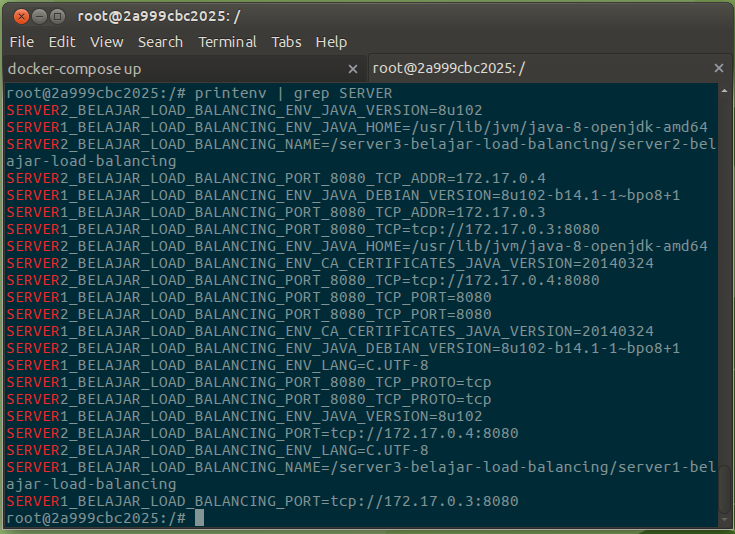
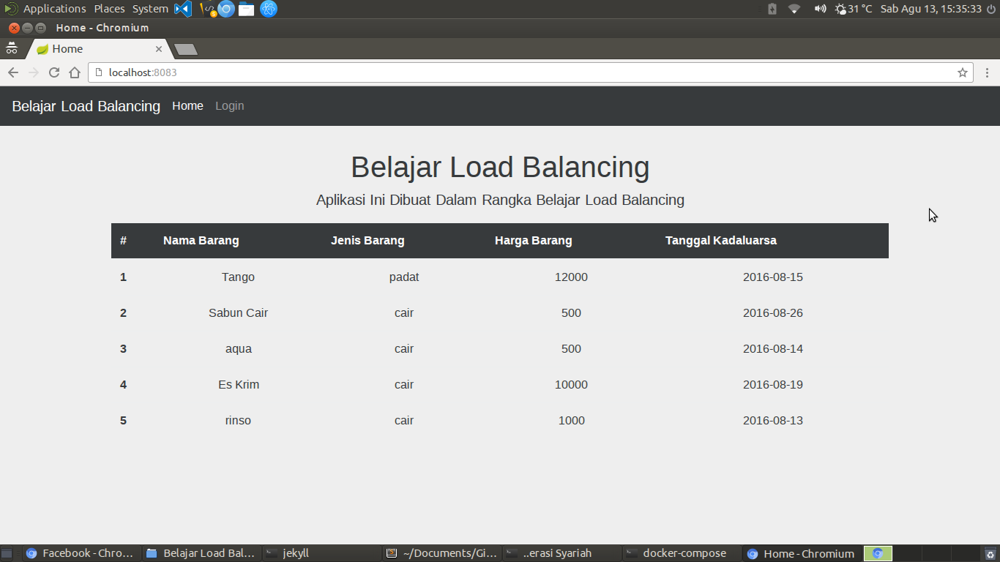
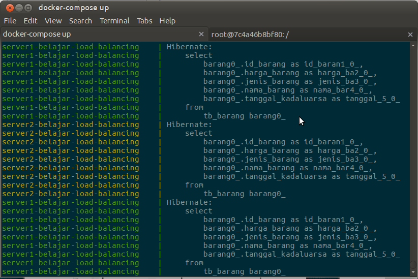
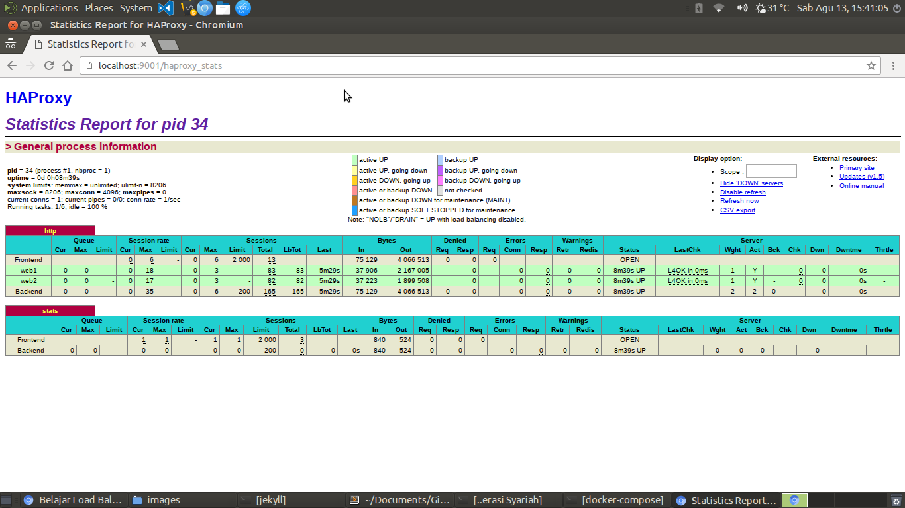
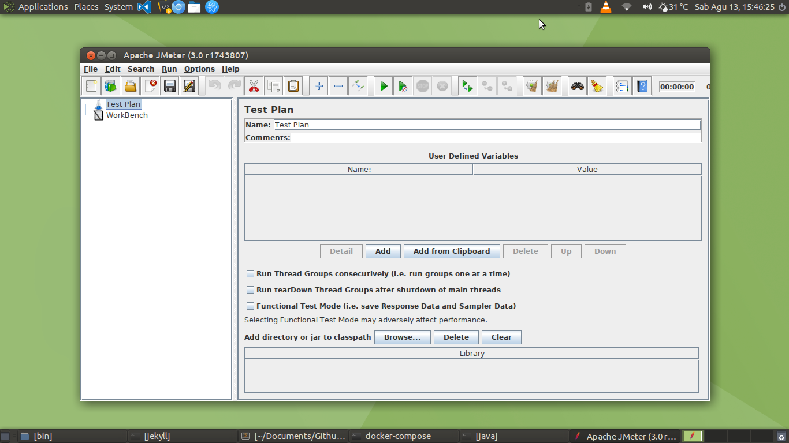
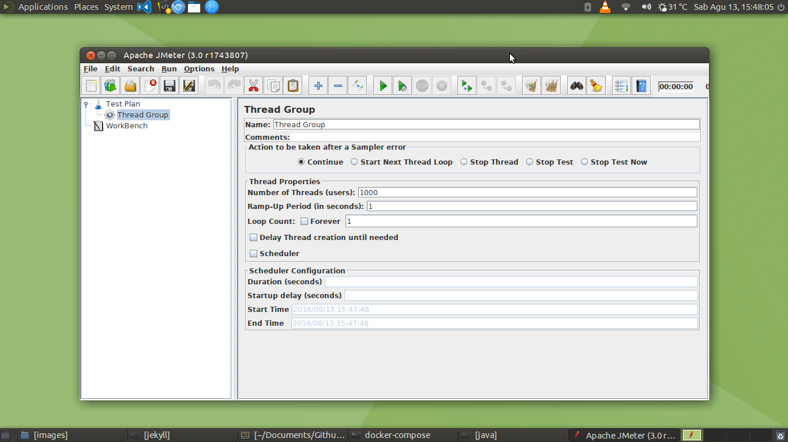
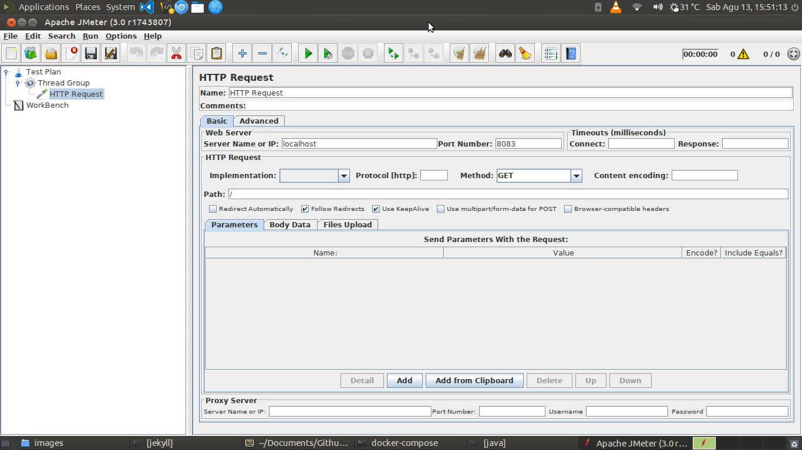
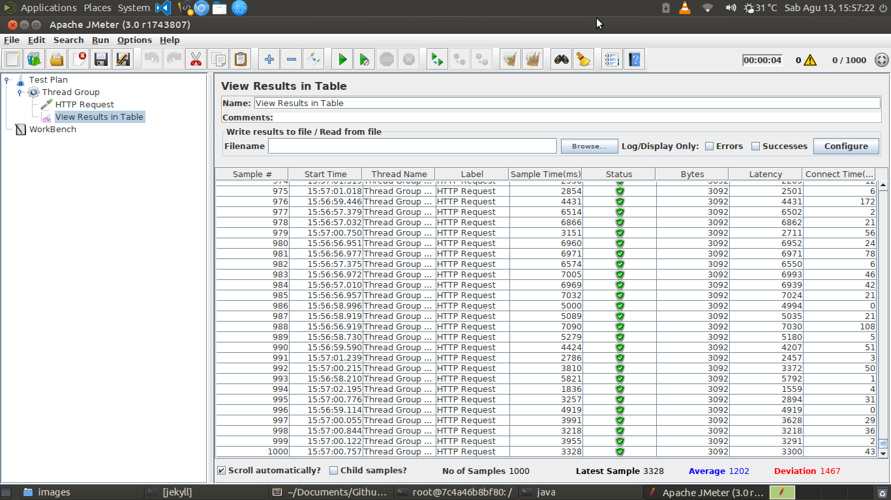

## Apa Itu Load Balancing ?

>>Load Balancing adalah sebuah teknik untuk melakukan distribusi beban trafik pada dua atau lebih jalur koneksi secara seimbang sehingga setiap jalur koneksi akan menerima beban trafik yang sama.

Load balancing ini sangat banyak digunakan oleh perusahaan - perusahaan skala besar. Load balancing biasanya sering digunakan untuk kebutuhan trafik web yang sangat tinggi seperti web e-commerce. Load balancing biasanya digunakan pada saat sebuah server jika user yang melakukan akses server tersebut telah melebihi jumlah maksimal. Ketika user yang mengakses melebihi kapasitas maka dengan menggunakan teknik load balancing, beban trafik tersebut akan dialihkan ke server yang lain.

## Mengapa web Menggunakan Load Balancing ?

Berikut adalah alasan mengapa web menggunakan load balancing :

* Untuk mempercepat waktu reponse sebuah web. Dengan menggunakan teknik load balancing maka yang akan menerima request tidak hanya 1 server, sehingga mempercepat waktu response sebuah web. 1 web server dapat menerima banyak request, sedangkan 1 server biasanya kita memiliki 1 web server, bayangkan saja jika kita mempunyai 5 dan masing - masing server mempunyai 1 web server maka waktu response sebuah web akan meningkat sangat pesat.

* Dengan menggunakan load balancing kita akan mengurangi error pada system, misalnya jika kita mempunyai 5 server, lalu masing - masing server tersebut mempunyai web server yang menjalankan web yang telah kita deploy, karena kita menggunakan load balancing, jika salah satu server mati maka web kita akan tetap berjalan karena server lain akan menghandle request web tersebut.

## Apa Itu HAProxy ?

>>HAProxy adalah salah satu software yang mendukung load balancing dan proxy untuk protokol TCP dan HTTP.

Pada artikel ini, penulis akan mencoba menggunakan teknologi HAProxy, salah satu keunggulan HAProxy adalah dapat melayani semua port TCP seperti 8080, 3000, 9000 dan lain - lain. Berikut adalah fitur - fitur dari HAProxy :

* Dapat melakukan load balancing untuk banyak server
* Dapat membuat load balancing master - slave sehingga apabila load balancing yang master mati maka akan digantikan oleh slave
* Dapat digunakan oleh banyak service seperti email, database, web server dan lain - lain.
* Terdapat statistik load balancing sehingga mempermudah kita memantau beban trafik
* Jika salah satu server mati, maka beban trafik ke server tersebut akan dihentikan.

Berikut adalah gambar dari arsitektur HAProxy

## Membuat Load Balancing Dengan HAProxy Dan Docker

Bagi anda yang belum mengerti docker, silahkan baca artikel [Belajar Docker](https://rizkimufrizal.github.io/belajar-docker/). Karena kita tidak memiliki server beneran maka kita akan mencoba menggunakan docker sebagai visualisasi server. Untuk melakukan uji terhadap aplikasi web, maka penulis telah membuat contoh aplikasi web java, silahkan download di [Belajar Load Balancing](https://github.com/RizkiMufrizal/Belajar-Load-Balancing/tree/ebb6901f59da614297684b714da01062747cc12e), Karena aplikasi ini adalah aplikasi java web maka anda perlu melakukan instalasi java untuk melakukan build web java tersebut, bagi anda yang belum melakukan instalasi java, silakan lihat di artikel [Instalasi Perlengkapan Coding Java](https://rizkimufrizal.github.io/instalasi-perlengkapan-coding-java/). Berikut adalah beberapa teknologi yang akan kita gunakan untuk load balancing :

* Web Server : jetty web server
* Framework Aplikasi Web : Spring Boot, Spring Data JPA
* database : MariaDB
* Pooling Database : HikariCP
* Visualisasi Server : Docker
* Sistem Operasi : Ubuntu, Debian
* Load Balancing : HAProxy

Dan berikut adalah arsitektur yang akan kita gunakan untuk membuat load balancing.

Dari gambar diatas dapat kita lihat bahwa kita menggunakan 4 server, dimana 1 server menghadle database, 2 server menghadle web dan 1 server lagi khusus untuk load balancing dengan menggunakan HAProxy. User akan melakukan akses terhadap server load balancing, lalu HAProxy secara otomatis akan meneruskan request tersebut ke server selanjutnya, sebelumnya meneruskan request, HAProxy akan melakukan pengecekan terlebih dahulu dengan menggunakan algoritma load balancing, biasanya yang paling sering digunakan adalah algoritma Round Robin, algoritma ini biasanya akan membagikan beban trafik secara bergiliran ke setiap server.

Jika project [Belajar Load Balancing](https://github.com/RizkiMufrizal/Belajar-Load-Balancing/tree/ebb6901f59da614297684b714da01062747cc12e) telah anda download, kemudian jalankan perintah.


mvn clean package docker:build


Tunggu hingga proses selesai, nantinya akan terbentuk sebuah image dengan nama `rizki.mufrizal/belajar.spring.boot.load.balancing`, konfigurasi docker tersebut berada pada folder `src/main/docker`. Disana terdapat 2 file yaitu `Dockerfile`. File `Dockerfile` berisi konfigurasi server untuk menjalankan aplikasi web java. Langkah selanjutnya, silahkan buat sebuah file `docker-compose.yml` di root project anda, lalu masukkan codingan seperti berikut.


mariadb:
  container_name: mariadb-server
  image: mariadb:10.1.16
  environment:
    - MYSQL_ROOT_PASSWORD=root
    - MYSQL_DATABASE=microservicespringboot
    - MYSQL_USER=rizki
    - MYSQL_PASSWORD=mufrizal

server1-belajar-load-balancing:
  container_name: server1-belajar-load-balancing
  image: rizki.mufrizal/belajar.spring.boot.load.balancing
  links:
    - mariadb
  ports:
    - 8081:8080

server2-belajar-load-balancing:
  container_name: server2-belajar-load-balancing
  image: rizki.mufrizal/belajar.spring.boot.load.balancing
  links:
    - mariadb
  ports:
    - 8082:8080


Konfigurasi diatas berfungsi untuk membuat 3 container secara sekaligus, dimana container pertama bernama `mariadb` yang dikhususkan untuk server database, 2 container lagi berisi aplikasi java, dimana kedua server ini memiliki link ke server database mariadb. Untuk menjalankan ketiga container tersebut, silahkan akses folder root project dengan terminal anda, lalu jalankan perintah berikut.


docker-compose up


Kemudian silahkan cek apakah 3 container tersebut telah berjalan atau tidak dengan perintah.


docker ps


Pada saat penulis menjalankan perintah diatas, penulis berhasil menjalankan 2 container, sedangkan 1 container lagi tidak jalan, mengapa demikian ? biasanya ini sering terjadi karena start up database mariadb yang lebih lambat dari pada start up aplikasi web java. Untuk mengatasi hal ini, silahkan hentikan container yang sedang jalan dengan perintah `CTRL + c` lalu jalankan kembali dengan perintah docker-compose up. Jika telah berjalan ketiga container tersebut, silahkan cek web tersebut melalui browser anda, anda dapat melakukan pengecekan pada `localhost:8081` dan `localhost:8082`.

Langkah selanjutnya kita akan membuat 1 container lagi yang berfungsi sebagai load balancing. Silahkan jalankan perintah berikut untuk menjalankan container untuk load balancing.


docker run --link server1-belajar-load-balancing --link server2-belajar-load-balancing --name server3-belajar-load-balancing -p 8083:80 -p 9001:9000 -it ubuntu:latest


Maka anda dapat melakukan akses CLI container tersebut, silahkan jalankan perintah berikut untuk melakukan update, upgrade, instalasi HAProxy dan editor nano.


apt update && apt dist-upgrade -y && apt install haproxy nano -y


Nah setelah selesai, tahap selanjutnya kita akan memulai konfigurasi HAProxy, silahkan jalankan perintah berikut untuk mengetahui environment variabel yang ada di dalam server untuk load balancing, environment variabel ini berfungsi agar kita dapat mengetahui IP dari server yang akan menangani request web.


printenv | grep SERVER


mengapa kita menggunakan key `SERVER` ? ini dikarenakan kita menggunakan kata - kata server pada saat membuat nama container. Jika berhasil maka akan muncul output seperti berikut.

Kita akan menggunakan environment berikut untuk konfigurasi IP dan PORT.

* SERVER1_BELAJAR_LOAD_BALANCING_PORT_8080_TCP_ADDR
* SERVER2_BELAJAR_LOAD_BALANCING_PORT_8080_TCP_ADDR
* SERVER1_BELAJAR_LOAD_BALANCING_PORT_8080_TCP_PORT
* SERVER2_BELAJAR_LOAD_BALANCING_PORT_8080_TCP_PORT

Setelah mengetahui environment variabel nya, langkah selanjutnya silahkan jalankan perintah berikut untuk menghapus konfigurasi haproxy.


rm /etc/haproxy/haproxy.cfg


Kemudian jalankan perintah berikut untuk membuat dan mengedit konfigurasi haproxy.


nano /etc/haproxy/haproxy.cfg


Kemudian masukkan codingan seperti berikut.


global
    user daemon
    group daemon
    daemon
    log 127.0.0.1 daemon
    maxconn 4096
    chroot /var/lib/haproxy

defaults
    log global
    retries 2
    timeout connect 3000
    timeout server 5000
    timeout client 5000

listen http
    bind 0.0.0.0:80
    mode http
    option tcplog
    log global
    mode http
    option httplog
    option dontlognull
    balance roundrobin
    retries 3
    option redispatch
    maxconn 2000
    timeout connect 5000
    timeout client 50000
    timeout server 50000
    server web1 ${SERVER1_BELAJAR_LOAD_BALANCING_PORT_8080_TCP_ADDR}:${SERVER1_BELAJAR_LOAD_BALANCING_PORT_8080_TCP_PORT} check
    server web2 ${SERVER2_BELAJAR_LOAD_BALANCING_PORT_8080_TCP_ADDR}:${SERVER2_BELAJAR_LOAD_BALANCING_PORT_8080_TCP_PORT} check
    cookie web1 insert nocache
    cookie web2 insert nocache

listen stats
    bind 0.0.0.0:9000
    mode http
    stats enable
    stats hide-version
    balance
    timeout client 5000
    timeout connect 4000
    timeout server 30000
    stats uri /haproxy_stats
    stats realm HAProxy\ Statistics
    stats refresh 10s
    stats auth admin:admin


Dari konfigurasi diatas dapat dilihat bahwa kita membuat 2 konfigurasi untuk 2 server yaitu pada bagian `server web1` dan `server web2`. Pada bagian tersebut kita akan mendeklarasikan IP dan PORT dari server yang akan kita buat load balancing. Untuk mempermudah monitoring load balancing, kita menggunakan monitor status dari HAProxy, konfigurasinya terdapat pada `listen stats`. Kemudian silahkan restart HAProxy dengan perintah.


/etc/init.d/haproxy restart


Jika berhasil akan muncul output seperti berikut.


Restarting haproxy haproxy                                                  [ OK ]


## Uji Coba Load Balancing

Akhirnya selesai juga konfigurasinya, tahap terakhir adalah melakukan uji coba :D. Untuk melakukan uji coba, silahkan akses `localhost:8083` maka jika berhasil akan muncul output seperti berikut.

Jika anda sering melakukan reload, maka sebanarnya load balancing tersebut akan berjalan, anda dapat melihatnya melalui output docker pada terminal, berikut adalah contohnya.

Dari gambar diatas dapat kita lihat bahwa terdapat 2 server yang menghandle request secara bergantian, yaitu server 1 dengan warna hijau dan server 2 dengan warna kuning. Anda juga dapat melakukan monitoring melalui url `localhost:9001/haproxy_stats`, jika diminta password silahkan masukkan username `admin` dan password `admin`, dan jika berhasil maka akan muncul output seperti berikut.

## Uji Coba Load Balancing Dengan JMeter

Untuk melakukan uji coba kehandalan atau uji coba performance sebuah aplikasi, kita dapat menggunakan aplikasi [JMeter](http://jmeter.apache.org/). Silahkan download aplikasi tersebut lalu jalankan file `ApacheJMeter.jar` di dalam folder `bin`. Jika berhasil maka akan muncul output seperti berikut.

Lalu klik kanan pada test plan, pilih menu add lalu pilih threads(users) dan pilih menu thread. Pada bagian number of thread silahkan isikan angka 1000 seperti gambar berikut.

Kemudian pilih Thread Group lalu pilih menu add, pilih menu sampler dan pilih menu HTTP Request. Pada kolom Server Name or IP isikan `localhost`, pada port number isikan `8083` dan pada kolom path isikan `/` seperti gambar berikut.

Kemudian pilih kembali thread Group lalu pilih menu add, pilih menu listener dan pilih menu view results in table. Lalu silahkan pilih menu run dan pilih start maka secara otomatis JMeter akan melakukan request sebanyak 1000 request dalam 1 second, jika load balancing bekerja sesuai dengan harapan, beban bekerja secara merata pada tiap server dan spesifikasi perangkat komputer telah sesuai maka anda akan mendapatkan semua status request menjadi success. Berikut adalah output pada JMeter setelah melakukan test request.

Bagi anda yang ingin melihat source code codingan, silahkan lihat di [Belajar Load Balancing](https://github.com/RizkiMufrizal/Belajar-Load-Balancing). Sekian artikel mengenai belajar load balancing dan terima kasih :)
