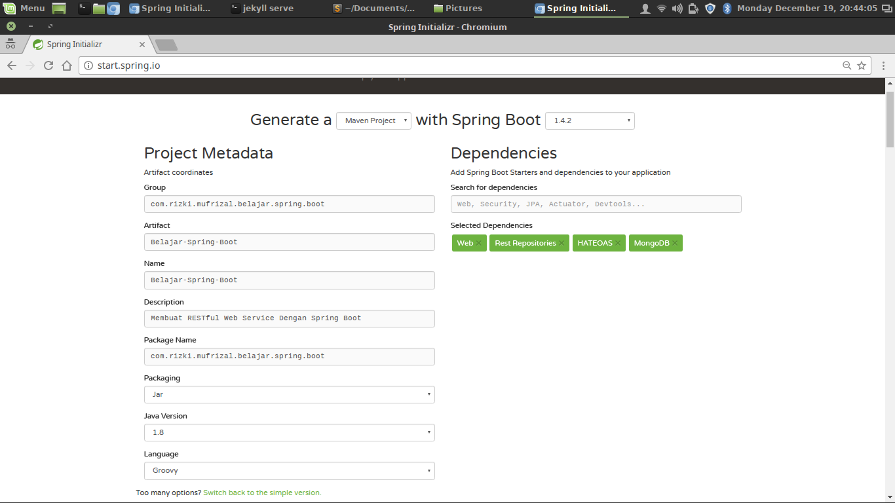
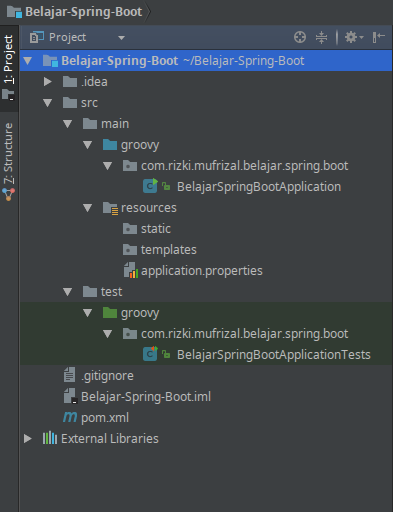

Setelah sekian lama tidak update blog, nah kali ini penulis akan membuat sebuah artikel mengenai bagaimana cara membuat RESTful Web Service dengan menggunakan Framework Spring Boot :). Spring Boot merupakan salah satu project dari pivotal yaitu sebuah perusahaan yang mengembangkan framework spring. Bagi anda yang belum kenal dengan spring framework bisa membaca artikel di [Belajar Spring Framework](https://rizkimufrizal.github.io/belajar-framework-spring/). Karena spring framework merupakan salah satu framework dari bahasa pemrograman java maka anda diwajibkan untuk melakukan instalasi java, bagi anda yang belum melakukan instalasi java dapat membaca artikel [Instalasi Perlengkapan Coding Java](https://rizkimufrizal.github.io/instalasi-perlengkapan-coding-java/).

## Setup Project

Pada artikel ini, kita akan menggunakan [groovy](http://www.groovy-lang.org/) yaitu salah satu bahasa scripting yang dikembangkan diatas JVM (java virtual machine) dimana bahasa groovy ini dapat diinterpretasikan atau dikompilasi. Masih terdapat bahasa pemrograman lain yang dikembangkan diatas JVM seperti [scala](https://www.scala-lang.org/), [kotlin](https://kotlinlang.org/), [jruby](http://jruby.org/), [jython](http://www.jython.org/) dan lain sebagainya. Di blog pribadi saya, terdapat salah satu pembahasan bahasa pemrograman diatas yaitu [kotlin](https://kotlinlang.org/), bagi anda yang ingin membaca tentang kotlin, silahkan akses di [Instalasi Perlengkapan Coding Kotlin](https://rizkimufrizal.github.io/instalasi-perlengkapan-coding-kotlin/).

Untuk melakukan setup project spring boot, kita dapat mengenerate projectnya melalui [start spring.io](http://start.spring.io/). Silahkan isikan konfigurasi seperti berikut.

Kemudian silahkan pilih menu generate project. Maka secara otomatis akan dibuatkan sebuah project spring boot dengan menggunakan bahasa pemrograman groovy :D. Disini kita akan menggunakan database mongodb dan menggunakan arsitektur HATEOAS (Hypermedia as the Engine of Application State). HATEOAS adalah salah satu constraint untuk membangun sebuah RESTful Web Service, dimana HATEOAS ini merupakan level 3 pada constraint RESTful Web Service. Pembahasan mengenai HATEOAS akan dibahas pada artikel berikutnya :).

Silahkan extract file yang telah didownload. Pada artikel ini, kita akan menggunakan [IntellIJ IDE](https://www.jetbrains.com/idea/). Silahkan buka IDE tersebut lalu import project spring boot, berikut adalah struktur project jika dilihat dari IDE tersebut.

