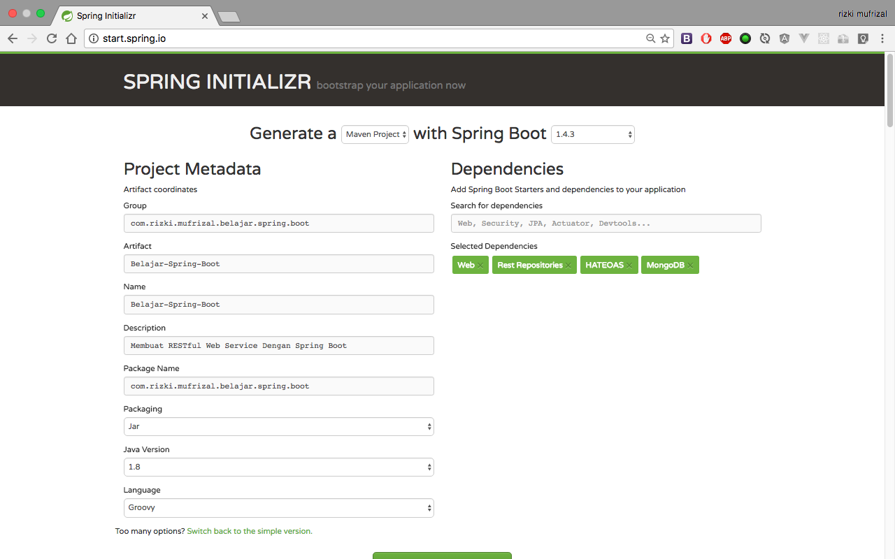
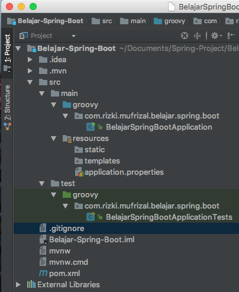
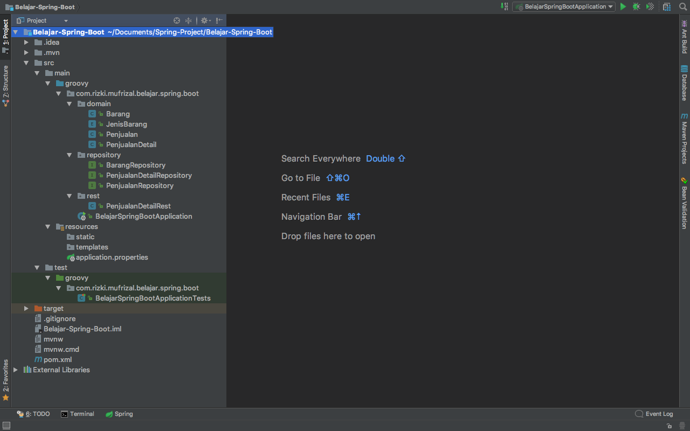
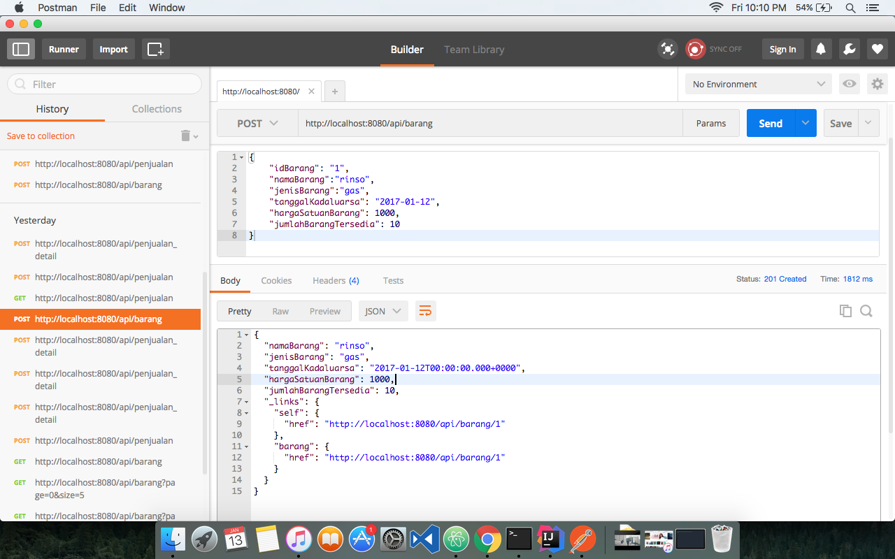
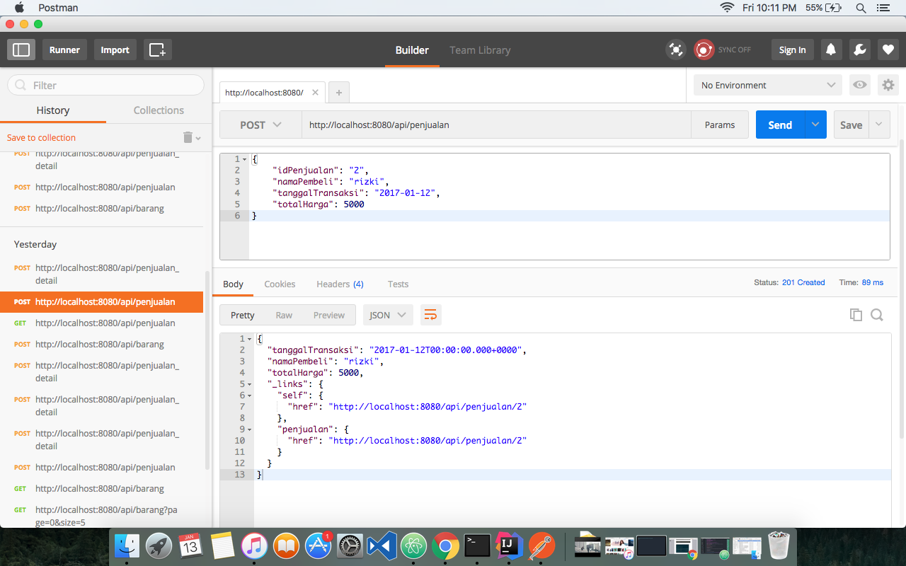
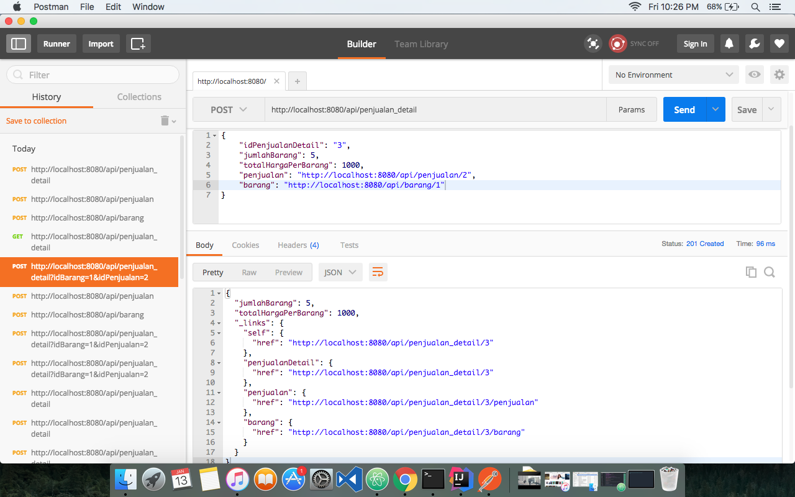

Setelah sekian lama tidak update blog, nah kali ini penulis akan membuat sebuah artikel mengenai bagaimana cara membuat RESTful Web Service dengan menggunakan Framework Spring Boot :). Spring Boot merupakan salah satu project dari pivotal yaitu sebuah perusahaan yang mengembangkan framework spring. Bagi anda yang belum kenal dengan spring framework bisa membaca artikel di [Belajar Spring Framework](https://rizkimufrizal.github.io/belajar-framework-spring/). Karena spring framework merupakan salah satu framework dari bahasa pemrograman java maka anda diwajibkan untuk melakukan instalasi java, bagi anda yang belum melakukan instalasi java dapat membaca artikel [Instalasi Perlengkapan Coding Java](https://rizkimufrizal.github.io/instalasi-perlengkapan-coding-java/).

## Setup Project

Pada artikel ini, kita akan menggunakan [groovy](http://www.groovy-lang.org/) yaitu salah satu bahasa scripting yang dikembangkan diatas JVM (java virtual machine) dimana bahasa groovy ini dapat diinterpretasikan atau dikompilasi. Masih terdapat bahasa pemrograman lain yang dikembangkan diatas JVM seperti [scala](https://www.scala-lang.org/), [kotlin](https://kotlinlang.org/), [jruby](http://jruby.org/), [jython](http://www.jython.org/) dan lain sebagainya. Di blog pribadi saya, terdapat salah satu pembahasan bahasa pemrograman diatas yaitu [kotlin](https://kotlinlang.org/), bagi anda yang ingin membaca tentang kotlin, silahkan akses di [Instalasi Perlengkapan Coding Kotlin](https://rizkimufrizal.github.io/instalasi-perlengkapan-coding-kotlin/).

Untuk melakukan setup project spring boot, kita dapat mengenerate projectnya melalui [start spring.io](http://start.spring.io/). Silahkan isikan konfigurasi seperti berikut.

Kemudian silahkan pilih menu generate project. Maka secara otomatis akan dibuatkan sebuah project spring boot dengan menggunakan bahasa pemrograman groovy :D. Disini kita akan menggunakan database mongodb dan menggunakan arsitektur HATEOAS (Hypermedia as the Engine of Application State). HATEOAS adalah salah satu constraint untuk membangun sebuah RESTful Web Service, dimana HATEOAS ini merupakan level 3 pada constraint RESTful Web Service. Pembahasan mengenai HATEOAS akan dibahas pada artikel berikutnya :).

Silahkan extract file yang telah didownload. Pada artikel ini, kita akan menggunakan [IntellIJ IDE](https://www.jetbrains.com/idea/). Silahkan buka IDE tersebut lalu import project spring boot, berikut adalah struktur project jika dilihat dari IDE tersebut.

Langkah Pertama silahkan Buat Struktur aplikasi seperti berikut.

Silahkan buka class `Barang` yang ada di package `domain`. Kemudian ubah codingannya menjadi seperti berikut.


package com.rizki.mufrizal.belajar.spring.boot.domain

import org.springframework.data.annotation.Id
import org.springframework.data.mongodb.core.mapping.Document
import org.springframework.data.mongodb.core.mapping.Field

/**
 *
 * @Author Rizki Mufrizal <mufrizalrizki@gmail.com>
 * @Web <https://RizkiMufrizal.github.com>
 * @Since 12 January 2017
 * @Time 10:13 PM
 * @Project Belajar-Spring-Boot
 * @Package com.rizki.mufrizal.belajar.spring.boot.domain
 * @File Barang
 *
 */
@Document(collection = "tb_barang")
class Barang implements Serializable {

    @Id
    @Field(value = "id_barang")
    String idBarang

    @Field(value = "nama_barang")
    String namaBarang

    @Field(value = "jenis_barang")
    JenisBarang jenisBarang

    @Field(value = "tanggal_kadaluarsa")
    Date tanggalKadaluarsa

    @Field(value = "harga_satuan_barang")
    BigDecimal hargaSatuanBarang

    @Field(value = "jumlah_barang_tersedia")
    Integer jumlahBarangTersedia

}


Dari codingan diatas dapat kita lihat bahwa penulisan sintak java dan groovy sangat lah mirip, dimana terdapat perbedaan yaitu groovy tidak mengharuskan developer untuk menulis titik koma (;). Pada artikel ini, penulis menggunakan database `mongodb` maka pada saat mendeklarasikan domain / class pojo kita menggunakan annotation `@Document` dimana annotation tersebut mewakili dari collection yang ada di database mongodb. Untuk mendeklarasikan jenis barang, kita menggunakan `enum class`, silahkan buat sebuah enum class dengan nama `JenisKelamin`, Kemudian isikan codingan seperti berikut.


package com.rizki.mufrizal.belajar.spring.boot.domain

/**
 *
 * @Author Rizki Mufrizal <mufrizalrizki@gmail.com>
 * @Web <https://RizkiMufrizal.github.com>
 * @Since 12 January 2017
 * @Time 10:15 PM
 * @Project Belajar-Spring-Boot
 * @Package com.rizki.mufrizal.belajar.spring.boot.domain
 * @File JenisBarang
 *
 */
enum JenisBarang {
    gas, padat, cair
}


Setelah selesai, tahap selanjutnya silahkan buka class `Penjualan` untuk aksi transaksi, kemudian isikan codingan seperti berikut.


package com.rizki.mufrizal.belajar.spring.boot.domain

import org.springframework.data.annotation.Id
import org.springframework.data.mongodb.core.mapping.Document
import org.springframework.data.mongodb.core.mapping.Field

/**
 *
 * @Author Rizki Mufrizal <mufrizalrizki@gmail.com>
 * @Web <https://RizkiMufrizal.github.com>
 * @Since 12 January 2017
 * @Time 10:17 PM
 * @Project Belajar-Spring-Boot
 * @Package com.rizki.mufrizal.belajar.spring.boot.domain
 * @File Penjualan
 *
 */
@Document(collection = "tb_penjualan")
class Penjualan implements Serializable {

    @Id
    @Field(value = "id_penjualan")
    String idPenjualan

    @Field(value = "tanggal_transaksi")
    Date tanggalTransaksi

    @Field(value = "nama_pembeli")
    String namaPembeli

    @Field(value = "total_harga")
    BigDecimal totalHarga

}


Sama seperti sebelumnya, class ini berisi tentang domain / class pojo. Kemudian buka class `PenjualanDetail` lalu masukkan codingan seperti berikut.


package com.rizki.mufrizal.belajar.spring.boot.domain

import org.springframework.data.annotation.Id
import org.springframework.data.mongodb.core.mapping.DBRef
import org.springframework.data.mongodb.core.mapping.Document
import org.springframework.data.mongodb.core.mapping.Field

/**
 *
 * @Author Rizki Mufrizal <mufrizalrizki@gmail.com>
 * @Web <https://RizkiMufrizal.github.com>
 * @Since 12 January 2017
 * @Time 10:20 PM
 * @Project Belajar-Spring-Boot
 * @Package com.rizki.mufrizal.belajar.spring.boot.domain
 * @File PenjualanDetail
 *
 */
@Document(collection = "tb_penjualan_detail")
class PenjualanDetail implements Serializable {

    @Id
    @Field(value = "id_penjualan_detail")
    String idPenjualanDetail

    @Field(value = "jumlah_barang")
    Integer jumlahBarang

    @Field(value = "total_harga_per_barang")
    BigDecimal totalHargaPerBarang

    @DBRef(lazy = true)
    Penjualan penjualan

    @DBRef(lazy = true)
    Barang barang

}


Pada domain `PenjualanDetail` terdapat sedikit tambahkan yaitu annotation `DBRef` dimana annotation ini berfungsi sebagai relasi antara collection. Terdapat 1 Penjualan dengan banyak Penjualan Detail dan begitu pula dengan barang, sehingga relasi ini menghasilkan relasi one to many dari penjualan ke penjualan detail dan dari barang ke penjualan detail.

Langkah selanjutnya silahkan buka file `BarangRepository`, kemudian isikan codingan seperti berikut.


package com.rizki.mufrizal.belajar.spring.boot.repository

import com.rizki.mufrizal.belajar.spring.boot.domain.Barang
import org.springframework.data.mongodb.repository.MongoRepository
import org.springframework.data.rest.core.annotation.Description
import org.springframework.data.rest.core.annotation.RepositoryRestResource

/**
 *
 * @Author Rizki Mufrizal <mufrizalrizki@gmail.com>
 * @Web <https://RizkiMufrizal.github.com>
 * @Since 12 January 2017
 * @Time 10:23 PM
 * @Project Belajar-Spring-Boot
 * @Package com.rizki.mufrizal.belajar.spring.boot.repository
 * @File BarangRepository
 *
 */
@RepositoryRestResource(collectionResourceRel = "barang", path = "barang", collectionResourceDescription = @Description("API Barang"))
interface BarangRepository extends MongoRepository<Barang, String> {

}


class `BarangRepository` adalah sebuah class interface dimana di dalam class ini kita melakukan extends terhadap class MongoRepository sehingga melalui class ini kita dapat melakukan process create read update dan delete. Spring data mongodb telah menyediakan fungsi paging, sorting dan lain sebagainya, bahkan kita dapat melakukan custom terhadap query yang kita butuhkan. Dikarenkan project ini menggunakan spring data rest maka kita tidak lagi memerlukan membuat controller maupun service, sehingga dari class respository sudah dapat dilakukan proses manipulasi data. Bagaimana kita dapat mengetahui url / end point yang digunakan ? kita dapat mengetahuinya melalui path yang ada di annotation `RepositoryRestResource`. Untuk end point / url process create update, read dan delete secara otomatis akan dibuatkan berdasarkan method http. Berikut adalah daftar listnya :

| Method Http | Deksripsi            |
|:------------|:---------------------|
| GET         | Untuk mengambil data |
| POST        | Untuk menyimpan data |
| PUT         | Untuk merubah data   |
| DELETE      | Untuk menghapus data |
{: rules="groups"}

Selanjutnya silahkan buka class `PenjualanRepository` kemudian isikan codingan seperti berikut.


package com.rizki.mufrizal.belajar.spring.boot.repository

import com.rizki.mufrizal.belajar.spring.boot.domain.Penjualan
import org.springframework.data.mongodb.repository.MongoRepository
import org.springframework.data.rest.core.annotation.Description
import org.springframework.data.rest.core.annotation.RepositoryRestResource

/**
 *
 * @Author Rizki Mufrizal <mufrizalrizki@gmail.com>
 * @Web <https://RizkiMufrizal.github.com>
 * @Since 12 January 2017
 * @Time 10:25 PM
 * @Project Belajar-Spring-Boot
 * @Package com.rizki.mufrizal.belajar.spring.boot.repository
 * @File PenjualanRepository
 *
 */
@RepositoryRestResource(collectionResourceRel = "penjualan", path = "penjualan", collectionResourceDescription = @Description("API Penjualan"))
interface PenjualanRepository extends MongoRepository<Penjualan, String> {

}


Sama seperti class sebelumnya, selanjutnya silahkan buka class `PenjualanDetailRepository` kemudian isikan codingan seperti berikut.


package com.rizki.mufrizal.belajar.spring.boot.repository

import com.rizki.mufrizal.belajar.spring.boot.domain.PenjualanDetail
import org.springframework.data.mongodb.repository.MongoRepository
import org.springframework.data.rest.core.annotation.Description
import org.springframework.data.rest.core.annotation.RepositoryRestResource
import org.springframework.data.rest.core.annotation.RestResource

/**
 *
 * @Author Rizki Mufrizal <mufrizalrizki@gmail.com>
 * @Web <https://RizkiMufrizal.github.com>
 * @Since 12 January 2017
 * @Time 10:26 PM
 * @Project Belajar-Spring-Boot
 * @Package com.rizki.mufrizal.belajar.spring.boot.repository
 * @File PenjualanDetailRepository
 *
 */
@RepositoryRestResource(collectionResourceRel = "penjualan_detail", path = "penjualan_detail", collectionResourceDescription = @Description("API Penjualan detail"))
interface PenjualanDetailRepository extends MongoRepository<PenjualanDetail, String> {

}


Kemudian tahap terakhir silahkan buka file `application.properties` yang ada di folder `resouces`, kemudian isikan codingan berikut.


#konfigurasi mongodb
spring.data.mongodb.database=belajar_spring_boot
spring.data.mongodb.host=127.0.0.1
spring.data.mongodb.port=27017

#konfigurasi HATEOAS
spring.hateoas.use-hal-as-default-json-media-type=true

endpoints.cors.allowed-methods = POST, GET, OPTIONS, DELETE, PUT
endpoints.cors.allowed-origins = '*'
endpoints.cors.exposed-headers = accept, authorization, x-requested-with, content-type
endpoints.cors.max-age = 3600

#konfigurasi jackson
spring.jackson.serialization.indent-output=true

#konfigurasi spring data rest
spring.data.rest.base-path=/api


Setelah selesai, tahap terakhir kita akan menjalankan aplikasi web nya dengan perintah.


mvn clean spring-boot:run


Berikut adalah output ketika dijalankan.

Kemudian kita lakukan testing menggunakan postman, berikut adalah proses menyimpan data untuk barang

berikut adalah proses menyimpan data untuk penjualan

berikut adalah proses menyimpan data untuk penjualan detail

Bagi anda yang ingin melihat source code codingan, silahkan lihat di [Belajar Spring Boot](https://github.com/RizkiMufrizal/Belajar-Spring-Boot). Sekian artikel mengenai Membuat RESTful Web Service Dengan Framework Spring Boot dan terima kasih :)
