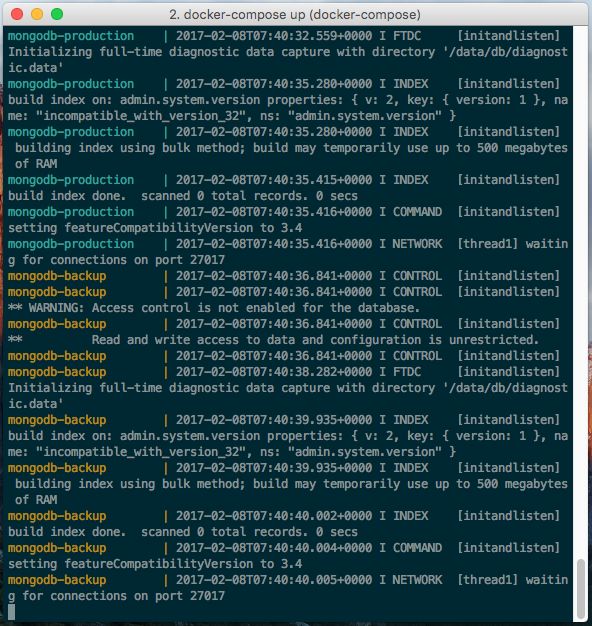
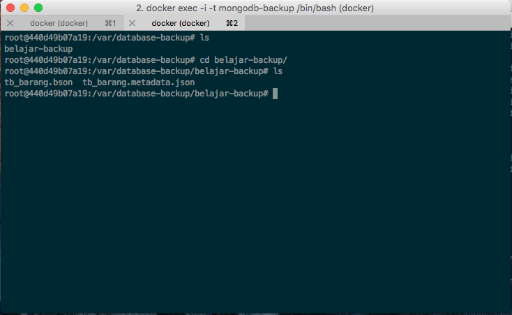
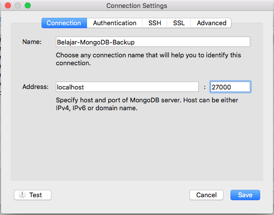
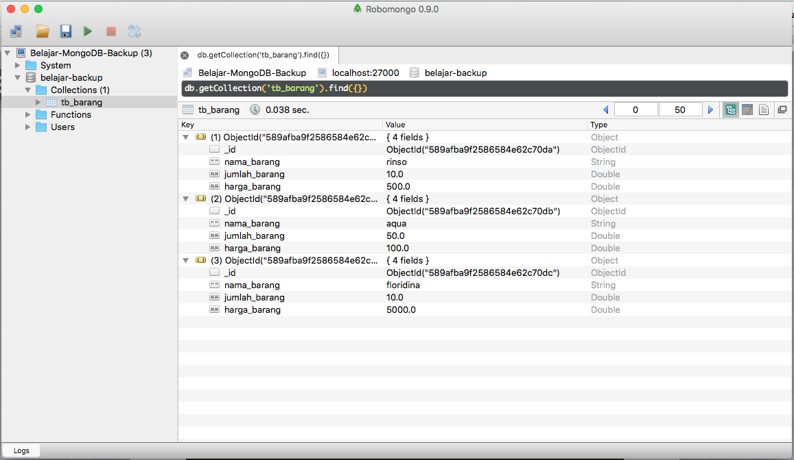

Bicara mengenai database, seorang database administrator harus mengetahui seluk beluk dari database, salah satunya adalah proses backup dan restore database. Database tanpa backup adalah suatu hal yang sangat fatal dikarenakan jika suatu waktu terjadi sesuatu pada database production maka hilang sudah semua harapan :D. Pada artikel ini, penulis akan mencoba membuat sebuah backup data lalu kita akan restore.

## Perlengkapan Project

Untuk membuat virtual database maka kita akan menggunakan docker, bagi anda yang belum mengerti tentang docker, silakan baca artikel [Belajar Docker](https://rizkimufrizal.github.io/belajar-docker/). Silahkan jalan docker anda, jika anda pengguna linux maka secara default service docker akan berjalan, jika anda pengguna osx maka anda harus menjalankan docker terlebih dahulu. Berikut adalah arsitektur yang akan kita gunakan untuk membuat backup dan restore database mongodb.

Dari gambar diatas, kita dapat melihat bahwa nantinya akan ada 2 container, dimana container tersebut berisi database production dan database backup. Biasanya antara database production dan backup berada pada server yang berbeda.

## Membuat Backup Database

Sebelum kita membuat backup database, kita akan melakukan setup docker terlebih dahulu, silahkan buka terminal anda, lalu jalankan perintah berikut untuk mendownload image mongodb.


docker pull mongo


Setelah selesai, silahkan anda membuat `docker-compose.yml` karena kita akan menggunakan docker compose. Isikan source code seperti berikut.


mongodb-production:
  container_name: mongodb-production
  image: mongo:latest
  ports:
    - 27000:27017

mongodb-backup:
  container_name: mongodb-backup
  image: mongo:latest
  links:
    - mongodb-production
  ports:
    - 27001:27017


Dari konfigurasi diatas dapat kita lihat bahwa container mongodb-backup membutuhkan dependency dari mongodb-production. Untuk menjalankan kedua docker diatas, silahkan gunakan perintah berikut.


docker-compose up


Jika berhasil maka di terminal anda akan muncul seperti berikut.

Langkah selanjutnya kita akan membuat file shell script, bagi anda yang belum paham shell script, silahkan baca pada artikel [Belajar Shell Script](https://rizkimufrizal.github.io/belajar-shell-script/). Silahkan buat sebuah file dengan nama `mongodb-backup.sh`, kemudian isikan codingan seperti berikut.


#!/bin/bash
# author Rizki Mufrizal

HOST="127.0.0.1"
PORT="27017"
REMOTE_DB="2016"
USER=""
PASS=""
PATH_BACKUP="/var/database-backup"

mongodump --db=$REMOTE_DB --username=$USER --password=$PASS --host=$HOST --port=$PORT --out=$PATH_BACKUP


Untuk parameter environment seperti nama database, username, password dan lain - lain kita langsung membuat per variabel sehingga nantinya hanya perlu diubah pada bagian variabel saja. Untuk melakukan backup, kita akan menggunakan `mongodump`, dimana mongodump ini mempunya beberapa parameter diantaranya adalah database yang diremote, username, password, host, port dan folder backup. Karena file shell script ini akan kita gunakan di dalam container docker maka kita harus melakukan setting ulang dockernya. Silahkan buat sebuah file dengan nama `Dockerfile` kemudian isikan codingan seperti berikut.


FROM mongo:latest

RUN mkdir /backup-restore
WORKDIR /backup-restore
ADD . /backup-restore


Setelah selesai, sekarang jalankan perintah berikut untuk menghapus container yang lama.


docker stop $(docker ps -a -q) && docker rm $(docker ps -a -q)


Setelah selesai, kemudian kita akan membuat image baru dengan perintah berikut.


docker build -t rizki.mufrizal/mongo-backup .


Jika berhasil maka akan muncul output seperti berikut.


Sending build context to Docker daemon 10.24 kB
Step 1/4 : FROM mongo:latest
 ---> 59dbd3885751
Step 2/4 : RUN mkdir /backup-restore
 ---> Running in f7710c593a1b
 ---> 7eeacbf6f587
Removing intermediate container f7710c593a1b
Step 3/4 : WORKDIR /backup-restore
 ---> 89413f734f6d
Removing intermediate container 019a58f8d2ba
Step 4/4 : ADD . /backup-restore
 ---> c593b1efba36
Removing intermediate container 3129347a292d
Successfully built c593b1efba36


Karena ada perubahan konfigurasi, maka kita harus melakukan perubahan pada file `docker-compose.yml` seperti berikut.


mongodb-production:
  container_name: mongodb-production
  image: mongo:latest
  ports:
    - 27000:27017

mongodb-backup:
  container_name: mongodb-backup
  image: rizki.mufrizal/mongo-backup
  links:
    - mongodb-production
  ports:
    - 27001:27017


Lalu jalankan kembali docker compose dengan perintah.


docker-compose up


### Test Backup Data

Setelah selesai melakukan konfigurasi, langkah selanjutnya kita akan mencoba mengakses database mongodb yang versi production dengan perintah berikut.


docker exec -i -t mongodb-production /bin/bash


Kemudian silahkan akses cli mongodb dengan perintah.


mongo


Kemudian jalankan perintah berikut untuk mengakses / membuat database.


use belajar-backup;


Kemudian untuk membuat sebuah collection, silahkan jalankan perintah berikut.


db.createCollection('tb_barang');


Untuk melakukan insert, silahkan jalankan perintah berikut.


db.tb_barang.insert(
  [
    { nama_barang: 'rinso', jumlah_barang: 10, harga_barang: 500 },
    { nama_barang: 'aqua', jumlah_barang: 50, harga_barang: 100 },
    { nama_barang: 'floridina', jumlah_barang: 10, harga_barang: 5000 }
  ]
);


Untuk melihat data di mongodb, anda dapat menggunakan perintah berikut.


db.tb_barang.find().pretty();


berikut adalah hasil outputnya.


{
	"_id" : ObjectId("589afba9f2586584e62c70da"),
	"nama_barang" : "rinso",
	"jumlah_barang" : 10,
	"harga_barang" : 500
}
{
	"_id" : ObjectId("589afba9f2586584e62c70db"),
	"nama_barang" : "aqua",
	"jumlah_barang" : 50,
	"harga_barang" : 100
}
{
	"_id" : ObjectId("589afba9f2586584e62c70dc"),
	"nama_barang" : "floridina",
	"jumlah_barang" : 10,
	"harga_barang" : 5000
}


Setelah selesai, sekarang saatnya untuk membuat backup database, silahkan akses cli mongodb yang versi backup dengan perintah berikut.


docker exec -i -t mongodb-backup /bin/bash


Secara otomatis kita akan berada di folder `backup-restore`, di dalam folder tersebut terdapat file `mongodb-backup.sh` yang telah kita buat, akan tetapi host yang digunakan pastinya akan berbeda dikarenakan berbeda container, untuk mengecek host database mongodb versi production silahkan jalankan perintah berikut.


printenv | grep MONGO


Berikut adalah hasil outputnya.


MONGODB_PRODUCTION_PORT_27017_TCP_PROTO=tcp
MONGO_VERSION=3.4.2
MONGODB_PRODUCTION_ENV_GPG_KEYS=0C49F3730359A14518585931BC711F9BA15703C6
MONGODB_PRODUCTION_ENV_GOSU_VERSION=1.7
MONGODB_PRODUCTION_PORT_27017_TCP_ADDR=172.17.0.2
MONGODB_PRODUCTION_ENV_no_proxy=*.local, 169.254/16
MONGO_PACKAGE=mongodb-org
MONGODB_PRODUCTION_NAME=/mongodb-backup/mongodb-production
MONGODB_PRODUCTION_PORT_27017_TCP_PORT=27017
MONGODB_PRODUCTION_ENV_MONGO_PACKAGE=mongodb-org
MONGODB_PRODUCTION_ENV_MONGO_MAJOR=3.4
MONGODB_PRODUCTION_PORT=tcp://172.17.0.2:27017
MONGO_MAJOR=3.4
MONGODB_PRODUCTION_ENV_MONGO_VERSION=3.4.2
MONGODB_PRODUCTION_PORT_27017_TCP=tcp://172.17.0.2:27017


Kemudian silahkan buka kembali file `mongodb-backup.sh` lalu ubah konfigurasinya seperti berikut.


#!/bin/bash
# author Rizki Mufrizal

HOST=${MONGODB_PRODUCTION_PORT_27017_TCP_ADDR}
PORT=${MONGODB_PRODUCTION_PORT_27017_TCP_PORT}
REMOTE_DB="belajar-backup"
USER=""
PASS=""
PATH_BACKUP="/var/database-backup"

mongodump --db=$REMOTE_DB --username=$USER --password=$PASS --host=$HOST --port=$PORT --out=$PATH_BACKUP


Setelah selesai, silahkan berikan hak akses untuk execute dengan perintah.


chmod a+x mongodb-backup.sh


Kemudian jalankan file tersebut dengan perintah.


./mongodb-backup.sh


Jika berhasil maka akan muncul output seperti berikut.


2017-02-08T13:00:52.092+0000	writing belajar-backup.tb_barang to
2017-02-08T13:00:52.095+0000	done dumping belajar-backup.tb_barang (3 documents)


Untuk memastikan bahwa database anda telah di backup, silahkan cek path folder backup anda, tadinya kita membuat path back up database di `/var/database-backup`, berikut adalah hasilnya jika berhasil.

## Melakukan Restore Database

Pada tahap sebelumnya kita telah berhasil membuat backup database, nah sekarang kita akan melakukan restore database, sebelumnya, untuk mempermudah kita akan menggunakan [Robomongo](https://robomongo.org/) untuk mengakses database production. Silahkan download dan lakukan instalasi, jika telah selesai, silahkan buka robomongo anda, lalu lakukan konfigurasi seperti berikut.

mengapa kita menggunakan port 27000 ? ya dikarenakan konfigurasi forward port yang ada pada docker. Sehingga setiap kita mengakses port 27000 maka docker akan melakukan forward ke port 27017. Jika anda melakukan akses database dan collection nya maka akan muncul output seperti berikut.

Sekarang silahkan klik kanan di databasenya kemudian pilih menu drop database, maka secara otomatis database dihapus, nah sekarang kita akan melakukan restore. Silahkan akses terminal untuk database mongodb versi backup. Kemudian jalankan perintah berikut untuk melakukan restore database.


mongorestore /var/database-backup/belajar-backup/ --host=${MONGODB_PRODUCTION_PORT_27017_TCP_ADDR} --port=${MONGODB_PRODUCTION_PORT_27017_TCP_PORT} --db="belajar-backup" --username="" --password=""


Jika berhasil maka akan muncul output seperti berikut.


2017-02-08T13:25:30.559+0000	the --db and --collection args should only be used when restoring from a BSON file. Other uses are deprecated and will not exist in the future; use --nsInclude instead
2017-02-08T13:25:30.560+0000	building a list of collections to restore from /var/database-backup/belajar-backup dir
2017-02-08T13:25:30.561+0000	reading metadata for belajar-backup.tb_barang from /var/database-backup/belajar-backup/tb_barang.metadata.json
2017-02-08T13:25:32.837+0000	restoring belajar-backup.tb_barang from /var/database-backup/belajar-backup/tb_barang.bson
2017-02-08T13:25:32.841+0000	no indexes to restore
2017-02-08T13:25:32.841+0000	finished restoring belajar-backup.tb_barang (3 documents)
2017-02-08T13:25:32.841+0000	done


Output diatas menandakan bahwa database telah berhasil direstore :D. Sekian artikel mengenai Membuat Backup dan Restore Pada MongoDB, semoga bermanfaat dan terima kasih :)
